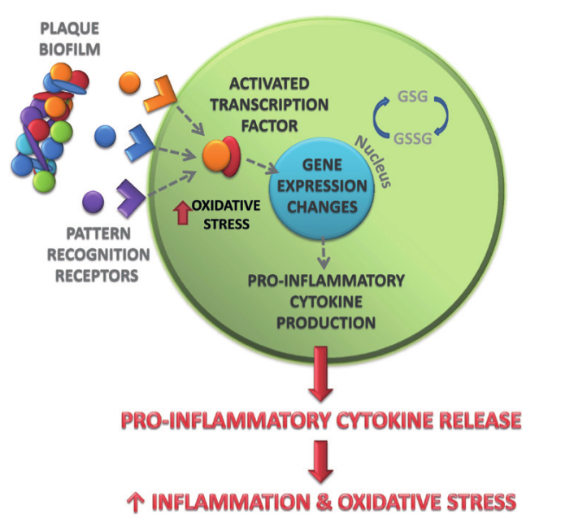
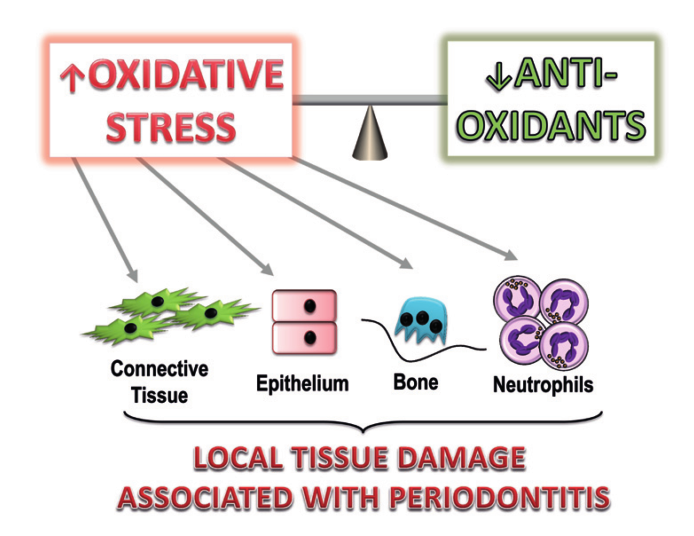
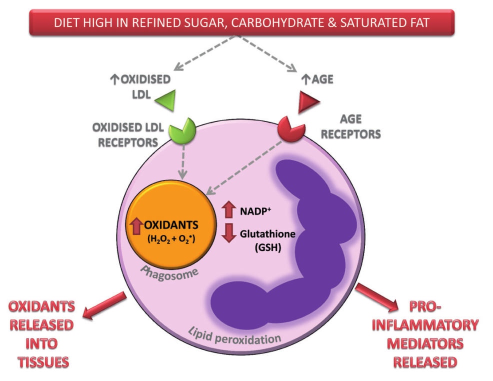

_\[This post is part of an ongoing challenge to understand 52 papers in 52 weeks. You can read previous entries, [here](http://swizec.com/blog/category/52-papers-in-52-weeks), or subscribe to be notified of new posts by [email](http://swiz.ec/52papers-list)]_ [Periodontitis](http://en.wikipedia.org/wiki/Periodontitis "Periodontitis") is a terrible disease that causes gums to detach from teeth, the bones holding your teeth to melt away, and can cause your teeth to fall out. You likely have it _right now_! About 43% of all adults in the UK have some form of periodontitis. 85% of those older than 65. Yikes! In their 2013 paper, [The Role of Diet in Periodontal Disease](http://www.bsdht.org.uk/res/DH%20May%20p18-21.pdf), MR Milward and ILC Chapple wrote about what sort of diet makes you more susceptible to periodontitis and how. The gist of it is: avoid refined carbs, antioxidants are good.

## Periodontitis

## Nutritional mechanisms of inflammation

\_\_

## Effect of diet on oxidative stress

Since oxidative stress comes partially from normal cell metabolism, it can be affected by diet. Sugars, processed carbohydrates, and [saturated fats](http://en.wikipedia.org/wiki/Saturated_fat "Saturated fat") in particular. I'm not sure I fully understand the mechanism because my molecular biology is rather poor, but the paper mentions two mechanisms. Cells performing [ATP synthesis](http://en.wikipedia.org/wiki/ATP_synthase "ATP synthase") to generate energy for themselves, produce mitochondrial superoxide radicals as a side-effect. The more simple food, the more radicals. Possibly related to the fact that simple carbs start digestion in the mouth. Another mechanism is receptor binding of neutrophils, which are a type of white blood cell. Something about glucose binding to proteins and activating oxidation enzymes. And saturated fats doing something similar, but with cholesterol. The result is _"meal induced inflammation"_. A result of increased glucose and lipid levels in the blood stream. But diet can also reduce oxidative stress. Avoiding simple carbohydrates and saturated fats is obviously going to reduce their effect. More importantly, with the right kind of antioxidants, you can help restore the balance between oxidants and antioxidants. But this only works reliably as part of whole foods like spinach, red beans, berries, and fancy dark chocolate (70%+ cocoa). Turns out there is a large body of research showing that [antioxidant supplements](http://en.wikipedia.org/wiki/Antioxidant "Antioxidant") do not work. A healthy [balanced diet](http://en.wikipedia.org/wiki/Human_nutrition "Human nutrition") is where it's at, so flush those vitamin pills, they're just making your pee expensive.

## Diet and periodontitis

## Conclusion

In conclusion, periodontitis is very prevalent, current ways of treating it haven't changed in 50 years, and we have early indication that dietary supplements could be a viable way of treating the disease at least to an extent. For the best chance of avoiding periodontitis and to help treatment if you do have it - brush your teeth regularly, avoid crappy food and don't smoke. Smoking makes it worse. Other than that there isn't much you can do. If you are prone to periodontitis due to any of a number of factors, it is more than likely to develop _eventually_.

