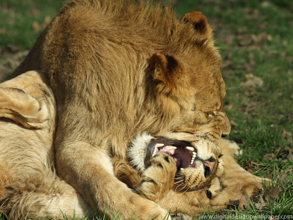
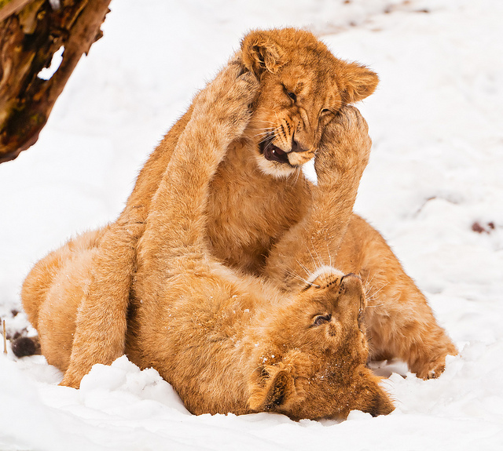
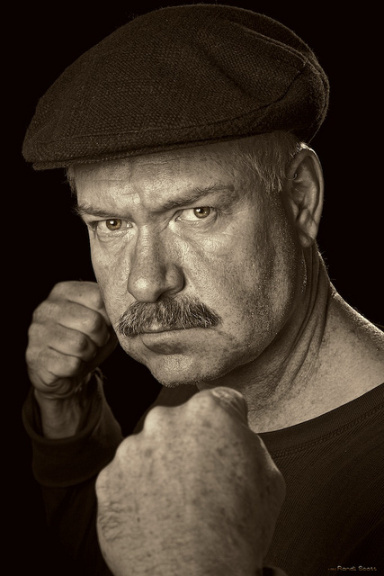
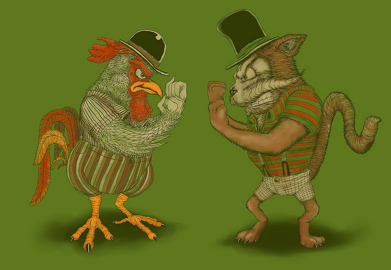

__

## Aggression, Social Systems and Evolution

Aggression is one of the oldest evolved traits. The [adaptive trait](http://en.wikipedia.org/wiki/Adaptation "Adaptation") of aggression is most commonly believed to be resource control wherein winning means you get something, and losing means you don't. Think lions and hyenas fighting over food, or rams butting heads for access to females. Resources and their availability have the biggest affect on evolution and more importantly, it seems that highly variable environments produce species with a greater flexibility of adaptation both physically and socially. Such as for instance mice, which evolved as human cohabitants. Most other mammalian species, however, evolved in more stable environments. For example, [California ground squirrels](http://en.wikipedia.org/wiki/California_ground_squirrel "California ground squirrel") that developed an immunity to rattlesnake poison took thousands of years to weed out this trait after rattle snakes disappeared from their environment. Complex social behaviors appear to take a particularly long time to evolve. The paper gives an example of zebras, where one species lives in female groups that act as harems for the males where the environment holds an abundance of food and water. A different species living in a rougher environment has evolved large territories, guarded by males, through which female zebras then roam when looking for food and water. In both cases, the male attempts to control access to fertile females by exhibiting aggression towards other males.

## Felids

\_\_

- lions are the only felids that live in social groups
- lions are the only felids with manes

Even more interestingly, lions appear to be the only animal species that exhibits manes - abundant hair growth around the head and neck area that only appears in males during puberty. Most felid species lead solitary lives and rarely interact with other adult members of their species. When they do, attacks are often lethal or leave the loser gravely injured. This is usually achieved through bites to the neck and blows to the head. Interestingly, felids do not appear to have a submissive behaviour to avert physical injury and even a submissive cat will roll on its back and confront the attacker with claws on all paws. If the attacker isn't careful, disembowelment is a distinct possibility. However, it is rare for felids to even want to fight. The only opportunity for fighting to be highly adaptive is during mating where even running away unharmed will greatly reduce chances of mating. The solitary lifestyles ensure there is little chance of fighting over prey.

## Lion Social Systems

\_\_

## The Mane as Protection

Recently, the belief that manes serve a protective function has been challenged by observing attacks on dummies and examining wounds on living and dead lions. Target sites were classified into four regions: neck/shoulder (delienated by the mane), face, trunk, and legs. In subadults and females wounds were equally distributed over all four regions, but in males they were less numerous in the neck and shoulder region. Strangely enough, females and subadults were equally likely to survive wounds to these sites as male lions. This is particularly interesting in light of the fact that the only three direct observations of killings between lions resulted from bites to the nape in two cases, and the third was a bite to the lower back. It seems then, that these areas, if reached, can be particularly lethal. But targets and successful attacks are not made equal. Considering the face is much smaller than the other areas and receives the same amount of damage that makes it a far more frequent target. This likely results from how lions defend themselves - facing the attacker with their teeth to protect the nape and neck. Another observation relates to approach behaviors of females. When exposed to a dark- or light-maned dummy they approached darker maned dummies more frequently than lighter maned dummies. This might have had to do with the sexual selection features of manes - they honestly advertise health - or simply because they wanted to assess possible danger to their pride.

## Sociality in Maneless Lions

When studying the influence of manes on lion social systems, care must be given to consider two groups of lions which exhibit lessened manes. Lions from the [Gir forest](<http://maps.google.com/maps?ll=21.1355555556,70.7966666667&spn=0.01,0.01&q=21.1355555556,70.7966666667 (Gir%20Forest%20National%20Park)&t=h> "Gir Forest National Park") of India have scant manes due to high humidity and [Tsavo lions](http://en.wikipedia.org/wiki/Tsavo_lion "Tsavo lion") from Keny have no manes at all because of the intense heat. If manes serve a permissive function in multi-male prides, what happens to sociality in Gir and Tsavo lions? In the Gir regions the manelessness of lions results in even less association between males and females. Prides are composed completely of related females and subadults, with male lions forming male-only nomadic prides. This shows a striking difference from normal lion behavior where a pride will have somewhere from 2 to 4 males. Strangely enough, the lack of manes does not affect association between males or females exclusively, but shows a strong influence on how males and females socialise in multi-sex situations. Crucially, it has been observed that prides without males in constant attendance failed to raise any cubs at all due to infanticide by roaming males and pride takeovers. The observation seems to indicate that manes enable multi-male groups of lions to exist because of the lessened possibility of lethal fighting. While the amount of male-male fights occurring in courtship situations is disputed, it has often been observed that a lack of clear social hierarchy often leads to fighting indiscriminately over food. All of this seems to indicate that manes act as a permissive function in male-male contests:

- fatal injuries in lions often involve the head and nape
- lion fighting involves frontal confrontation
- when manes are reduced, multi-male mixed sex prides are vanishingly rare
- females approached heavily-maned dummies more than did males
- mane quality is a sensitive index of health in lions

## Lions and Men

