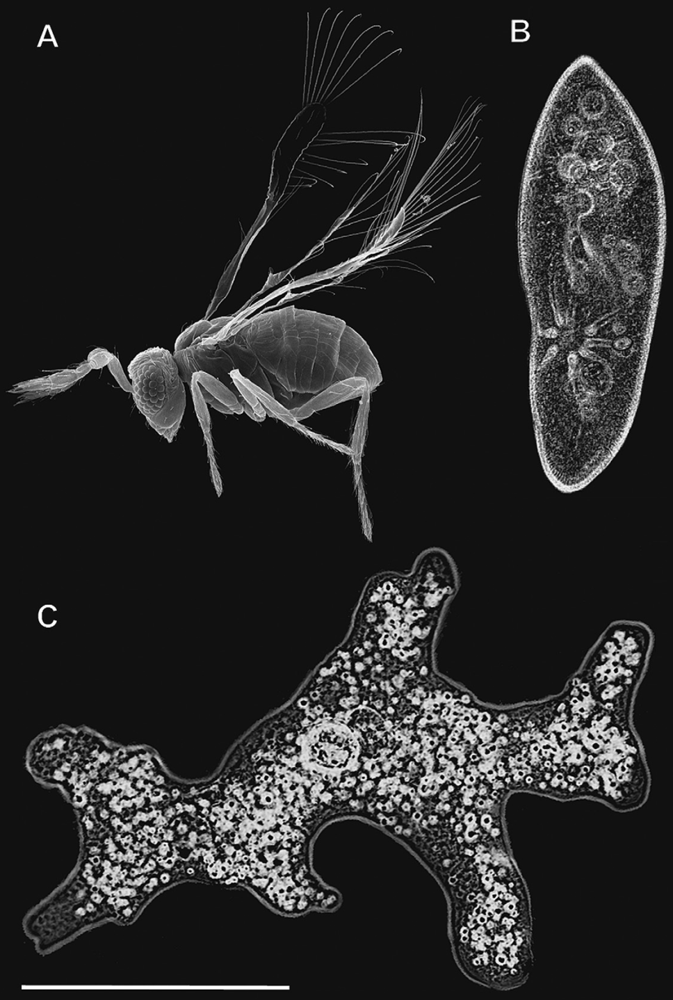
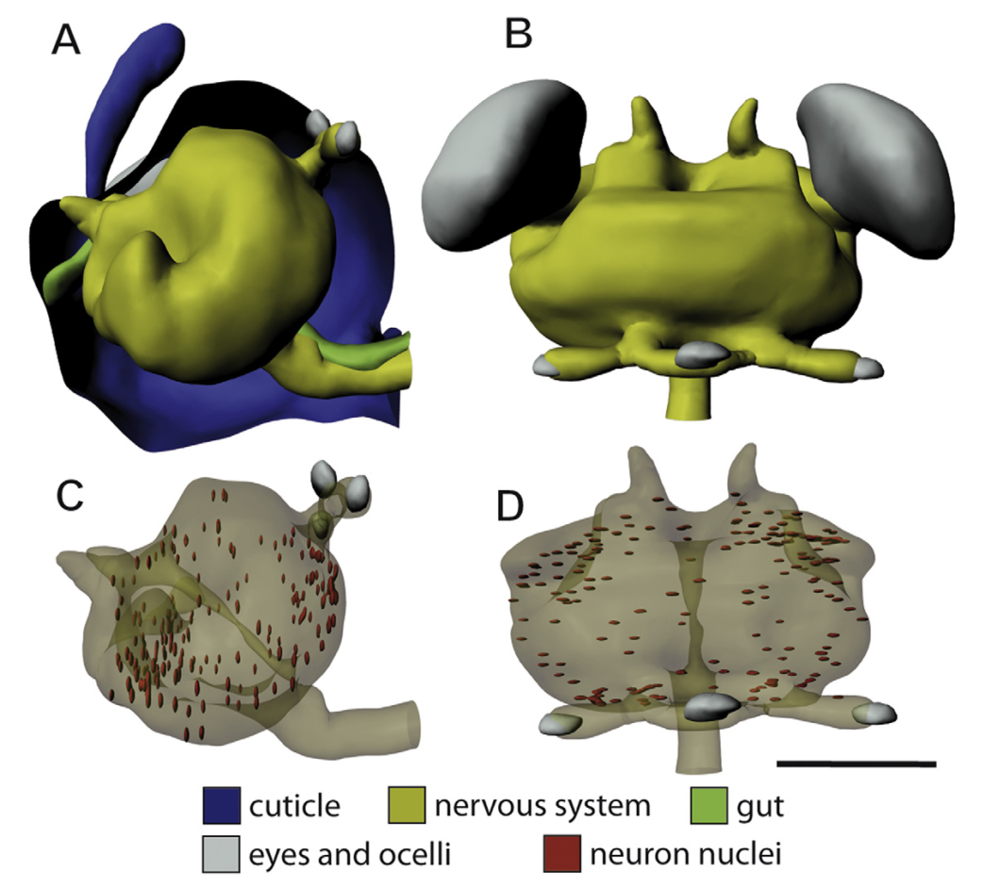
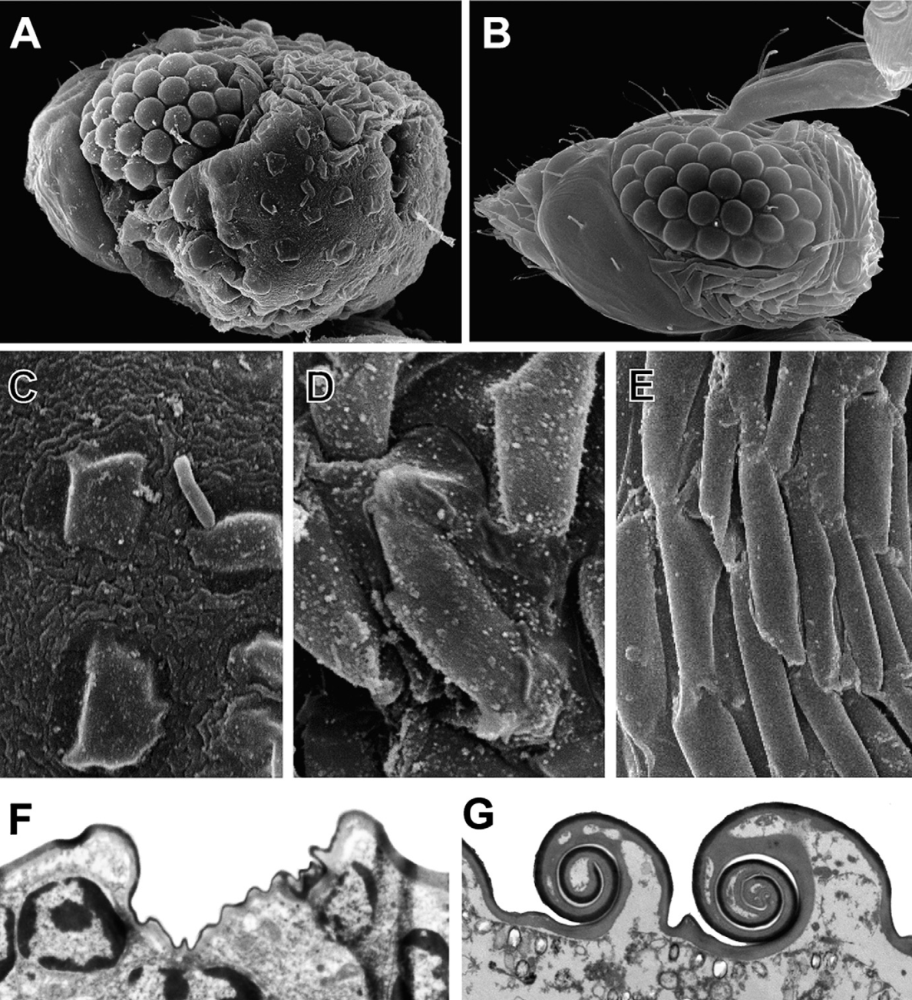

__

## Miniaturization

Vertebrates achieve miniaturization by changing their skeleton and organ size, but invertebrates get into some real trouble because when tiny insects become even tinier there just isn't a lot of space left. In particular, the [nervous system](http://en.wikipedia.org/wiki/Nervous_system "Nervous system") isn't something that can just magically become smaller. Some species of microscopic ants move parts of their brain out of the head and into other parts of the body. This happens during the [pupa](http://en.wikipedia.org/wiki/Pupa "Pupa") stage of metamorphosis - between the larva and an adult animal. In butterflies this would be the cocoon, which comes between the caterpillar and butterfly stages. But wasps have very articulate heads and there isn't enough room in their neck to have a multi-part brain. This causes problems at the [cellular level](http://en.wikipedia.org/wiki/Cell_%28biology%29 "Cell (biology)") and means they have to do something pretty amazing. Most of the neurons lose their nucleus.

## Research

The researchers compared pupa and adult stages of two closely related microscopic wasps - the Megaphragma mymaripenne and the larger [Trichogramma evanescens](http://en.wikipedia.org/wiki/Trichogramma_evanescens "Trichogramma evanescens"). Specimens were fixed in formaldehyde and sliced into 1µm slices. Using these slices they created 3D models of the specimens, which helped them calculate volumes of different tissues. Later on the slices were coated in gold so they could be looked at under an electronic microscope. The research and methodology section isn't very interesting in general, but the detailed info on software and equipment used might help you reproduce the experiment. You know, because you have that Jeol JEM-1011 microscope just lying around and don't know what to do with it.

## Results

