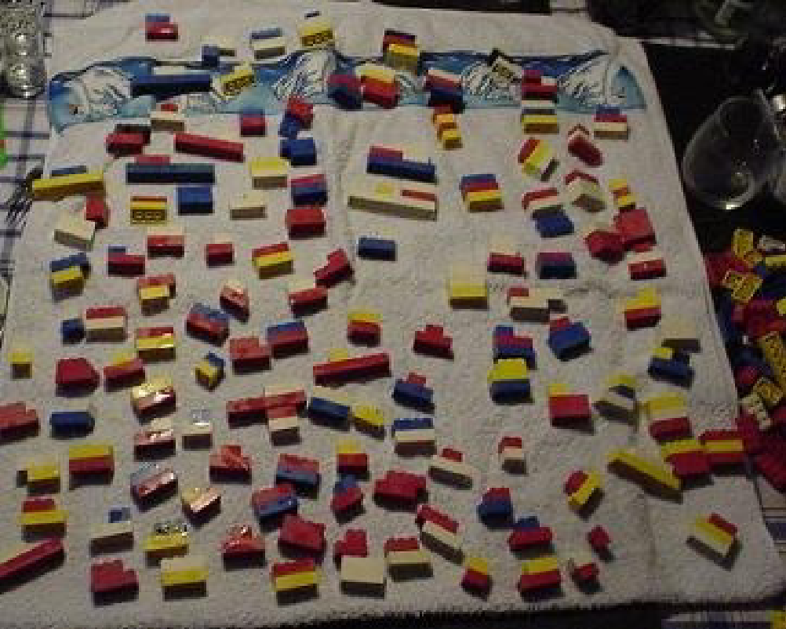
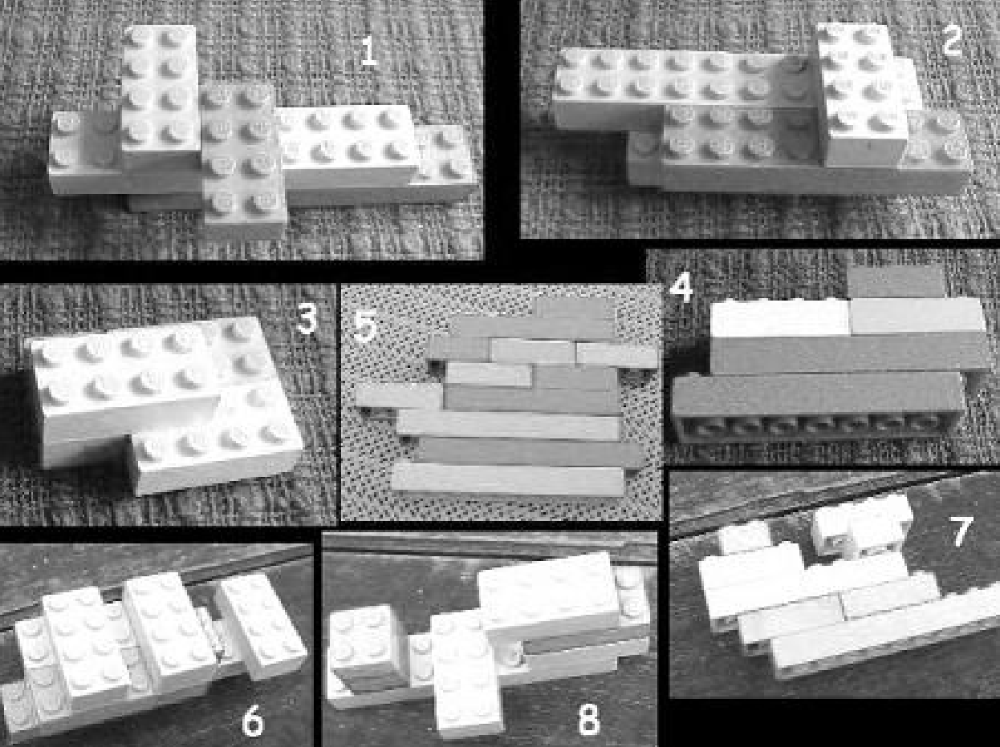
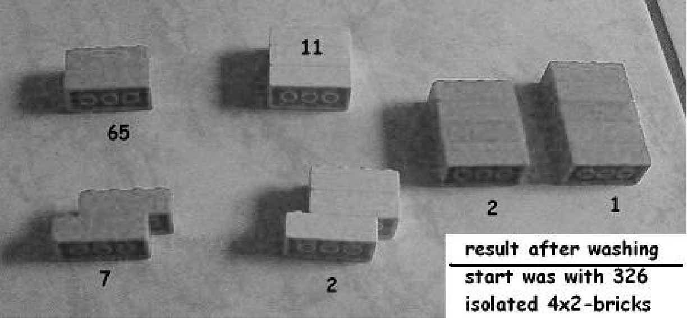

__\_\_

## Games to play

\_\_

## Related work

As silly as these games might seem, others before have played with [LEGOs](http://www.lego.com/ "Lego") to get interesting results. A similar set of experiments was done using [Duplo](http://duplo.lego.com/ "Lego Duplo") bricks in January 2013, called Duplo DNA. Another experiment used evolutionary experiments to tackle the "LEGO layout problem": Given a 3D shape, how can it be built out of LEGO bricks? M. Abrahamsen and S. Eilers showed that you can combine 6 4x2 bricks into 915,103,765 different combinations. A stark contrast from the subset of stable structures a washing machine produces.

## More interpretations and experiments

## Fun teaching aid

You can even use the LEGO washing machine to simulate evolution. Run the cycle for a bit. Pick out interesting complexes, possibly replicating them, rerun the cycle. Continue this until a complex is generated that satisfies your idea of interesting, or you give up. In this case the washing machine is performing the generation function, and you are performing the fitness function deciding what survives and what doesn't. It's a pretty powerful feeling I'd imagine. Either way, you might not discover the secrets of the universe by throwing LEGOs into a washing machine, but it's _interesting_. And interesting is the best type of science! Furthermore, this is the most fun and obvious way of showing someone that [random processes](http://en.wikipedia.org/wiki/Stochastic_process "Stochastic process") _can_ have predictable results. And that you _can_ throw randomness at a problem until a result falls out.

