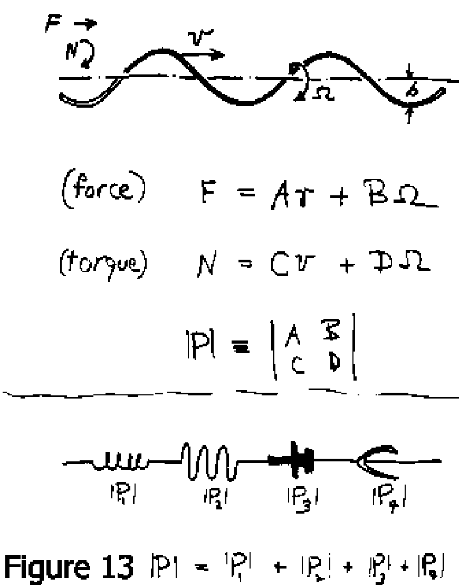

_\[This post is part of an ongoing challenge to understand 52 papers in 52 weeks. You can read previous entries, [here](http://swizec.com/blog/category/52-papers-in-52-weeks), or subscribe to be notified of new posts by [email](http://swiz.ec/52papers-list)]_ Have you ever wondered how [micro-organisms](http://en.wikipedia.org/wiki/Microorganism "Microorganism") can just live in a drop of water like that? I have and now I have an answer. Part of the answer anyway ... the part explaining how come water looks so solid to those creatures and how that affects their behaviour. The answer comes from a talk [Life at Low Reynolds Number](http://jila.colorado.edu/perkinsgroup/Purcell_life_at_low_reynolds_number.pdf) given by E. M. Purcell and published as a paper in June 1976.

## What is a Reynold's number

In fluid dynamics [Reynold's number](http://en.wikipedia.org/wiki/Reynold%27s_number) is the ratio between inertial and [viscous forces](http://en.wikipedia.org/wiki/Viscosity "Viscosity") for an object moving through a fluid. It depends on the object's dimensions - usually just one significant dimension - its velocity, and the fluid's density and viscosity. You can think of it as a measure of how well a particular object is going to travel through a particular fluid at a certain velocity.  In the formula, 'ρ' is the fluid's density, 'v' is the object's velocity, 'L' its significant dimension, and 'μ' the fluid's kinematic viscosity. For a person swimming in water 'Re' would be in the order of 104, for a small fish it can go as far down as 102. Which might be why they're so difficult to catch with your bare hands. Water just feels more solid to them than to you. But at the [microscopic scale](http://en.wikipedia.org/wiki/Microscopic_scale "Microscopic scale"), for something like a paramecium or a bacteria, the 'Re' of water will go as far down as 10-4. At that scale, inertia simply stops existing. At Reynold's numbers that small, the only thing that matters are forces currently exhibited on a body. Past activity doesn't matter and even time itself becomes irrelevant.

## What does it mean to swim

\_\_

## The flagellum

- the flexible oar
- the corkscrew

\_\_\_\_

## How a corkscrew works

\_\_

## Why swim at all?

\_\_

