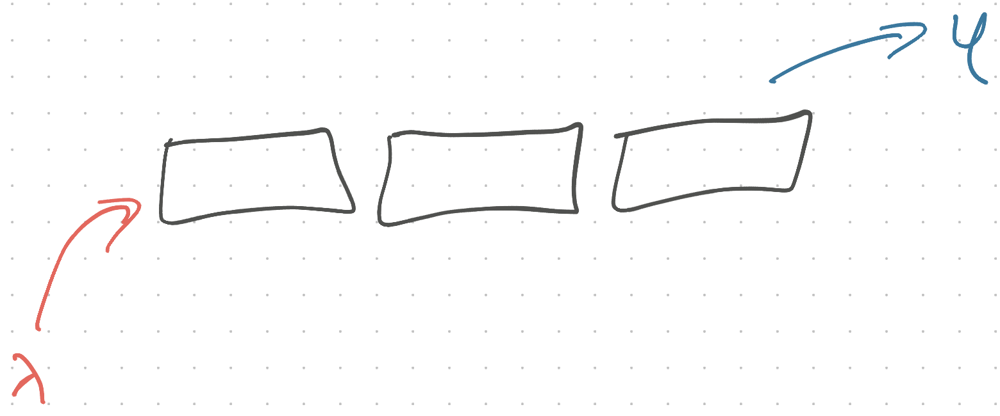
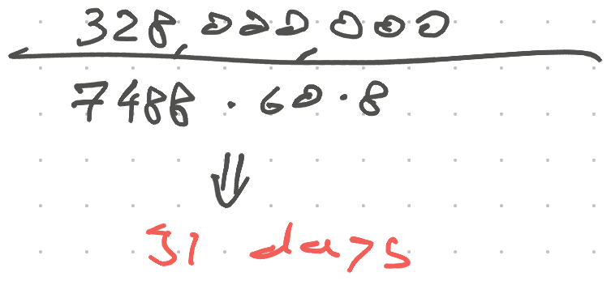

Friend, how would you rollout the covid vaccine?

You want to ensure equitable access, fairness, prioritize the vulnerable, immunize frontline workers, go as fast as supplies allow, and eventually get everyone immunized. If they want to.

Fun thought experiment for you, huge problem for policy makers.

While [Israel delivered the first dose to 1.5 million people](https://www.cnbc.com/2021/01/07/israels-covid-vaccine-rollout-is-the-fastest-in-the-world.html) – 16% of the population, the US sits at [11 million](https://www.nytimes.com/interactive/2020/us/covid-19-vaccine-doses.html) – 3% of the population. With some states going as fast as possible and others saying _"We'll have a plan that ensures fairness in 5 weeks"_.

Everyone is worried about jumping the line. Stealing doses from those more deserving. Yet up to 40% of those offered say no. Causing huge delays.

🤦‍♂️

How would you approach this?

## Queueing theory

You could try statistical regressions or plain old simulation, but really this is a problem for [queueing theory](https://en.wikipedia.org/wiki/Queueing_theory). The most useful comp sci class I took in college.

Not because I remember the formulae, because of the intuition. 😅

Queueing theory talks about the behavior of queues. How do you design a system that processes every request in time? What if some requests fail? What if long waits lead to bailing? What if time to process a request varies? It's cool.


λ – request rate (typical time between requests)
μ – typical number of requests served per unit of time

A basic [M/M/1 queue](https://en.wikipedia.org/wiki/M/M/1_queue) – memoryless arrival, memoryless service time, 1 server – assumes requests don't affect each other. Complexity blows up fast when they do.

## Queuing theory and vaccines

Let's assume we have infinite supply. You can buy or produce vaccines as fast as we can distribute them.

USA has [purchased 100 million doses](https://www.hhs.gov/about/news/2020/12/11/trump-administration-purchases-additional-100-million-doses-covid-19-investigational-vaccine-moderna.html) and distributed 11. Supply is not the problem.

_Fairness_ is a problem. 100 million is a 3rd of the population. Distribute without priority and you could leave the people who need it most.

But if you can vaccinate fast enough, fairness doesn't matter. If everyone gets vaccinated in 4 weeks, does it matter that grandma waited 2 weeks and you waited 2 days? Nah.

🤔

## How do you design the fastest queue?

Queue performance depends on λ – arrival rate – and μ – processing speed. Arrival rate fills up your queue, processing drains it.

We know the queue is full. That leaves processing speed.

I recently lucked into getting vaccinated. It took 60 seconds. Doctor says hi, walks you to a chair, asks about allergies, gives you a pamphlet, delivers the shot, walks you out.

60 seconds of their time.

You spend many minutes getting there, 5 minutes in the waiting room, 15 minutes afterwards waiting for any allergic reactions. We can ignore _your_ time for now.

What's the fastest you can get everyone vaccinated?

## A single FIFO queue with 1 server

Let's try a [first-in-first-out queue]\([https://en.wikipedia.org/wiki/FIFO\_(computing_and_electronics)](<https://en.wikipedia.org/wiki/FIFO_(computing_and_electronics)>). First come first served. Like a taco truck.



You've got 1 doctor working their butt off. They need no sleep and no rest. Everyone shows up on time.

At 60 seconds per patient, you'll need 328,000,000 minutes. 624 years.

## A FIFO queue with multiple servers

You'll need more than 1 vaccination site. How many? Is FIFO the best approach?


If you had 328,000,000 doctors, the queue falls to zero. Everyone vaccinates themselves and you're done in 1 minute. The problem becomes delivering the medicine.

USPS is good at logistics, but do you trust people to do it themselves? And to [keep the medicine at cryogenic temperatures](https://www.reuters.com/article/health-coronavirus-vaccines-distribution/why-pfizers-ultra-cold-covid-19-vaccine-will-not-be-at-the-local-pharmacy-any-time-soon-idUSKBN27P2VP)?

😅

Maybe not.

To vaccinate everyone in a month, you'll need:


To achieve a vaccination rate of 7488/min, you'll need 7488 vaccination sites that never rest. We don't have that many and they _do_ need rest.

### More realistic behavior

Let's assume a typical clinic stays open for 8 hours. Hospitals have shifts and operate 24/7, but that averages out.

Or as physicists say: _"A cow is roughly a sphere"_

At 8 hours/day and working full-time on vaccinations, your 7488 sites take



91 days. That's 3 months. Is 3 months long enough to worry about priority and equitable outcome? 🤔

## What about people who say no?

You've got 7488 doctors working 8 hours per day, vaccinating 1 person per minute. You don't need 7488 clinics for this, doctors can work side by side.

And when [30% say no](https://www.boropark24.com/news/nypd-waits-for-vaccine-while-30-of-fdny-reject-the-shots) that destroys your FIFO queue.

FIFO holds spots. You put everyone in the queue. When it's their turn you reach out.

```
1. Hey your turn
2. Nah
3. move on to next person
```

That takes time too! It's processing before processing. Technically a queue feeding into the vaccination queue.

### Absolute fairness

To ensure absolute fairness, you have to _wait for a response_. Even if everyone is ridiculously fast to reply – 5 minutes – that increases processing time to 6 minutes.

In the best case (everyone says Yes) that increases your time from 91 days to **547 days**. Just to stay fair. 🤯

And we know people don't reply that fast.

Every No adds another 5min wait. You can model average wait time as a [Bernoulli trial](https://en.wikipedia.org/wiki/Bernoulli_trial) and that's where my math taps out.

### Lossy fairness

Lossy fairness means you _don't wait for a response_. Offer vaccine, move on to the next person.

You go as fast as you can, prioritize the needy, and replies don't slow you down.

## Priority queue feeding into FIFO

Intuitively, a lossy fairness approach works best. You make vaccines available based on priority and vaccinate based on who says Yes first.


Rejections don't affect processing time. Fairness guaranteed by probability. It takes time to go down the prioritized list and send emails. You can do it in batches.

That's what Israel did. _"If you're 85 and older, come and get it"_. When batch runs out, say _"If you're 80 and older, come and get it"_.

It worked.

## Conclusion

Shots. In. Arms. Forget fairness and priorities, dole that shit out. Make it fly.

And we kinda derived [Little's Law](https://en.wikipedia.org/wiki/Little%27s_law). Queue length depends on arrival rate and time spent in the system. Nothing else.

And we had nerdy fun ✌️

Cheers,<br/>
~Swizec

PS: this is all back-of-the-envelope math, I am not a licensed statistician and it took me 4 tries to pass the damn queuing theory exam. Also I don't have all the data

[sparkjoy|queue-theory-vaccines]
