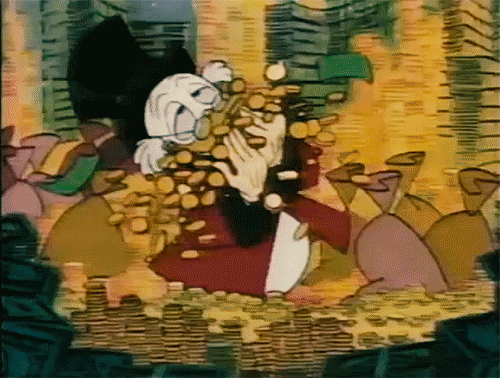
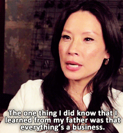
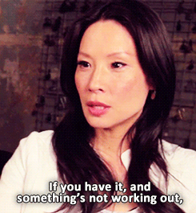
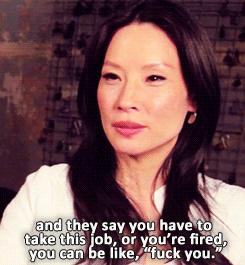

Imagine you're at a party, my friend. You're chatting with a friend of a friend and conversation turns to money.

_"Oh yeah money is dumb, you don't need more than \\\\\\$75,000 to be happy anyway. Science said so"_

First of all, that's wrong. $75k is the global average for emotional well-being 👉 not being stressed the fuck out. The global average for "eh, maybe I'm good" is $95k. [\[citation\]](https://www.nature.com/articles/s41562-017-0277-0)

That number goes as high as $320k in places like San Francisco 😳

Second of all, someone says that and you can just imagine Scrooge McCapitalist laughing his way to the bank.

The greatest lie capitalists ever sold us is that talking about money is impolite. Second greatest is that we don't need more.

Look around you, who are the people that say "money doesn't matter"?

1.  Upper middle class kids who never learned what $0 _really_ means
2.  Folks who feel stuck – _"Oh I can't make more but that's okay it would't make me happy anyway"_

Bollocks.

**You are a software engineer. You can always make more.**

But more money more problems, right?

Oh boo-hoo, you need to spend $500 to save your $500,000 so it makes $50,000 in a year just sitting there? Cry me a river 🙄

I don't know where that bullshit came from. More money more problems ... yeah maybe if you don't know how to use it.

Money is a tool. A damn good tool.

Think about it​. **What could an extra \\\\\\$1,000 per month do for you?** Don't worry about how, imagine you have it already. What can it do?

## Build a fuck you fund

You could do what my favorite financial advisor Lucy Liu suggests 👉 build a fuck you fund.

   

A fuck you fund is the ultimate freedom. Even if it's small.

The difference between living paycheck-to-paycheck and having just 1 month of savings can mean the difference between enduring a toxic job and quitting to find better.

> You are always 1 day from fired, 1 week from hungry, 1 month from homeless

Not with a fuck you fund you're not 😉

## Buy time

Money is time, right?

It's true. Money _is_ time. And time is happiness.

Imagine a chore you hate most. Picture it in your mind's eye. Really imagine it. What is the one thing you hate doing that feels like a total waste of time?

Is it cleaning your house? Cooking dinner? Washing dishes? Vacuuming? Calling the doctor to make that appointment you've been putting off ever since your spouse found that weird mole on your back? Buying toilet paper?

Someone else can do it.

I have a friend who splurges on a daily meal service at his house. $10/day. No groceries, no shopping, no cooking, no cleaning.

For $70/week, he saves hours of his time. Hours he can spend hanging out with friends instead.

My girlfriend and I splurge on weekly cleaners who make our house look spotless. It's amazing. They even change the paper towels on Kiwi's play stand 😍

2 frustrating hours of our life that we can spend at the farmer's market instead. Yes we're _that_ couple.

I have an assistant. For $400/month she makes all those annoying calls that give me the heebie-jeebies. Last year she even dealt with the DMV for me.

Best money I ever spent.

What could _you_ do with an extra 2 hours in your week, my friend? Spend time with kids? Hang out with friends? Learn a new skill? Read that book you've been putting off? Think about it.

## Buy expertise

Beyond freedom, beyond time, money has another superpower 👉 solve problems.

Your dishwasher breaks.

Yeah you could fix it yourself. Find a video on YouTube, buy a bunch of tools, muck around for 2 hours, and figure it out. You're smart my friend, I believe in you.

2 weeks later it breaks again. Maybe dishwashers just aren't your thing.

With money, you can make a call, pay an expert, and hang out with your family while the expert deploys 10 years of dishwasher experience fixes it perfectly right away.

Clean dishes for years. 🤘

Heck, here's an even better example.

Last year I got a job offer. Seemed like a cool opportunity, right in my wheel-house, big impact for the company.

So I hired a salary negotiation expert.

For $3000, I could sit back and relax. No worries about negotiation, no mental anguish over what to say, no pangs about pushing too far. _"I got you, Swiz, I've done this hundreds of times. Don't worry"_ he said.

Worth every penny. But only because I could.

Money 👉 freedom, time, and expertise.

Think about it​. **What could you do with an extra \\\\\\$1,000/month?** Hit reply

Cheers,  
~Swizec

PS: did you know a whopping 63% of Americans couldn't cover a $500 emergency? [Damn.](https://www.forbes.com/sites/maggiemcgrath/2016/01/06/63-of-americans-dont-have-enough-savings-to-cover-a-500-emergency/#650a3b634e0d)
