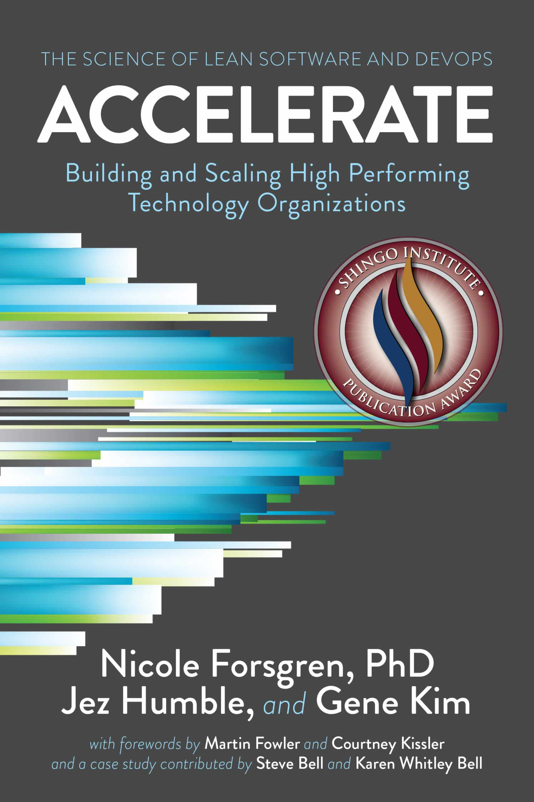

Accelerate is the empirical research behind books such as [The Phoenix/Unicorn Project](https://swizec.com/blog/the-phoenix-project-recap/) and (parts of) [Software Engineering at Google](https://swizec.com/blog/what-i-learned-from-software-engineering-at-google/). I loved it.

[Accelerate](https://itrevolution.com/product/accelerate/) describes 4 years of research into _"What makes one technology organization more successful than another?"_.

It's not a framework, it's not the code they write, it's people and processes. The authors find that across thousands of teams and companies, **iteration speed** is the strongest predictor of commercial success. The faster you can bring products/features to market and respond to user feedback, the more successful you'll bee.

That is the thesis I've hinged my [Scaling Fast book](https://swizec.com/blog/scaling-fast-my-talk-on-lessons-from-tech-startups/) on so this is perfect timing 🤘

The book is well-worth a read. Short and to the point, lots of good advice. First part is takeaways. Second part is how to do research like this. Third part is 1 chapter on how to put this into practice – feels like a trailer for another book.

## Here are the key takeaways:

1. Your tech stack has zero predictive power of success
2. Product delivery cycle times are key
3. The "Iron Triangle" is wrong – faster delivery means _fewer_ bugs _and_ cheaper software (less rework, fewer missed requirements, less time)

These are [DORA metrics](https://dora.dev/guides/dora-metrics-four-keys/), you should keep track of these if you aren't.

4. Use continuous delivery – this has some pre-reqs (automated deploys, enough tests, ...) and directly leads to better DORA metrics
5. **Build a learning organization** – use mistakes to improve the system, not punish individuals
6. Build a generative collaborative culture
7. Faster delivery with less bureaucracy makes employees happy and reduces burnout
8. Use lean development practices – reduce work-in-progress, get feedback from production, make work visible
9. Change approvals should be quick and easy
10. Work in small batches
11. **DO NOT copy paste processes** from other teams and companies. Focus on the outcomes and iterate your way to a process that works for your team and situation.
12. Do surveys of what the day-to-day work feels like. Then fix the problems

Cheers, 
\~Swizec
