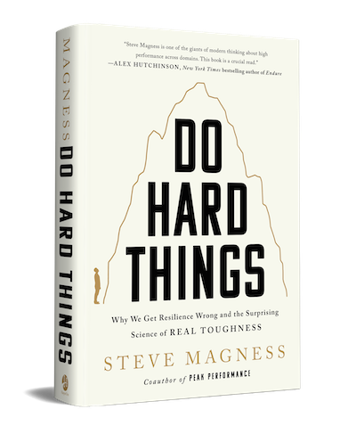

Do Hard Things is a recent book from an author of my favorite book about burnout (Peak Performance). It talks about why our traditional view of toughness is wrong.

[Do Hard Things](https://www.stevemagness.com/do-hard-things/) is one of those books that you read and think _"Wow that was amazing, I learned so much"_. Then it embeds deep in your subconscious and 2 days later you struggle to summarize. You have always understood its lessons.

That is to say, you should read the book \[name|]. My summary can't replace the way Magness weaves story and science together to change who you are as a person.

Thanks to Andrew for recommending this book. It was great ❤️

## Tough guy machismo is the opposite of tough

Do Hard Things starts by dispelling the myth of the tough guy macho man. The caricature of tough we see on TV, the internet, and in many misguided coaches and bosses.

These people use toughness as a defense mechanism to hide their inner fragility. Pierce the veil and it all falls apart. The veneer shatters and behind the bluster there's nothing left. When the going gets tough these people cannot perform.

True confidence is quiet. A king doesn't have to _say_ he's king. You'll know from their actions.

_Sidenote: this does not mean suffer silently. Asking for help takes strength and is the brave thing to do._

## Filtering is not training

Throughout the book Magness explains that when we see movie portrayals of military training and read books about SEALs hell week and watch Master Chef and take lessons from Olympic tryouts, we're trying to learn from the wrong part of the cycle.

Those ordeals are about _filtering_. They exist to put people in situations that simulate the toughest parts of what they might face on the job.

This is crucial. You want firemen who can run into a burning building and cary casualties out on their shoulders.

_But_ you don't **train** firemen by sending them repeatedly into burning buildings and saying "The good ones will survive". No. You train first, nurture progress, _then_ you evaluate and put those who can't do the work through even more training.

Ideally filtering isn't one and done. It should be a test of whether you meet the bar or need more training.

## Expectations pair with nurture

That segues into Magness's next point, also seen in many parenting books.

👉 to create high output (defined loosely) individuals and teams, you have to pair high expectations with nurture and support.

If all you have are high expectations, that's tyranny. Not good.

If all you have is nurture and support, that's directionless wandering. Not good.

Strike a balance. Have high expectations so people have that necessary challenge for growth then offer support and nurture to help them get there.

## Only intrinsic motivation lasts

The biggest downside of the tough guy macho man boss, coach, or parent is that their attitude breeds fragile humans.

When you teach someone to work hard when you're yelling at them, what do you think happens when you're not there?

I use "yelling" in the colloquial sense here – talking down to someone regardless of volume; you can berate or chastise someone, in a low tone of voice, and be yelling.

Same is true for praise. If you teach someone to work hard when they're showered in praise, what do you think happens when you're not there to hand out the stickers?

That's right. Their performance falls apart. Boss walks out of the room and work stops. Coach has a sick day and athletes chill. You achieve your goal and think _"Now what?"_

This ties into growth mindset stuff. Praising the work, not the achievement.

## Embrace discomfort

Finally the book talks about discomfort. Because hard things are hard.

There are 2 strategies for managing discomfort:

1. Disassociation
2. Focus

**Disassociation** is any time you avoid thinking about the discomfort. Pulling out your phone the moment your friend walks to the bathroom and you're alone. Thinking about anything but the pain of running.

**Focus** is when you zoom into the discomfort and observe. Focus on the pain and how it feels.

In sports, both strategies work. Amateurs prefer disassociation. Professionals prefer focus. But the winners do both. Disassociate through the easy parts and bank your mental stamina for later when you need to focus on the hard parts.

Cheers, 
\~Swizec
