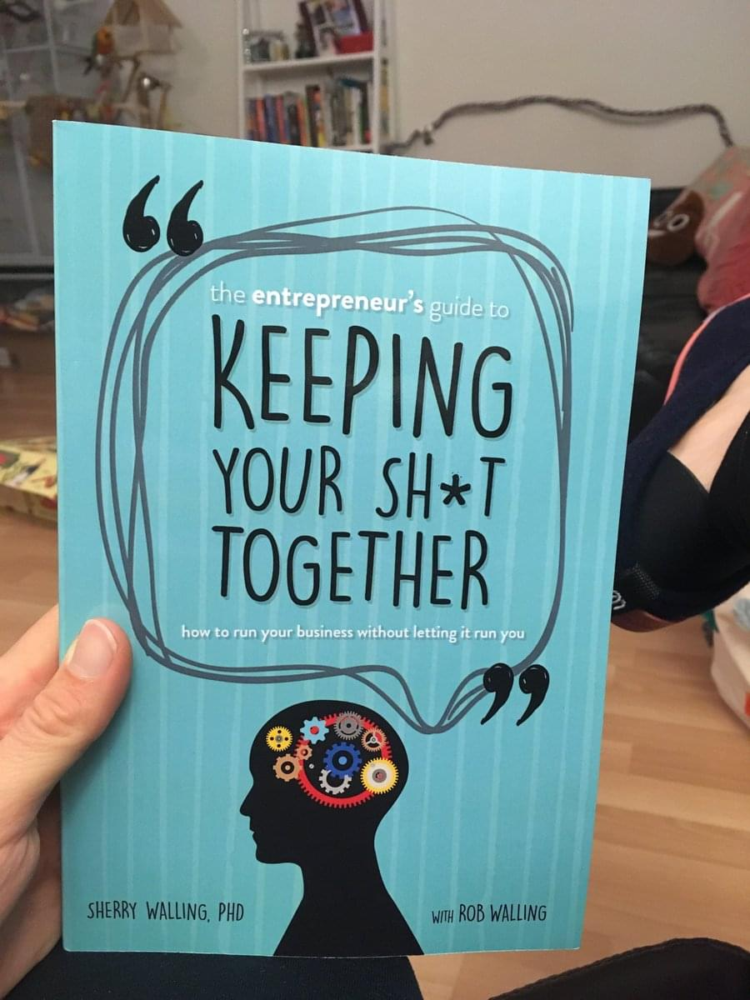

I started reading Sherry Walling&#x27;s _The Entrepreneur’s Guide to Keeping Your Sh\*t Together_ more than a month ago. It&#x27;s a 164 page book. I finished a week and a half ago and haven&#x27;t found time to condense my thoughts until now.

Talk about needing to keep my shit together 😅

https&amp;#x3A;//twitter.com/Swizec/status/969451663684657152

Sherry Walling&#x27;s book is great. You should read it.

A little light on practical advice, heavy on understanding _why_ you feel overwhelmed. The writing is light enough to read with half a brain thinking about the pressures that are making you feel overwhelmed.

Perfect targeting 👌

Keeping Your Sh\*t Together is one of those books that you should Just Read™. It&#x27;s hard to condense into a few bullet points of practical advice. You read it and its lessons sit somewhere deep in your subconscious. When you face a situation or recognize a pattern, your mind says _&quot;Ah! I&#x27;ve read about that before! I wonder where?&quot;_

## The Important Learnings

Walling talks about different founders having different modes of working and how that contributes to their stress and overwhelmedness. When they are stressed, some people tend towards chaos. They say fuck it and throw caution to the wind. Others say, “Ok, shit. I need to get organized,” and become too rigid.

So you have to look into yourself and see what&#x27;s up. If you&#x27;re too unstructured, adding some structure to your life will help. If you&#x27;re too structured, letting go will help because you can&#x27;t control everything.

And you should have a growth mindset always.

She says that vacations also help and are \\important. You are human, and you should keep yourself human. Sometimes, if everything is falling to shit around you, the best thing to do is to take a step back and go on vacation. The steaming pile of dung will still be there when you get back, but you&#x27;ll have a fresh perspective.

And maybe you should try yoga. It relaxes and creates space.

If you feel like there isn&#x27;t enough time in the day to get everything done, time is rarely the problem. You&#x27;re probably suffering from a mindshare issue. Something weighing on your mind? That&#x27;s gonna seep into all other tasks and make them slow. No good.

Manage your _energy_, not your time.

And avoid chronic stress. Acute stress makes you crazy productive and focused. Like an imminent hard deadline. Chronic stress makes you dead. Literally, it can take decades off your life span.

So take a break.

Oh, and your company can&#x27;t love you back. You feel towards your company like you would towards your baby. MRI scans show evidence of this. Same regions of the brain light up when you think about your baby or about your business.

But a baby can love you back. A business cannot.

And avoid burnout. You burn out when you have little social support, feel like your goals are meaningless, and have chronic stress.

https&amp;#x3A;//twitter.com/Swizec/status/976667477080813569

Once you burn out for real, it can take years to come back.

5/7 book. Recommending Sherry Walling&#x27;s _Entrepreneur&#x27;s Guide to Keeping your Sh\*t Together_ to everyone I know who&#x27;s feeling whelmed.