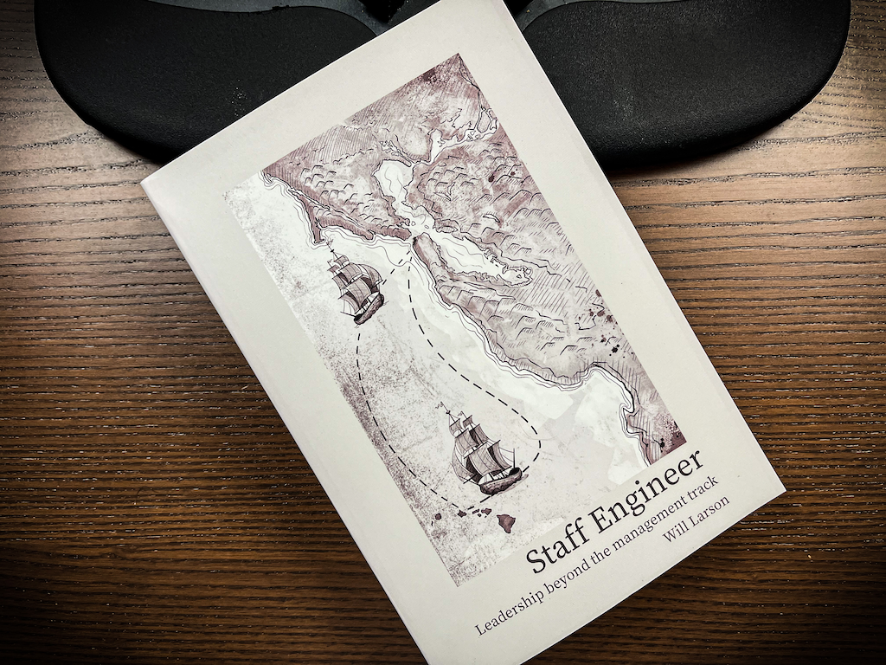

Staff Engineer was one of the more impactful books I've read in recent months. Went through the audiobook soon after [becoming tech lead](https://swizec.com/blog/on-becoming-tech-lead/) so the timing was perfect.

[The book](https://staffeng.com/book) extracts lessons on being a staff+ engineer from conversations with 14 staff engineers at different companies. Full transcripts (cleaned up, I assume) are included in the book.

Larson uses the same questions for every conversation so you get a good comparison of what being staff looks like.

Here are my highlights 👇

## Titles don't matter, unless you're not a white male

Staff is not "senior but more". It's a different job based on influence and leadership without authority. That means achieving _your_ goals in part through the work of others.

America being what it is, doing that is easier as a white male. You don't need to flaunt your title because you have "traditional signals of authority".

For women and minorities, having the title makes a big difference. Instead of wasting time justifying their presence and proving competence, they can say Staff Engineer and everyone gets it.

## Becoming staff is rare

You are expected to grow into a senior engineer.

You are _not_ expected to go beyond that. Staying senior forever is the norm. Growing into staff and beyond is the exception.

## What _is_ staff

Staff is a new-ish title that gained prominence in the last 5 to 10 years as a grab bag of roles that sit between senior and principal engineer. The titling between companies is inconsistent, the requirements are vague, and few resources about it exist.

The common thread is this: A staff engineer is an individual contributor with broader team/company impact.

Larson describes [4 staff engineer archetypes](https://staffeng.com/guides/staff-archetypes):

1.  **tech lead** guides the technical vision and execution of a team
2.  **architect** holds the technical vision of a particular area
3.  **solver** floats around the org and solves gnarly problems
4.  **right hand** extends an executive's attention

Tech lead is the most common and first to arise. Great fit for modern organizations where engineering management is considered orthogonal to technical leadership. Manager thinks about people issues, tech lead thinks about technical issues.

Architects and Solvers are similar in that they focus on deep technical expertise and don't belong to a team. Difference is that solvers move between difficult projects and architects stay put in their area of responsibility.

Right hands happen in large organizations where too much is happening for one executive to oversee.

## Being in The Room

A big part of operating at the staff level is Being in The Room, the one where decisions happen and plans are made.

You get pulled into those early meetings about the future roadmap. Before sprints are made and stories defined. You get a chance to help define scope and find ways to achieve results without breaking the space-time continuum.

If you've ever felt like unrealistic ideas come from up high and you're expected to deliver no matter what, staff is your chance to shape that.

But!

The title gets you in the room. It's _your job to stay_ in the room. Show that you bring value and want to be there.

## Sponsoring others

It surprised me how much the 14 staff engineers in Larson's book talked about sponsoring others.

This means creating space and incentive for others to shine. Encourage engineers to present at company meetings, push them to share talks about their work, invite them to The Room when appropriate, empower them to hone their soft skills and be the face of a project.

All those things others did for you, whether you know it or not, that got you opportunities to practice being staff.

Everybody already expects _you_, the staff engineer, to speak up. Push others to have their time in the spotlight.

## Focus on energizing work

> I've taken to using the word "energized" over "impactful". Impactful feels company centric, and while that's important, energized is more inwards looking. Finding energizing work is what has kept me at Stripe for so long, pursuing impactful work.
> ~ Michelle Bu

**Avoid snacking**. Low-effort, low-impact work gives you a sense of accomplishment, checks things off the todo list, and wastes your time.

Cheers, 
~Swizec
