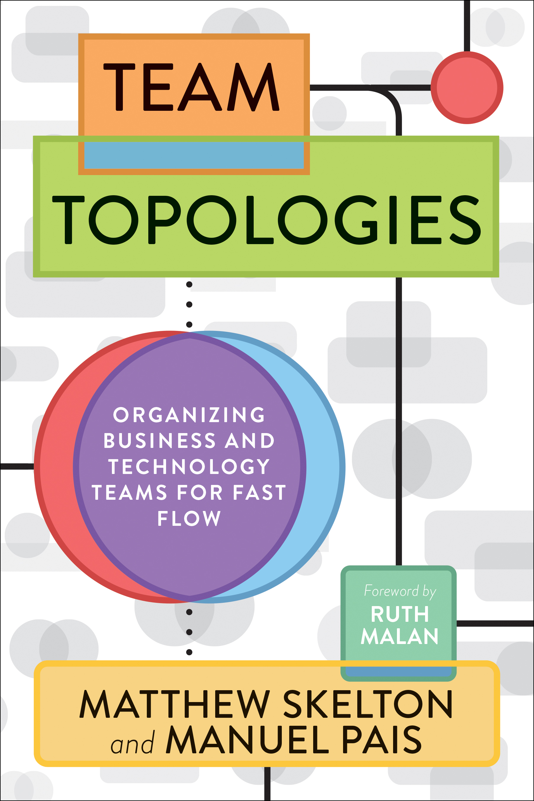

You can't escape Conway's Law. Might as well use it for good.

That's the core lesson from [Team Topologies](https://teamtopologies.com), a book on engineering org design. Or maybe software design. It's hard to tell 🤔

The authors' message is that that's the same thing. You design an engineering team _to_ design your software. That's what good architects do.

Team Topologies is an easy read. Strong recommend. I blazed through the audiobook on a single Sunday run a while back. Here's the good shit that stayed.

## Conway's law

In case you haven't heard, [Conway's law](https://en.wikipedia.org/wiki/Conway's_law) says that the structure of your software will naturally follow the structure of your org.

> Any organization that designs a system (defined broadly) will produce a design whose structure is a copy of the organization's communication structure.
>
> — Melvin E. Conway

You can fight against this, or you can embrace it.

## Scaling teams is a technical problem

There are two types of "scale" in software:

1.  Performance scale
2.  Team scale

**Scaling for performance** means building software that can handle more load. More requests, heavier requests, faster responses, etc. This is the scale we bicker about online.

https://twitter.com/Swizec/status/1682083824434577408

**Scaling for teams** means building software that more people can work on. How do we work without stepping on each other's toes, avoid too many cooks in the kitchen, ensure consistency, avoid bugs when the left hand doesn't know what the right is doing, etc.

https://twitter.com/Swizec/status/1648675877260017667

Microservices are the canonical example of scaling for teams _not_ performance. I first wrote about this back in 2019 in [What Microservices are for](https://swizec.com/blog/what-microservices-are-for/). On paper, microservices make your software slower – you're replacing fast function calls with slow network calls – but they help large teams to work together.

And I had this thought again in 2022 with [Scaling Teams is a Technical Challenge](https://swizec.com/blog/scaling-teams-is-a-technical-challenge/).

Now, because your software is eventually going to reflect your team structure, that means _team design is a technical problem_. You are designing your software by designing your teams.

## Reverse Conway manuever

Team Topologies takes this "team design is a technical problem" approach even further and suggests using it aggressively.

See a big ball of mud that needs cleaning? Assign ownership of different parts of the ball to different teams, wait for engineers to duke it out, voila you have 2 modules.

The process is messy and annoying and your engineers might hate you. But if you say _"No this is the way, just try it. I trust you to figure it out"_ then give the teams enough time and space and management cover, they will split the domains.

Because they'll be too annoyed bumping into each other. Boundaries _will_ show up. It's great.

If you find yourself in a confusing situation with another team where you suddenly have weirdly shared ownership of a domain you barely understand, this is likely what's happening. ✌️

## Two types of teams

Like many others, Team Topologies recommends 2 types of teams using its own words:

1.  Vertical teams – can deliver user value end-to-end
2.  Horizontal teams – build platforms for vertical teams to use

Team Topologies calls the first a "flow aligned team" and I forget what they call the 2nd. It doesn't matter, the point is in the concept.

For a team to be truly independent, _it needs to own the full stack of its domain_. Build features from idea to deploy without having to wait on others.

You see this concept in [The Phoenix Project](https://swizec.com/blog/the-phoenix-project-recap/), The Unicorn Project, the [Empowered](https://swizec.com/blog/scaling-teams-is-a-technical-challenge/#vertical-features) teams book, and a bunch that I'm forgetting. Everyone eventually learns this lesson – being blocked by others sucks.

And my own pet theory is this: Much of engineering meta-work, the kind that doesn't directly drive user value, comes from poor org design.

Cheers, 
~Swizec

PS: as an experiment, I had ChatGPT write [a version of this newsletter](https://chat.openai.com/share/748066a1-6d1c-4330-87b1-1a8c41f22cff). It was pretty okay
