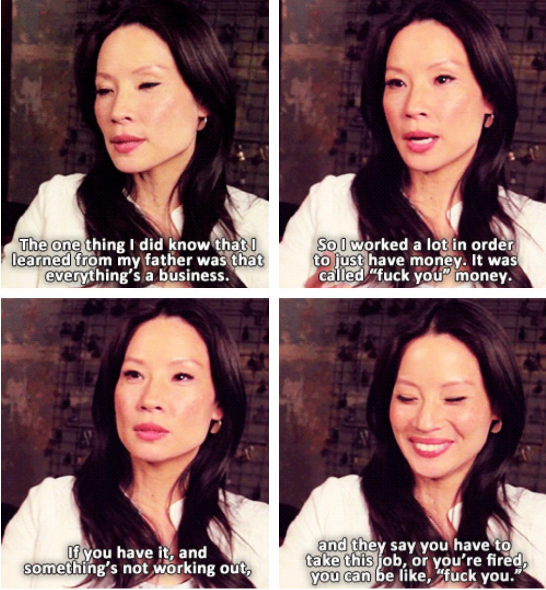

Money and career has been on my mind lately. Lots of conversations. Here's what I uncovered.

The question folks are asking is this 👉 With global economy in turmoil, why are stocks up? Why are experienced engineers getting hired faster and junior engineers struggle more than ever?

It's a good question.

I think it's because hiring incentives in tech are shifting.

## Old incentives in tech

When we talk about "tech", we mean VC-backed startups with the stated goal of becoming a billion dollar unicorn. Some make it, most don't.

Companies _say_ they're building a product for a market, but look behind the curtain and you'll see the product is irrelevant. At least at first.

_The company_ is the product, investors are the customer.

What do investors want? A big company.

How do you get a big company? Headcount.

Companies want to hire fast, fire slow, and accumulate lots of cruft. Get 5 junior engineers, let them loose, and wow your valuation looks great.

You added 5 whole engineers! Awesome 😍

How much they get done, how many wheels they invent because they don't know wheels exist, how much your code looks like duct tape and chewing gum 👉 irrelevant.

As long as you have 1 or 2 senior engineers for every 5 to 6 juniors, you'll be fine.

## New incentives in tech

With the uncertain future, free money is slowing down. \[^1]

Companies realized winter is coming and it's time to start _making_ money. Like, you have to **build a business.**

> Wtf that's not what we signed up for ~ every "entrepreneur" with a rich mommy and daddy

First thing that happened were rounds of layoffs at big companies. Even engineers got fired.

Everyone who wasn't directly involved with bringing home the bacon, gone.

## Who do companies hire when engineers need to bring home the bacon?

They hire seniors. Because seniors get shit done.

And they avoid juniors. Because they don't have the time to train them.

It's unfortunate and juniors aren't making it any easier. To a hiring committee or an HR person they all look the same.

Friend of mine recently said: _Yeah I was part of hiring at my old job and one day I went through 200 resumes and couldn't find one single thing to tell them apart_

Everyone looks the same!

Yay graduated from X with GPA, did extracurricular Y, part of frat Z, went to bootcamp Q, super duper know tech A, B, C.

That shit matters if you have nothing better to show.

**_Do_** something.

PS: this is an area I'm figuring out how to help with. Hit reply if you're interested.

## What if you were paid like an athlete?

Say you're a senior or have a way to stand out from the crowd.

This gives you leverage.

Companies want _you_. Not any schmuck who can type code into an editor, _you_. _Your_ experience, _your_ expertise, _you_.

Not saying it's easy to get there, saying it's realistically doable ✌️

Past a certain level companies stop seeing you as a code monkey. They don't care about your hours, lines of code, or tickets closed.

**Companies care about the systems and tools you put in place to make the whole engineering team run better, do more, and make bank.**

You're paid for value, not work.

Now what? Cash, baby.

https://twitter.com/Swizec/status/1288553126773940224

This is a simplistic model of what you could achieve with a pretty basic "The Tech" career ladder for a software engineer. [Here's a more realistic version](https://twitter.com/ArvindVermani/status/1288869833539551235) from [@ArvindVermani](https://twitter.com/ArvindVermani).

You start with a salary and no wealth. 6-figures is common.

Then you switch jobs _regularly_. [About 2 years is the median tenure in tech. 4.7 years across all industries](https://carta.com/blog/employment-tenure-startups/).

Don't worry about looking like a job hopper. Everyone does it.

Reid Hoffman calls this the [Tour of Duty model](https://hbr.org/2013/06/tours-of-duty-the-new-employer-employee-compact).

Avoid saying it out loud and you'll be fine 😛

A 30% raise is common when switching jobs. Lots of advice on salary negotiation and how to make this happen.

I recommend [Josh Doody's Fearless Salary Negotiation](https://fearlesssalarynegotiation.com/). He's helped me in the past.

And lest you worry that a few 30% jumps lead to unrealistic numbers, check out [levels.fyi for SFBA](https://www.levels.fyi/Salaries/Software-Engineer/San-Francisco-Bay-Area/). $500k+ for 10 years of experience is normal.

Yes that means you'll have to bring the bacon. The game is not "sit around and wait", it's **"get aggressively better and work"**.

## What about the athlete thing?

Athletes are paid for value.

Sponsorship money. Notoriety. [Daniel Ricciardo is the 4th highest paid F1 driver](https://www.racefans.net/2020/03/30/how-much-are-f1-drivers-earning-in-2020-and-should-their-fees-be-capped/) despite bad race results.

But he looks good on camera and has a fanbase. Value.

Your value is the expertise, the experience, the not gonna make avoidable mistakes that cost us 3 years to fix.

Tech contracts come with a 4 year vesting cycle. You're incentivized (but not required) to stay 4 years.

Here's how to shift your mindset 👇

https://twitter.com/Swizec/status/1289239363746856960

cash and bonuses included, equity is the unpredictable icing on top

Happy Friday,  
~Swizec

PS: my model above includes 7% investment returns because that's the standard rate everyone uses when talking about "the economy as a whole long term". Individual results vary and years like 2020 are bad.

\[^1] free money has weird effects right now because investors want their average returns and have nowhere to put the money
