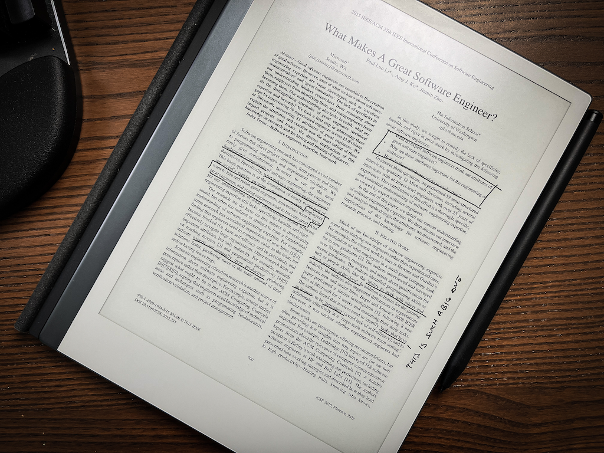
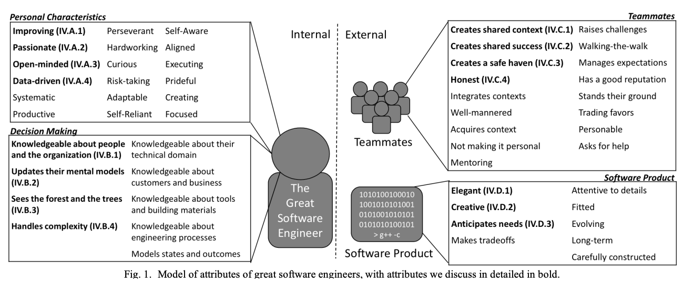

In 2015 a group of researchers asked 59 experienced engineers at Microsoft _"What makes a great software engineer?"_. Here's what they found.

Paul Luo Li et. al. noted that _"employers want to hire and retain great engineers, universities want to train great engineers, and young engineers want to become great"_. But there's no good definition of what that even means.

They figured great recognizes great and ran a series of interviews aimed at figuring out:

- What do expert software engineers think are the attributes of great software engineers?
- Why are these attributes important for the engineering of software?
- How do these attributes relate to each other?

You can [read the full paper here](https://faculty.washington.edu/ajko/papers/Li2015GreatEngineers.pdf).

## Traits of a great software engineer

Researchers grouped the 53 attributes of a great software engineer into 2 categories: Internal and External. Those further split into Personal Characteristics and Decision Making, and impact on Teammates and Software Product – what your code is like.

### Personal characteristics

Personal characteristics are about who you are as a person. Interviewees felt these cannot be learned at work. Reinforced and improved yes, but not learned.

Not a DEI problem at all 🤔

Psychologists say that [personality does change with age](https://www.apa.org/monitor/julaug03/personality) and practice. Takes work though.

1.  **improving** – constantly finding ways to improve, do things better, and keep up with trends in their field.
2.  **passionate** – intrinsically interested in the area they are working, not there just for the money (although money is nice). Finding person-project fit matters.
3.  **open-minded** – willing to let new information change how they think. If the facts change, your understanding should change.
4.  **data-driven** – using data to make decisions rather than guessing. And if you are guessing, validate with data.

The other 14 traits are variations on _"Great engineers ship"_ and _"Great engineers focus on impact over effort"_.

### Decision making

Decision making traits are about your comfort with synthesizing context, probabilistic outcomes, and understanding how your decisions play out in the real world. Book knowledge is not enough.

1.  **Knowledge about people and org** – knowing who knows what, who has the right context to help, and finding the right people to help you. The bigger the company, the more this matters.
2.  **Sees the forest and the trees** – considering situations at multiple levels of abstraction. Technical details, industry trends, company vision, and business needs. How does each impact what you're doing?
3.  **Updates their mental models** – relates to being open-minded. How does your understanding change when you gain new information about the system? Something can be true and working even if it flies against every best practice you've heard.
4.  **Handles complexity** – reasoning about complex and intertwining ideas with agility. Part natural ability, part how you leverage tools to make it easier.

The other 5 traits in this category talk about skill. Do you have the raw skills and tools to bring your ideas to reality?

As Twyla Tharp, a famous choreographer, says in [The Creative Habit](https://www.simonandschuster.com/books/The-Creative-Habit/Twyla-Tharp/9780743235273) – *"Skill bridges the gap between vision and reality"*

### Teammates

Software is a team sport and how you interact with and empower your team matters. A lot.

1.  **Creates shared context** – adapting your message to the other person's understanding so you're both working from the same context. Shared understanding is essential to success.
2.  **Creates shared success** – as my manager calls it _"We succeed and fail as a team"_. You give credit where it's due and don't take too much for yourself.
3.  **Creates a safe haven** – if engineers are afraid of mistakes, their growth slows. Making it safe to fail is paramount. But you need the space to learn from mistakes too.
4.  **Honest** – if you can't rely on people's words, you're gonna have a hard time. Keep it focused on solving the problem, not blame.

You can summarize the full 17 traits as _"Don't be a dick"_ and _"Foster psychological safety"_. The biggest, if not only, [predictor of successful engineering teams](https://www.nytimes.com/2016/02/28/magazine/what-google-learned-from-its-quest-to-build-the-perfect-team.html).

I would highlight that **Asks for help** was among these traits. Beats getting stuck.

### Software product

The craft of engineering. What your code and architecture looks like. How you solve problems. The part everyone focuses on the most.

Notice that it's last on the list.

1.  **Elegant** – elegance is the most revered. Hard to put into words. It comes down to taste, I think. Does this engineer have good taste?
2.  **Creative** – there are 2 parts to creativity. First is the ability to create novel solutions in the right context, second is knowing when _not_ to invent something new.
3.  **Anticipate needs** – software that keeps running and adapting to changing requirements with minimal intervention is considered wonderful. But you can't make it so future proof that it slows you down too much today.

The other 6 traits are what I would call _"Showing you care"_. Attention to detail, fit for purpose, ...

## The research isn't perfect

You should [read the full paper here](https://faculty.washington.edu/ajko/papers/Li2015GreatEngineers.pdf). Nice accessible read over coffee. I found myself nodding along.

The research _is_ limited to experienced engineers at Microsoft and may not generalize to every situation. Pick and choose what fits.

And remember: 99% of engineering literature online focuses on _how_, not _what_. But it's the _what_ and _why_ that make a senior+ ✌️

Cheers, 
~Swizec
