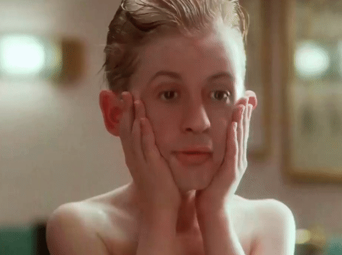
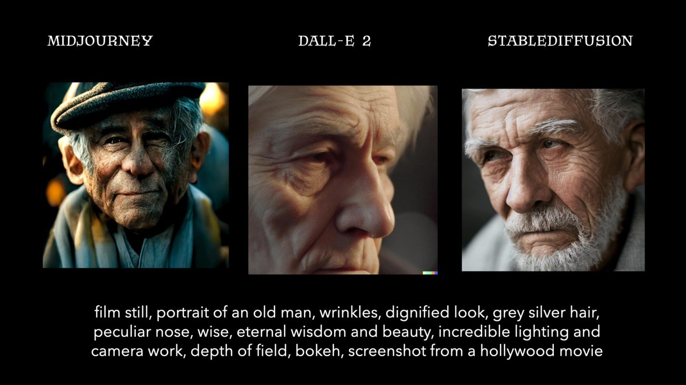
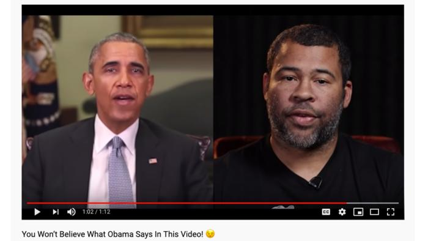
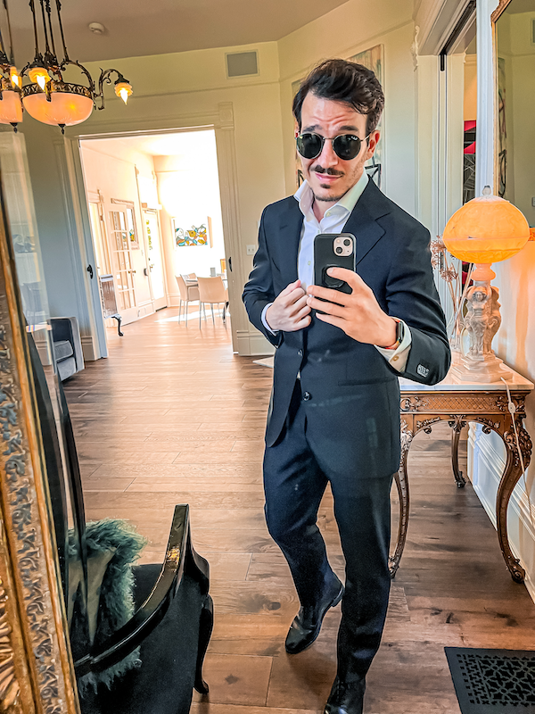
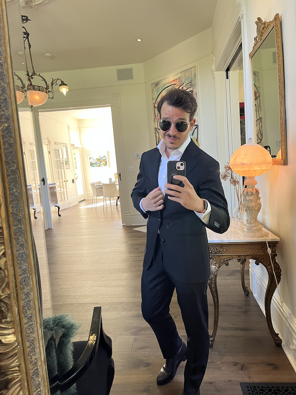
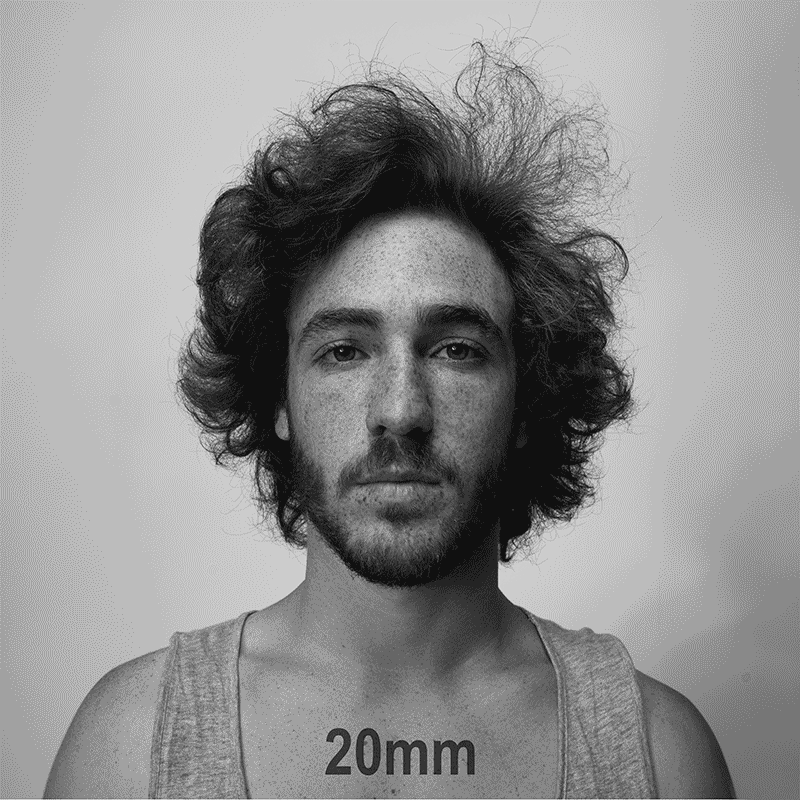
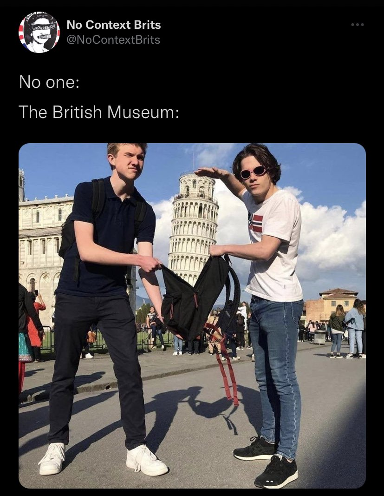

What does a real image look like? The rise of modern AI photo editing and generation tools makes this an interesting question.

People fear it's getting too easy for friends to take a photo of you and create a whole video where you're doing something weird. Like star in a Home Alone movie.

[Home Stallone](https://www.youtube.com/watch?v=2svOtXaD3gg) is pure fun. We all know Sylvester Stallone wasn't in Home Alone because there's decades of documented evidence.

Plus deepfakes aren't _there_ yet. You can [ask a suspicious video participant to look sideways](https://mindmatters.ai/2022/08/a-novel-trick-for-detecting-deepfakes-a-sideways-view/) and the current generation of AI will mess up their nose. Folks have started [using deepfakes to scam through interviews](https://mashable.com/article/deepfake-job-interviews-fbi).

## Deep-ish fakes are here

What happens when deepfake tech becomes even easier to use?

My iPad already has a feature to "seamlessly remove objects from a photo using AI to fill in the blank". Photoshop. Works great. 2 taps.

When anyone could have a Rule 34 photo floating around the internet. Do we freak out or roll with it?

I hoped this freedom would come with social media. Everyone says stupid shit online and everyone has past beliefs they’ve outgrown. So what’s the big deal?

Instead we went the opposite way. Everyone is super self conscious and censoring at all times because you never know who’s gonna take it out of context and make a big deal.

Like that [dad who got banned from Google for sending a photo of his son to a doctor](https://nypost.com/2022/08/22/google-bans-dad-for-sending-pics-of-toddlers-swollen-genitals-to-doctor/). In the near future someone could send you a questionable deepfake photo and get you banned from anything 🤔

## Are any modern photos real?

Truth is, photos have never been _real_ real. They involve processing. Digital, chemical, or optical.

We can all agree these aren't real photos of an old man.

Matt Growcoot [used the same prompt to compare AI image generators](https://petapixel.com/2022/08/22/ai-image-generators-compared-side-by-side-reveals-stark-differences/). Nothing in these images is real in the sense that photons never bounced off the subject into a recording device. Drawing from imagination.

What about this [video of Jordan Peele "driving" Obama's face](https://www.commonsensemedia.org/articles/common-sense-explains-what-are-deepfake-videos)?

Obama's speech happened and was recorded with a regular camera. Jordan Peele's video happened and was recorded with a regular camera. Then researchers (artists?) merged the two so the video looks and sounds like Obama saying Peele's speech. 🤔

What about this photo?

Obvious photoshop. I took a photo of myself, tapped "select subject" in Photoshop, deleted the background, and replaced it with the first search result for "lambo". Took 2 minutes.

If it's made of real photos, does that make it real?

What about this one?

The entire photo looks as it did in reality. Except the colors are punched up with Lightroom. That makes it look more exciting.

Maybe punched up colors are not real. What about this photo then?

Here the photo looks just as my iPhone 13 mini took it. But the phone uses [advanced algorithms to fix colors and lighting](https://www.researchgate.net/publication/266656189_Advanced_color_processing_for_mobile_devices). As the [New Yorker put it](https://www.newyorker.com/culture/infinite-scroll/have-iphone-cameras-become-too-smart):

> Apple’s newest smartphone models use machine learning to make every image look professionally taken. That doesn’t mean the photos are good.

Yes the photo looks similar to what I saw. But there's magic afoot. Taking that same photo with my DSLR that doesn't have Apple's algorithms wouldn't have worked.

Lots of light from the back. My face would be dark.

And did you know that until recently cameras weren't able to [accurately capture black faces](https://www.vox.com/2015/9/18/9348821/photography-race-bias)? Not even old analog film cameras.

## Were photos ever real?

Even before digital buffoonery you couldn't _really_ trust a photo. Cameras see differently than your eyes. A lot like [using data to lie with facts](https://swizec.com/blog/how-to-lie-with-facts/).

Focal distance changes how your face looks.

Which of those is the photographer's real face? Your brain can adjust and say "They're all the same". But they don't look the same do they?

Journalists use framing, perspective, and optical tricks to push a narrative. Like in this famous example of early Covid coverage.

https://twitter.com/baekdal/status/1254460167812415489

Which of those is the real photo? They both happened at the same time in the same place. Different angle and lens.

Is this a real photo then?

🤨

Cheers, 
~Swizec

PS: this probably wasn't an excuse to show off how good I look in a suit. It's from [a HackerNews discussion](https://news.ycombinator.com/item?id=32556107), but [our brains are lying to us all the time](https://en.wikipedia.org/wiki/List_of_cognitive_biases) so who knows
