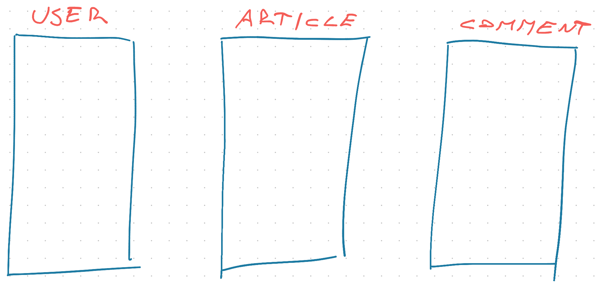
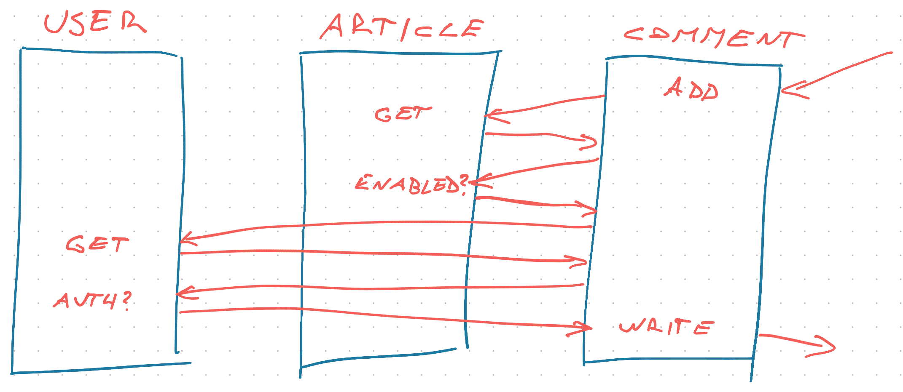
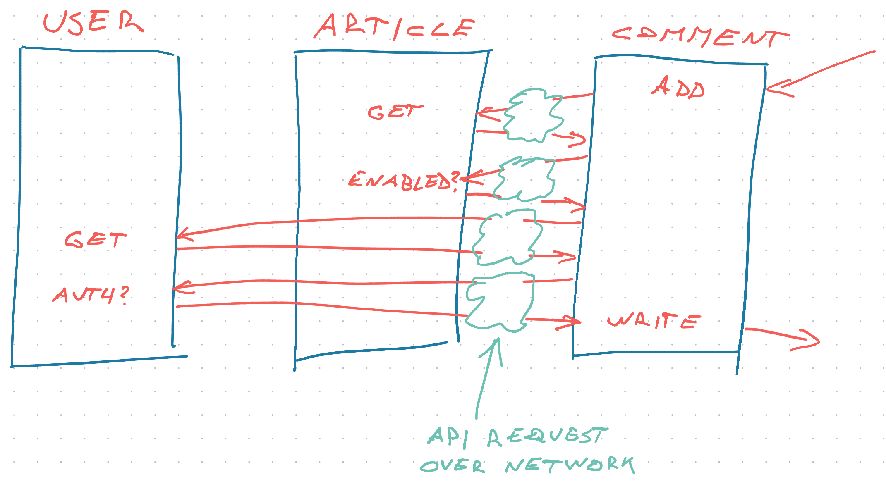

Microservices are a pain in the ass. They turn every system into a byzantine mess of complexity. But this week ... they saved my butt.

You'll see people talking about how microservices enable scale. They do. But not scale in a computer performance sense! Microservices are _worse_ for performance. They're about scaling teams!

The ultimate evolution of [Conway's Law](https://en.wikipedia.org/wiki/Conway%27s_law)

> Any organization that designs a system (defined broadly) will produce a design whose structure is a copy of the organization's communication structure
> ~ Melvin E. Conway

Microservices take that idea and say _"Yeah that sounds great!"_. You take your teams, give each a small subsystem to maintain, make them talk through APIs, and hope for the best.

You get systems like this:

https://youtu.be/y8OnoxKotPQ

Look why is this taking 3 years? It's not that simple! Fills whiteboard with incomprehensible scribbles of all the services required to make a login button.

😅

Makes you [pine for the good old monolith days](https://www.craigkerstiens.com/2019/03/13/give-me-back-my-monolith/).

## Microservice vs Monolith

A well-structured monolith will get you far. But the discipline to keep a monolith well-structured ... oof.

_"The code is right there! Why can't I just use it 😩"_ ~ me, every time

You start a monolith with some sensible design. Fat controllers, fat models, fat services, fat components. _Somewhere_ in your code lives The Business Logic and everything else calls that.



Sliced based on areas of concern. Fantastic. The `User` module has functions to handle users, the `Article` module for articles, and `Comment` for comments.

The control flow to add a comment goes like this:



You call `addComment` on the `Comment` module and it talks to the `Article` module to get the article and check if comments are enabled. Then it talks to the `User` module to get the commenter and check if they're allowed to make comments. Finally it writes the comment.

Looks sensible as code:

```javascript
async function addComment(...) {
	const article = await getArticle()

	if (commentsEnabled(article)) {
		const user = await getUser()

		if (authenticatedToComment(user)) {
			await writeComment()
		}
	}
}
```

Here's an important question: where does the `commentsEnabled` function go? Is it more of an article concern or more of a comments concern. 🤔

Same for `authenticatedToComment`.

The answer almost doesn't matter in a monolith. You can `import * from 'Articles'` inside Comments and vice-versa. Call the function and VSCode will find where to import it from.

Throw everything on a pile, let computers do the searching.


### Microservices force the decision

In a microservice world, those modules live on separate machines. Different repositories even.



Each of those cross-module calls turns into an API request. With [all the necessary error handling](https://serverlesshandbook.dev/robust-backend-design)

```javascript
async function addComment(...) {
	let article

	try {
		article = await getArticle()
	} catch (e) {
		throw new Error("Failed to get article")
	}

	if (commentsEnabled(article)) {
		let user

		try {
			user = await getUser()
		} catch (e) {
			throw new Error("Failed to get user")
		}

		if (authenticatedToComment(user)) {
			await writeComment()
		}
	}
}
```

Getting the user and article isn't just a function call anymore. It may fail at any time for any reason. You have to handle errors.

It's an order of magnitude slower as well. Even the fastest API call on a private network takes a few dozen milliseconds. A comparable function call is measured in nanoseconds.

Suddenly it _really_ matters where you put `commentsEnabled` and `authenticatedToComment`. Are they an API call to the Article and User service, or a local function call? 🤔

I don't know the answer, all I know is that **microservices force the conversation**. And that's a good thing.

## This week microservices saved my butt

Aside from forcing the conversation about your architecture, microservices excel at one other thing 👉 partial deploys.

That's what saved my butt this week.

At work we're in a distributed monolith world. The worst of both worlds as we transition from full monolith to full microservice. The hard part is cleaning the concerns between modules.

Because of this micro-but-not situation we have to Deploy The World regularly. You never know if a feature is going to work unless everything's deployed together 😅

I did the deploy and assumed all was fine. As it was the last 20 times.

Then the Product Owner slacks me _"Hey Swiz I can't login"_

Ah shit ... dig into logs, find the only new commit on `auth-service`. Suspicous! No idea what the commit is doing or how. Rollback that one little service and voila the system comes back 🥳

To make it even more fun: another service failed to deploy at all. _And everything was fine_

Deploy a bunch of things, one fails, one gets rolled back, and everything is fine. That's what microservices are for.

Cheers,
~Swizec

PS: an issue that makes my User-Article-Comment example tricky is that it's based on object oriented ideas of entities. Imagine if the architecture was instead sliced by task – _actions_ users want to achieve. I once called that [The Magic Function Principle](https://swizec.com/blog/the-magic-function-principle/), but that doesn't quite fit. Noodling continues :)
