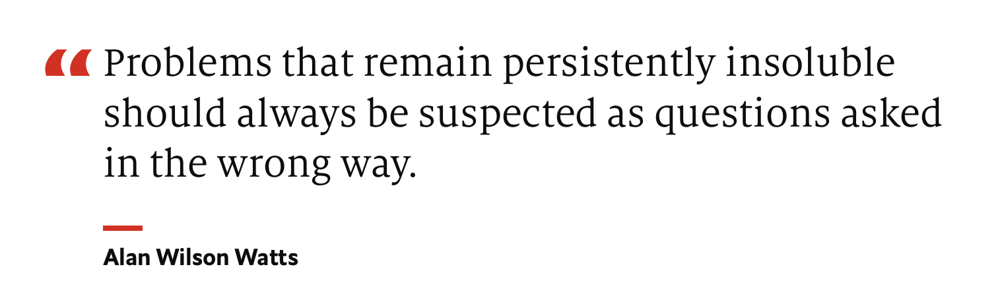

What do you do when every bug you fix creates 5 new bugs?

You could make a meme, patch the bug, and move on. The memes are funny and everyone can relate. We've all been there.

Or you could [own the outcome](https://swizec.com/blog/how-to-own-projects-like-a-senior-engineer/) and figure out what the heck is going on. _Why_ does every bug lead to more bugs? Something's wrong.

We talked about this on the [Senior Mindset Mastermind](https://swizec.gumroad.com/l/RnuqQ) group coaching call this week. Everyone had a fun story to share. Some were scary.

Like a single PHP file that runs a whole website and leads to 45 second page loads 😱

Every story had a few things in common:

- inexperience
- spaghetti code
- lack of leadership
- poor abstractions
- missing guardrails
- not understanding the problem

This happens fractally at every level. From a single function that grows edge cases and exceptions like weeds, to the team level where you have teams sliced by technologies instead of features and OKRs.

## How to fix the situation

The best thing you can do as a senior engineer in this case is to say _"Yo hold up! Something's fucky"_. Then _organize a meeting_. Get everyone together. Involve the stakeholders/customers if you can!

Make sure you understand the desired outcome. Then align the team on a vision of how to get there. Swarm sessions (topic from an earlier call) are a great tool for that.

You may need to tweak things with your PM. Sometimes they misunderstand the user or envision a feature that won't work because they don't know what you know. Be a [good partner, not a tool](https://swizec.com/blog/theres-two-types-of-engineers/) :)

## How to prevent the situation

Lead.

Focus on solving the problem, not the details of how the code is written. Design abstractions first, code second. Align on the contracts between functions/modules/services, worry less about the implementation.

Rethink and redesign as requirements change. You can't just glom onto the existing pile of mud.

Or you'll end up like this AI that learned to walk on its own 😆

https://www.youtube.com/watch?v=gn4nRCC9TwQ

Cheers, 
~Swizec

PS: If you want to improve your senior level thinking, consider joining the [Senior Mindset Mastermind](https://swizec.gumroad.com/l/RnuqQ). You get access to the full archive and we meet every 2 weeks
