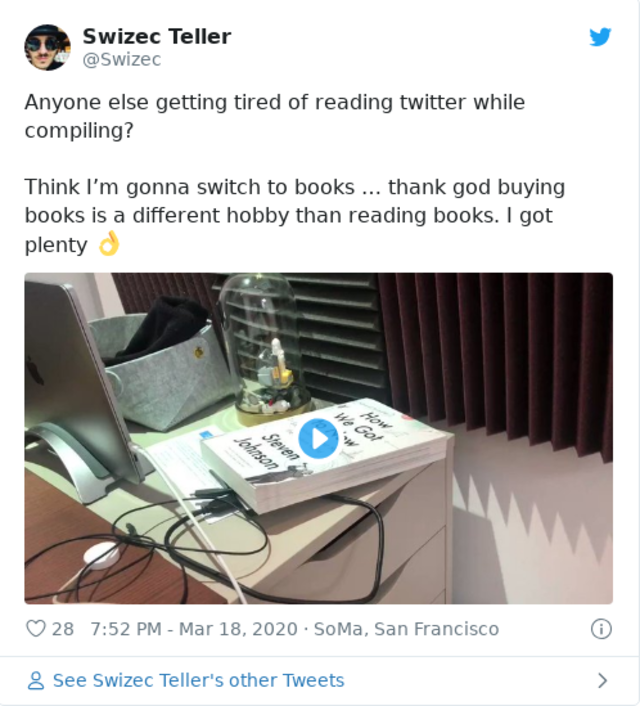

Dan Luu once wrote that the biggest detriment to his programming skill was wasting time. [\[1\]](https://danluu.com/p95-skill/)

> saw the same thing as in Overwatch, except instead of constantly making game-losing mistakes, I was constantly doing pointlessly time-losing things. Just getting rid of some of those bad habits has probably been at least a 2x productivity increase for me I noticed how I'd get distracted for N minutes if I read something on the internet when I needed to wait for two minutes ...

It me.

I work on a slow dual core computer – don't ask – and everything feels like it takes forever. Run rails tests, takes 20 seconds just to start. Run VSCode, takes 30 seconds to load the plugins, run ... it's slow.

So what happens?

Monkey brain kicks in and I switch to twitter, reddit, messages, work slack ... anything is better than the pain of staring at a screen waiting for the computer to do its thing.

Not enough time to context switch, too much time to sit and wait.

Sound familiar?

## Why you should reconsider

You don't want to hop online every time you wait, here's why:

1.  You _will_ come back later than you think
2.  It pollutes your mind space
3.  Makes you tired

Remember this unattributed quote

> The media doesn't tell you what to think, it tells you what to think about.

But you're supposed to be thinking about the work you're doing.

Even hopping on Slack to help a coworker has the same effect. You start thinking about something else. You start to solve _their_ problem, not yours.

How's that gonna help you focus? Will it make _your_ work easier?

Of course not.

## What you can do instead

Here's what I've been trying the past few months

1.  **Read books**

Reading books while waiting is fantastic. Read the whole Dark Tower saga waiting for video games to load back in high school. (even slower computer lol)

Nice thing about books is the single story you follow over days and weeks. No bite sized snippets on a bazillion topics. Just a nice slow progression.

Makes you feel rested, doesn't pollute your mind, gets your eyes off the screen.

Downside: you quickly realize that your looooooong wait times are actually pretty short. _What do you mean I only read half a page while this slow process took forever what the heck!?_

2.  **Do pushups**

Physical exercise works wonders.

Won't wanna keep doing it too long, keeps your mind clear, gets you away from the screen, takes just a few seconds. Great for body and soul.

Try squats also. Maybe a couple stretches.

Get off that chair and move a little my friend. Especially if you're working from home and stuck inside all day.

3.  **Take real breaks**

This one's killer.

Waiting? Bored? A little tired?

_❗️step away from the computer❗️_

Go make some tea. Go talk to your spouse. Annoy your cat. Clean the dishes. Take out the trash.

There's _so many_ little tasks around the house or office you can do in 5 minutes. Nice mindless tasks that let you relax the brain.

Yeah I know, it's easier to switch tabs or pick up your phone and read the internet. And that makes you more tired.

Happy Monday, may the 4th be with you ❤️

Cheers,  
~Swizec

PS: don't forget to take real breaks during this quarantine too. It's easy to forget PaidTimeOff exists while we all WorkFromHome. I went on a motorcycle adventure this Friday and it was amazing. Physically exhausting, mentally energizing.

