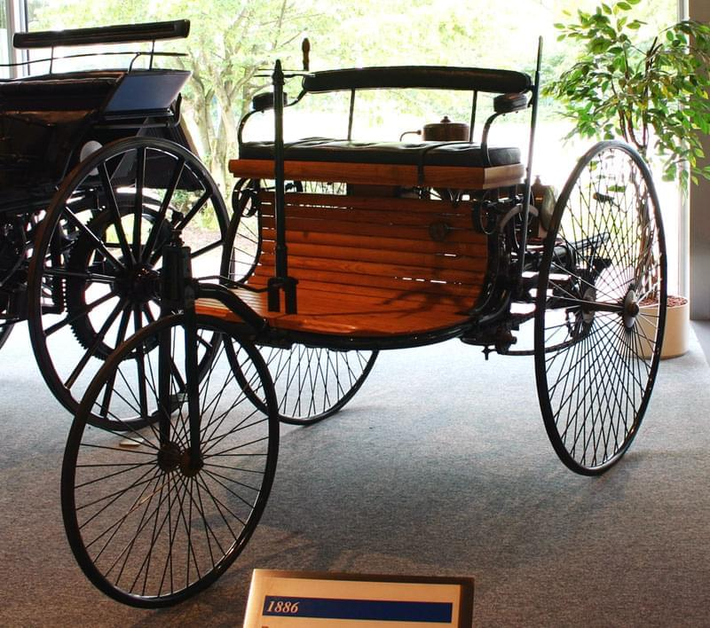
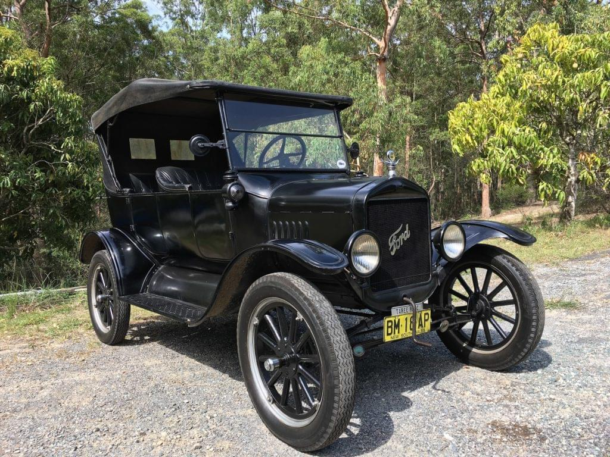

Mason writes on WIPchat 👇

> @swizec I&#x27;ll be partnered on a project with a less experienced dev soon. We&#x27;re going to use Gatsby, and he&#x27;s never worked with React (but knows JS). First thing I did when the boss told me was to send the other a dev a link to your [Learn While You Poop](https://twitter.com/Swizec/status/981932124231024640) thread 😊

Thanks mate!

> This is also funny because **the PM approached me like I&#x27;m senior, but I still feel more on the 🍼👶 end of the skill spectrum**. It seems like clients just assume I&#x27;ve been at it way longer than I have. I just roll with it 😬

Congratz! 👏

So I asked Mason how long he&#x27;s been doing this: Coding for 6 years, professional web dev for 2-3 years.

That&#x27;s not too bad!

I think that puts Mason solidly in the vast quagmire of _Intermediate Developer_. A designation that is most hardest to wrestle into an exact definition.

Large companies, of course, have well-defined ladders you can climb, but that&#x27;s weird.

To me, an intermediate developer is someone who…

- feels comfortable writing code,
- can come up with solutions on their own,
- often overthinks things,
- shoots themselves in the foot sometimes, and
- just needs exposure to real world problems and time to practice

That last one is important.

An intermediate developer is someone who can work independently but needs more experience. Experience is key. The more time you spend solving real-world problems for real-world businesses where the real money is on the line, the better you get.

No, solving example problems and pre-defined puzzles do not grow you from intermediate to senior. I&#x27;m not even sure it gets you from beginner to intermediate.

It&#x27;s fun though! Do puzzles if you like them. Just know that, in the real world, nobody cares about the elegance of your solution unless there is a specific business requirement that says _Must be elegant_.

\[caption id=&quot;attachment_8467&quot; align=&quot;alignnone&quot; width=&quot;1536&quot;] True real world engineering, by Luka Kladaric\[/caption]

Deployed beats perfect every time. That was the hardest lesson for me to learn.

Sure, go and be elegant if you&#x27;re building a framework that tens of thousands of engineers are gonna use to solve real-world problems. But that&#x27;s a very special place with very special rules.

---

So here&#x27;s Mason. He&#x27;s a good guy who isn&#x27;t afraid of anything. But he thinks he&#x27;s not senior enough to guide and mentor someone just starting out.

Here&#x27;s what Mason forgets 👉 According to the Stack Overflow survey, 67% of software engineers have less than 5 years of professional experience. Five years!

But think about it. The web reached consumers in 1993 or so. Tim Bernes Lee put [the very first web page](http://info.cern.ch/hypertext/WWW/TheProject.html) online in August 1991.

That&#x27;s just 27 years ago. The whole industry has existed for only 27 years.

Did you know that 50% of the world still doesn&#x27;t have internet access? 3.5 billion people left to reach over the next few decades.

Can you even call putting the first website online the birth of an industry? 🤔 Was the automobile industry born in 1885 when Benz created his Motorwagen, the first internal combustion vehicle?

\[caption id=&quot;attachment_8467&quot; align=&quot;alignnone&quot; width=&quot;1536&quot;] The first car, 1885\[/caption]

Let&#x27;s see, 1885 plus 27 years ... 1912. Just 4 years after the first mass-produced car, the Model T.

That sounds about right, doesn&#x27;t it? The web is just entering the era of mass production of web pages and websites and all sorts of web things.

\[caption id=&quot;attachment_8467&quot; align=&quot;alignnone&quot; width=&quot;1536&quot;] 1885 + 27 → mass production of cars\[/caption]

This mass production is what&#x27;s driving the democratization of web development as a profession that we&#x27;re seeing right now. More and more people are getting into web dev using better and better tools.

Just like factory workers in the early 20th century. The industry was booming, and everyone wanted to build cars. That&#x27;s where the jobs were.

Programs were started to teach people just enough skills to be productive in a factory. People were trained up fast and worked hard.

Give them the right tools and processes and anyone can build a car! Everyone should go build cars! We have more orders to fill than people to fulfill them!

You know, just like everyone should go to a boot camp or a school and become a Web Developer. Learn a specific tool, a specific process, crank things out as fast as you can.

But not everyone can design a car. You need an engineer for that.

Be the person who builds the tools and designs the solutions. ❤️
