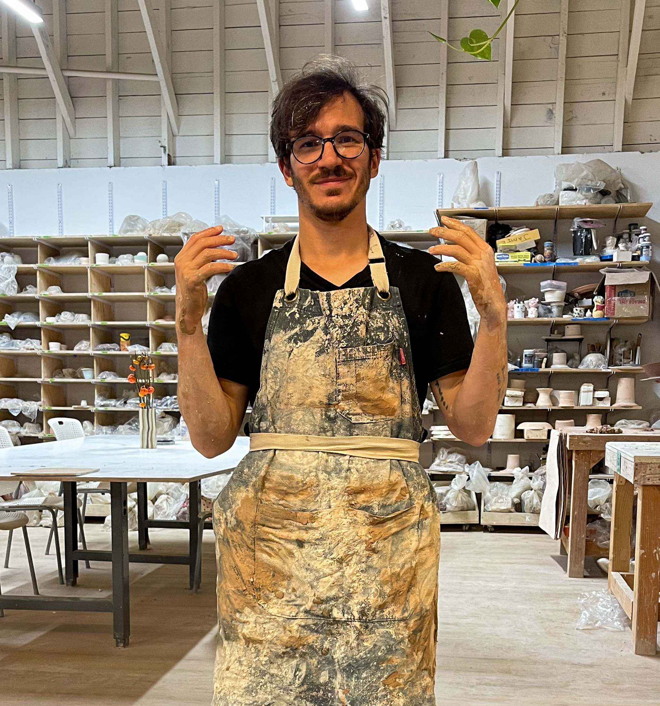

When's the last time you tried something new?

I don't mean a new library or programming language or a new video game. No, something _completely_ new. A skill you've never tried before that maybe you wouldn't even think to try unless somebody else gets the idea for you.

It can be a lot of fun! And useful.

Last week my partner surprised me with an intro to pottery class. I sucked and that was the best part.

Before Friday I'd never seen a pottery wheel in person. They're devilish little things. You step on the pedal and it spins.

You try the pedal a few times and think _"Oh yeah I got this, supes easy to control"_. Then you put the clay on and suddenly there's bits and pieces flying everywhere. Clay in your hair, clay on the floor, on your glasses, everywhere! Suddenly your twinkle toe foot feels like a blunt instrument with no control of the throttle.

Great fun.

Then the water comes out and you put your hands on the clay. Gently at first then with more force. It doesn't matter. Your pot doesn't look like a pot at all.

And it doesn't matter. You're not trying to become the next great pottery master. You're just exploring the clay.

What happens if I turn my hand like this? What if I put my face right next to the clay? Oh suddenly I have more control but now I can't see because the dirty water gets all over my glasses. What about if I press here with my finger? What if my elbow lifts from my lap? What about using the outside hand to shape the pot? No that doesn't work for tall bowls. What if I press inside and pull out? Oh now it's a plate but there's a little spyre in the middle. Oh I can press that down with the sponge. Great now my hand wobbled and the whole thing fell off.

Before you know it, 2 hours have passed and your 8th piece looks like a fucking masterpiece next to the mangled pile of clay from your 0th attempt.

Pottery is a tacit skill, you learn by doing. No amount of reading or studying will help you make a better pot. Only piles of tortured clay will get you there.

It's the same with programming.

**Wanna write better code?** Write lots of code. **Want to design better systems?** Design lots of systems. **Want to get better at interviewing?** Go to lots of interviews. **Want to get better at leading technical discussions?** Lead lots of technical discussions. **Want to get better at solving bugs?** Solve lots of bugs. **Want to improve your architecture?** Architect lots of code. **Want better domain modeling?** Model lots of domains.

Pottery and programming are kind learning environments. You do a thing, get instant feedback, and improve. When you're in a kind learning environment, doing the thing for a while is the best way to improve. Experience makes you better.

Wicked learning environments, where feedback is delayed or obscured, are tougher. We'll talk about that some other time :)

Cheers, 
~Swizec
