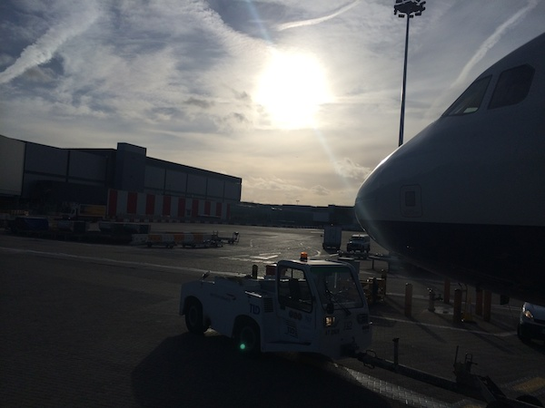
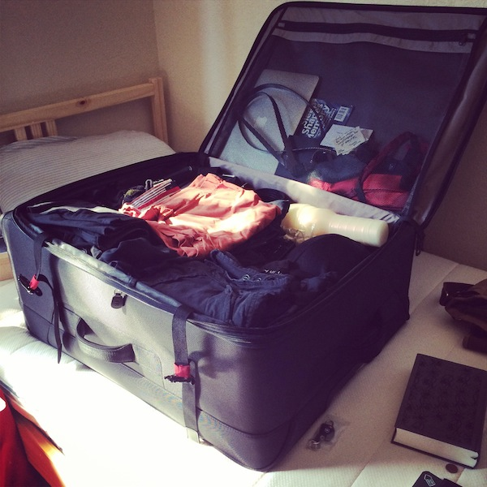

\[caption id=&quot;&quot; align=&quot;alignnone&quot; width=&quot;600&quot;] Departing SFO\[/caption] This story is the hubris side to last week&#x27;s [Why I don&#x27;t have a 5 year plan](http://swizec.com/blog/why-i-dont-have-a-5-year-plan/swizec/6508). Saying it was the universe telling me I don&#x27;t want to go home sounds better though so let&#x27;s go with that. Ladies and gents, the universe. It all started three months ago when I was sitting on a surf trip in Portugal, buying return tickets to the US some four days before departure. Cheaper ticket you say? Of _course_ I want to land in Vienna! I&#x27;ll just take a shuttle to Ljubljana. Booking a shuttle three months advance feels silly though. So I didn&#x27;t. Time passes. I do stuff and things. Crap crap crap crap! I&#x27;m leaving next weekend! Hair on fire! Run to the story to buy a huge suitcase. Got a bunch of new stuff in three months and it might be cheaper to use a big suitcase instead of a small suitcase and sending some things via post. Buy largest suitcase I could find. Keep this in mind, it&#x27;s important. Ok, I&#x27;ll book a shuttle on Monday and then I&#x27;m set. Tuesday evening - Wednesday 10am-ish in Slovenia time - I finally remember that I should look for a shuttle. GoOpti website says there are none. What the fuck do you mean there&#x27;s no shuttles, there&#x27;s always shuttles! But, landing in Vienna at 6pm on a Sunday ... in retrospect this one was obvious. Nonetheless, I send an email to the travel agency that usually handles my tickets and shuttles. Next morning of course. They get back to me on Thursday evening (Friday morning for them) with something like _&quot;The guy you emailed is on vacation, dude. But there&#x27;s no shuttles anyway.&quot;_ _&quot;Fuck! Get me a plane then! I really really don&#x27;t want to take a train, that&#x27;s going to take 9 hours ...&quot;_ It was too late. They close Friday at 6pm and don&#x27;t work weekends. Naturally, I missed the time window. Hooray. At this point I must also mention that I ran into the same problem with another important thing - transferring money from my business account to my personal and Visa accounts. By the time I _finally_ got around to it on Friday morning my bank&#x27;s interface just said _&quot;You got it! We&#x27;ll transfer the money first thing Monday morning!&quot;_ Crap. My business card has been giving me trouble at ATMs for the past few days. &quot;\*We can&#x27;t help you with this amount or account.&quot;\* But at least I packed on Friday morning so I could go have one last shindig without worrying about having a hangover next day, right? Nope. Had the shindig. Worried about not drinking too much. Started packing at 11:30am on Saturday. Had to leave for the airport at 2pm. But! I did remember to wash all my clothes when I came home from partying. So there&#x27;s that, I&#x27;m not a total idiot. \[caption id=&quot;&quot; align=&quot;alignnone&quot; width=&quot;600&quot;] Packed\[/caption] Turns out when you&#x27;re packing _everything_, it only takes about two hours. Yes! Anyway, Aaron drives me to the airport and this is where the real fun begins. Where every five minutes I was thinking the trip was a no-go.

## Your hands are explosive and your bags are too heavy (SFO)

_&quot;Hi friendly check-in person. Here is my bag.&quot;_ _&quot;Too heavy.&quot;_ _&quot;Yeah sure, it&#x27;s a big bag. How much is the surcharge?&quot;_ _&quot;\$60, but it&#x27;s too heavy ...&quot;_ _&quot;You wot?&quot;_ _&quot;Your bag can&#x27;t be heavier than 32kg. This is 38. Hmmmm ... what can you do ... well you **could** pay for an extra bag. That&#x27;s \$95&quot;_ _&quot;Ok sure, let&#x27;s do that.&quot;_ She just looks at me. She keeps looking. _&quot;Sir, the bag is too heavy. You have to make it lighter. Nobody will handle this lest they injure themselves.&quot;_ _&quot;Wait ... you&#x27;re saying I have to buy an extra bag? Like physically an extra bag?&quot;_ _&quot;Yes.&quot;_ Screw that then! I&#x27;m buying a carry-on suitcase. If I&#x27;m buying an extra bag anyway, I sure as hell am not going to pay for double luggage as well. Run to the suitcase store at the airport. Hi, yes, I&#x27;ll have that bag please. Here&#x27;s my card. _&quot;Sir, we don&#x27;t accept that.&quot;_ Fuck! No money on my Visa. The only thing they take. Run to an ATM. Shove my business card down its throat. _&quot;We can&#x27;t help you with this amount or account.&quot;_ Find out there&#x27;s a more international ATM downstairs. Run to the lift with this huge monster of a suitcase. Find the ATM. There&#x27;s a woman, slouched over so much she looked like she was climbing into the machine. Takes five attempts to make sure that when the ATM says _&quot;Your daily limit reached&quot;_, it&#x27;s not lying. Getting very antsy by now. Yes! This machine gives me money. Hooray! Run back up. Buy suitcase. Frantically throw the heaviest things from big suitcase into small suitcase. I must&#x27;ve looked like a joke. Run back to the check-in. 28kg! Throw a few things back in the big suitcase. Check-in. _&quot;Ok sir. Your bags are checked to Vienna and I put a priority stamp on your boarding pass because we start boarding in ten minutes.&quot;_ U wot m8? Mad dash to security. _&quot;What&#x27;s in your back pocket sir?&quot;_ _&quot;Uh ... nothing?&quot;_ _&quot;The scanner shows me there&#x27;s something.&quot;_ _&quot;Well I found this penny. Does that count?&quot;_ _&quot;Ok. But now you&#x27;ve touched yourself. We have to scan your hands&quot;_ ... Beep beep beep. _&quot;Your hands tested positive for explosives. Please step to this counter. No, don&#x27;t help us carry your stuff. Don&#x27;t touch anything. Stand behind that wall.&quot;_ Errr ... okay. They then swiped everything with these little paper slips. My messenger bag. My shoes. My hat. My jacket. My carry-on suitcase that&#x27;s been mine for exactly 20 minutes. Everything. Even my wallet. _&quot;Okay sir. Everything checks out here. Now if you would please follow us to the private pad down area.&quot;_ Them&#x27;s scary words right there! Images of dark rooms with strong in-the-face lighting flash in my mind. Just like in the movies. _&quot;I&#x27;m missing my flight aren&#x27;t I?&quot;_ _&quot;Nah you&#x27;re good. This only takes ten minutes.&quot;_ The private room was really just a small area of the security walled off with darkened glass walls. It had only a door, a small chair, a table, and a mat for a person to stand on. Nothing imposing. Nothing terrifying. A friendly man walked in and spent two minutes just explaining where he would touch me. He would use his open palms to go over my arms and body. He would go up and down the inside of my leg four times. He would use the back of his hands to fondle my buttcheeks. He would drag is palm horizontally across my groin five times. He would touch my feet. He did all that. I did not get an erection. Honestly, this whole tested positive for explosives was my most positive experience with TSA (or similar) ever. Everyone was very cordial. They were nice. The guy who fondled me even kept me company while I got all my stuff back together. We talked about the Austrian castle where The Sound of Music was filmed. He was very impressed that you can just see it from the Autobahn and waxed poetic about how cool it is that I only live about a two hour drive away. That&#x27;s nearby to Americans. I made it to my flight 10 minutes before take-off.

## Heathrow is too big for you

Some ten hours later I landed at Heathrow. Adventures with luggage and security long forgotten. Many hours of sleep had. I was relaxed and in high spirits. My next flight was in four hours. No rush. Check the screens. Okay, Terminal 1. Got it. Take a bus from Terminal 5, where I landed, to Terminal 1. Took about twenty minutes. Really a very huge airport, this. Go through UK border. End up in a baggage reclaim area. Okay this is a bit weird. Walk through customs. No wait, this is really weird. I should go back. I remember this from transferring in the US and Canada. Sometimes you have to carry your luggage through customs even though it&#x27;s checked to your final destination. _&quot;Hey nice lady at info desk, do I have to carry my luggage through customs? That doesn&#x27;t happen automatically does it?&quot;_ _&quot;Hah, yes you do dear.&quot;_ _&quot;Oh, cool. D&#x27;oh. What&#x27;s my carousel? I just flew in from San Francisco.&quot;_ _&quot;On the United flight, right? Let me see ...&quot;_ _&quot;Err ... actually ... I was on the British Airways flight.&quot;_ _&quot;You ... that flight did not land here. Let me see your baggage stub.&quot;_ _&quot;Uhm ... ah ... did I mess up?&quot;_ _&quot;Oh my. Yes you did mess up. You messed up bad. How did you even? You landed on Terminal 5, your next flight is from Terminal 3, and you ended up at Terminal 1 ... Okay. Walk down this way to the end of the building, then follow the signs to Terminal 3.&quot;_ _&quot;And my bags will be there?&quot;_ _&quot;No, your bags will be in Vienna.&quot;_ So I walked. And I walked. And I went through tunnels and walkways and passed two Underground stations. Enter here for the Piccadily Line. Where the fuck am I!? Walk up a set of stairs. \[caption id=&quot;&quot; align=&quot;alignnone&quot; width=&quot;600&quot;] Outside Heathrow\[/caption] In front of airport. Literally outside the airport. Like I had just been dropped off by a car or something. How the hell? Go past all the check-in windows. Feels weird, but I&#x27;m already checked in. I just happen to be outside the airport. No biggie. Go through security and all that. Everything went fine this time. No more explosive hands. But somehow my four hour layover was reduced to a one hour tea break. Wow. Board flight, land in Vienna two hours later. Smooth as silk.

## Getting home from Vienna

\[caption id=&quot;&quot; align=&quot;alignnone&quot; width=&quot;600&quot;] Vienna airport\[/caption] So here I am in Vienna with some 40kg of luggage and no idea how I&#x27;m getting home. It&#x27;s 6pm on a Sunday. There have been reports of extreme weather from Slovenia and all I know at this point is that gMaps says I can get a train at 9:35pm, which would get me home by 6am. And there&#x27;s a flight at 8:45pm, which gets me home by 10pm. I ask at the first info desk. _&quot;Yes, there is an Adria Airways ticket window at this airport, but they&#x27;ve closed already.&quot;_ Get to a second info desk on the outside area of the airport. _&quot;Just walk down that way. There&#x27;s a ticket office at the end of the building.&quot;_ Wind up at an Austria Airways ticket thingy instead. They sell the tickets I need as well and it later turned out the official window was in fact already closed. _&quot;Hi, I need a ticket from here to Ljubljana for tonight. Do you take debit cards?&quot;_ _&quot;Yes, we have them. But you&#x27;ll get it about 50 euro cheaper online. And no, we only take credit cards.&quot;_ Get out of queue. Call mum. Hey can you buy me a ticket online? After much convincing that it&#x27;s not _that_ hard to buy a ticket online - she&#x27;s never done it - she finally tells me that there are no more tickets available. I ask her to text me her credit card details and I&#x27;ll just find something myself. Oooooooh you can&#x27;t buy tickets online less than three hours before the flight. Back into queue. _&quot;Okay, hold that ticket for me if they&#x27;re available and I&#x27;m going to hop to that ATM over there and get cash. Here&#x27;s my passport.&quot;_ _&quot;Mkay ...&quot;_ _&quot;And can you add a heavy luggage surcharge please? I know my bag is too heavy.&quot;_ She spent twenty minutes searching through the system and finally came up with the number. _&quot;Yes you should buy it now. Otherwise you&#x27;re just going to go to check-in and they&#x27;ll send you back here.&quot;_ Well, yes, that&#x27;s why I asked her. She was obviously very tired by now. Guess it&#x27;s been a long day. Poor lady. Hop to the ATM. _&quot;Your daily withdrawal limit has been reached.&quot;_ FUCK! Must&#x27;ve been past midnight European time when I made that withdrawal way back at SFO. God damn it. _&quot;Okay cancel that ticket. I can&#x27;t get money. No it&#x27;s a problem with my card not your ATM ... do you perchance take this?&quot;_ _&quot;Oh yes, Maestro is fine!&quot;_ God damn it. She couldn&#x27;t tell me this an hour ago? But I got my ticket and I made it through security 20 minutes before boarding started. Plenty of time for a life-saving sandwich and some tea. Actually started feeling faint while buying the ticket because I hadn&#x27;t eaten in too long. Happens. Just before boarding I get a text from mum _&quot;Hey I&#x27;m not sure I want to come pick you up from the airport. Any way you can figure it out on your own?&quot;_ Oh for fuck&#x27;s sake. How bad can the weather _be_!? Convinced her to pick me up despite the weather. I mean really, I&#x27;ve been flying around for almost a full day, the last thing want to do now is look for a bus or taxi when I land in Ljubljana. Step out of the gate-to-airplane bus and the ground is covered in ice. The plane is covered in ice. The stairs are covered in ice. _That&#x27;s_ how bad the weather is huh? But I made it home all right. By 11pm on Sunday I was home cuddling my cat. It had taken me exactly 21 hours airport to airport and about 24 hours house to house. Not too bad. But boy was it eventful. Had I taken the train ... let&#x27;s just say most train traffic in Slovenia has _still_ been going by bus yesterday. Too much ice. Not enough power lines. Yeah. \[caption id=&quot;&quot; align=&quot;alignnone&quot; width=&quot;600&quot;] Ljubljana airport\[/caption]
