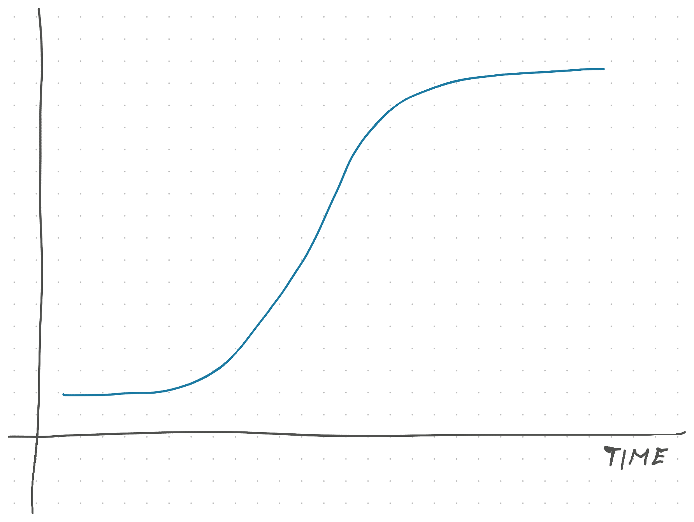
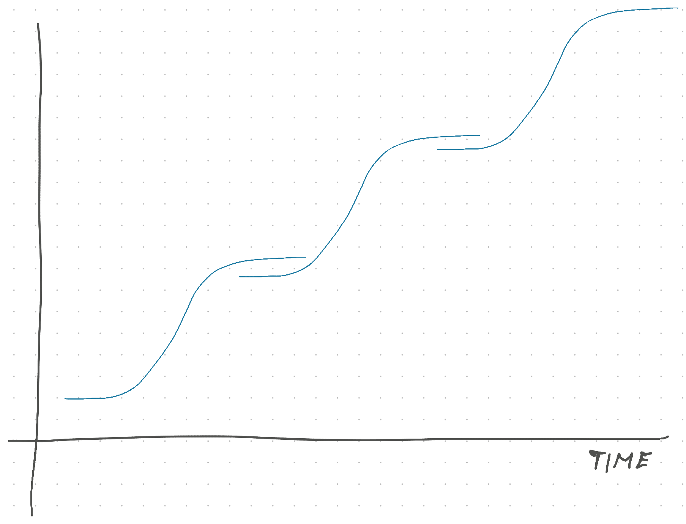
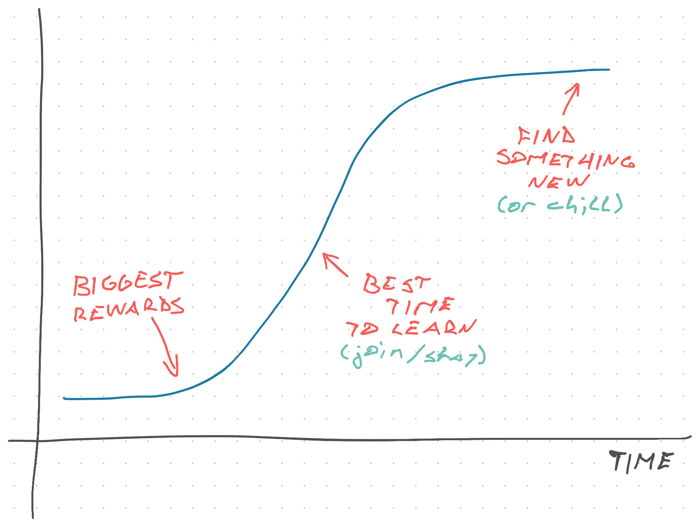

import { ContentUpgrades } from "@swizec/gatsby-theme-course-platform"

Timing changes everything.

Who do you think has better engineers? The team that built Google from 9 million daily searches in 2000 to 1 billion in 2009, or the team that launched Google's 10th chat app last year? Or was it the 20th ...

What's better: an engineer who saw Facebook grow from university students to market leader, or the person who spent 6 months making sure reactions to comments on comments work for all edge cases?

🤔

They're all interesting challenges!

Building at scale scale is _hard_. A 0.005% error rate at Facebook means 100,000 people see your bug every day.

What scale lacks is change. You work on a piece of the system and polish to perfection. 1 year of experience 5 times.

Growth means change. Serving 9 million searches is completely different than 1 billion. You get 5 years of experience. In 1 year, if you're lucky.

## The S-curve

Companies, technologies, projects, trends, and even your skills follow an [S-curve](https://www.indeed.com/career-advice/career-development/s-curve) – slow, fast, slow.

You can put anything on the Y axis.

Your skills are slow to acquire at first, then you grow fast as connections start to form and new concepts are easy to add. Later you slow down because there isn't much new to learn.

<ContentUpgrades.SeniorMindset />

A company grows slowly as it finds its footing, explodes in popularity when it finds product-market-messsage fit, and slows down when it saturates the market it can reach.

Same is true for technology trends. The web has little room to grow, everyone already has a podcast, and when's the last time you saw a smartphone that wasn't a Magic Glass Rectangle?

### The chain of S-curves

That slow-down doesn't mean the end. As Richard Hamming wrote in The Art of Doing Science and Engineering – S-curves come in sequences. The top of each curve creates a new vantage point that lets us see the start of another.

The transistor enables computers. The microcomputer enables home computers. The home computer enables the web. The web enables the smartphone. The smartphone enables social media. Social media ... web3? 🤷‍♀️

You can think S-curves as a flattened representation of [the hill climbing algorithm that governs your life](https://swizec.com/blog/deep-work-december/). A search through unknown space.

## Use the S-curve to your advantage

You can use the idea of S-curves to be more intentional about your career.

Here's one of my favorite quotes from a [Senior Engineer Mindset](https://swizec.com/senior-mindset) reader who picked up the book at 58 after a long career saving lives with electrical engineering:

> Perhaps I have not been intentional enough about managing my career. I have worked in the same building for my entire career. My team got dismantled and I realized this is a shrinking field with nowhere to go.

This person was caught out at the top of an S-curve. Not just their company is shrinking, the whole field is! They can retire or jump into a new field. I imagine that's scary. 58 isn't that old.

The best time to learn and grow quickly is when the thing you're working on is exploding. The biggest rewards come when you take a bet and join the inflection point. Stability comes at the end when things calm down.

You can use this framework when joining companies, changing teams or projects inside large organizations, or deciding which technology to learn. Focus on how it _feels_. You'll know when it's growing and when it's not.

I like to think of it like a game of Super Mario with platforms moving on the screen and falling from Mario's weight. You have to jump before you can't. If you time it so a rising platform gives your jump a boost, perfection.

In reality, timing is more art than science. Join too early and you'll get tired before it explodes. Join too late and there's no more growth to gain.

## Growth or stability?

The question I asked in the beginning is a head fake. Like when people tell you to _"Make the choice that tells a better story"_ – it's about taste.

If you think polishing a tiny feature at massive scale is the most impressive – do it! The world needs maintainers like you. If you like growth, you go girl! The world needs builders like you.

But make sure you **choose on purpose, not by accident**.

You don't want to spend your life climbing the wrong hill. That's why [your career needs a vision](https://swizec.com/blog/your-career-needs-a-vision/).

Good luck ✌️

Cheers, 
~Swizec
