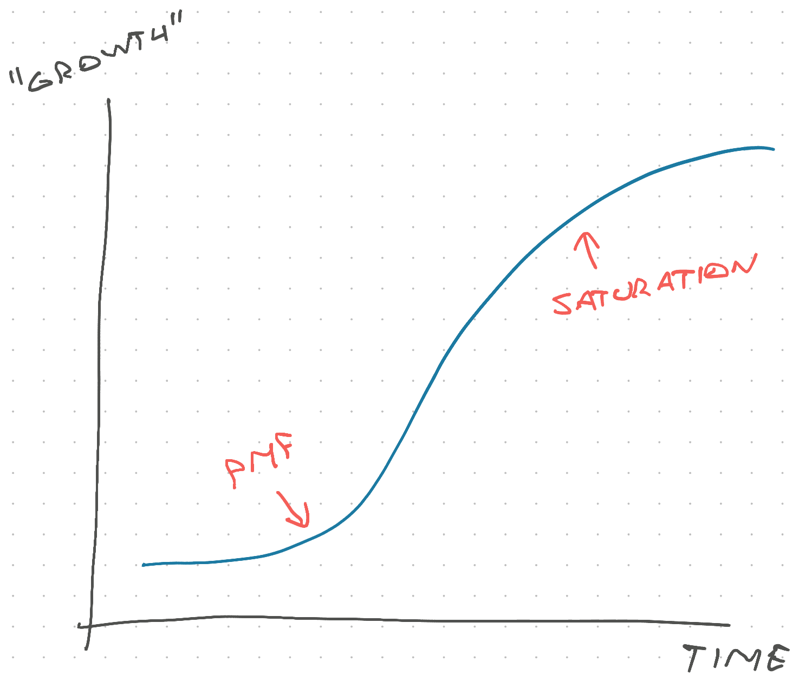

A question that comes up a lot is _"How do you know when to stay at a company?"_. Someone asks this any time I bust out the [S-curves](https://swizec.com/blog/i-m-a-different-engineer-than-i-was-3-years-ago/) and talk about why [joining right before big growth is best](https://swizec.com/blog/when-to-join-and-leave-a-company-project-or-trend/).

When the company or project grows, that does wonders for your career. Nothing looks as good on a resume as _"promoted while business went 10x"_. And when you're focused on growing the pie, much of the office politics bullshit that comes from zero-sum games melts away. It's great.

But how do you know when to stay? How can you tell an S-curve is coming? This has been on my mind lately. Here's how I think about it.

## The S-curve

As a refresher, this is the S-curve:

Company hits product-market-fit, grows fast, then slows down as current methods or market become saturated. You then have to change what you're doing to start a new S-curve.

You can't fight this no matter how good you are. That's like selling ice cream on the beach in winter. You can do all the right things perfectly but you won't sell much ice cream before summer.

## Think like an investor

The people who think about this the most are investors. They look for +EV (positive expected value) opportunities and bet money on their predictions.

As Nassim Taleb likes to say – *"Don't tell me what you think, show me your portfolio"*. The bets you've made, that's what you really think is true.

Unless you're a fool betting randomly. But you're no fool are you? You [have a career vision](https://swizec.com/blog/your-career-needs-a-vision/) and aren't randomly fleeting from opportunity to opportunity.

### Basic pre-requisite

**As a baseline**, I assume you're enjoying work and your team isn't a toxic place to be. No amount of money is worth hating your life.

For example: I would never take a job that requires a daily in-car commute. Sitting in traffic has such extreme -EV (negative expected value) for me personally that this overshadows all else. I also [don't work on ad clicks](https://swizec.com/blog/tips-for-a-fulfilling-tech-career/).

### Cap your down-side

**As a secondary baseline**, I assume your cash salary covers your desired lifestyle with room to spare. You're a software engineer, there's no need to suffer. Plenty of companies that pay good. Even in recent times.

You want your cashflow to cover expenses so you aren't stressed about money. [Poverty reduces brain power](https://www.reuters.com/article/idUSBRE97S10Y/) and [causes chronic stress](https://www.nature.com/articles/s41539-023-00199-2). The mindset this instills can stay with you for life. I remember growing up with too much month left at the end of the money and it wasn’t nice.

Plus BATNA – best alternative to negotiated agreement – is your strongest weapon in every salary or job negotiation. You want to be in a position that lets you walk away from a bad deal.

Boss says jump, you say fuck you, and walk away. Cap your down-side.

### Maximize your up-side

You're enjoying your job and it pays enough to support your lifestyle. Now what?

Now it's time to make the biggest bets you can find. Yes it might not work out, but if it does you'll be super happy. And if it doesn't, you've capped your downside! The worst that can happen is a vanilla life at a job you enjoy.

That's the gist of making a +EV bet.

The best employee returns come from [joining a Series C, A, or B](https://www.joinprospect.com/blog/which-stage-startup) startup. In that order. This balances out the risk of failure with being early enough to be worth the effort.

Metrics you should look for:

- **Market trends**. Is the market itself growing or falling? You can't sell ice cream on the beach in winter
- **LTV** (life-time value). How much money do you make from each user? A low LTV feels like squeezing blood from a rock.
- **CAC** (cost of acquiring customer). How expensive are users to acquire? You want this to be about 4x lower than LTV. Bigger spread is better.
- **Growth rate**. Are you getting more and more users? Is the growth rate itself growing? The 2nd derivative tells you where on the S-curve you are.
- **Churn**. Are users staying?
- **NPS** (net promoter score). Do users love your product enough to tell others?

Those are the key metrics you should look for. If you're thinking about joining a company, ask. If you're thinking about staying, look for ground truth in the database ;)

Cheers, 
\~Swizec
