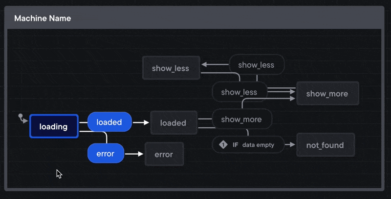
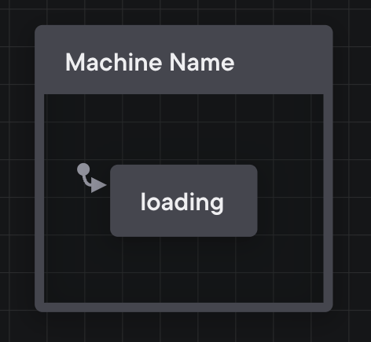
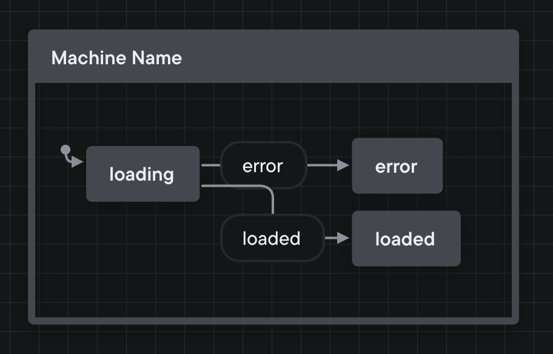
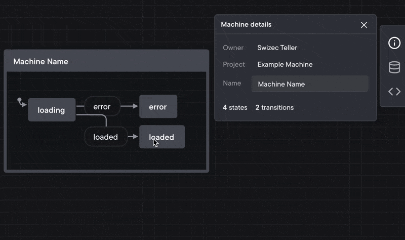
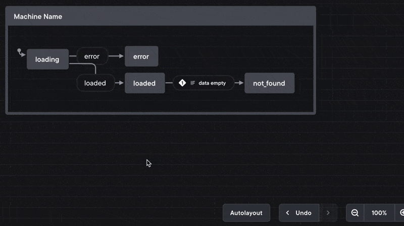
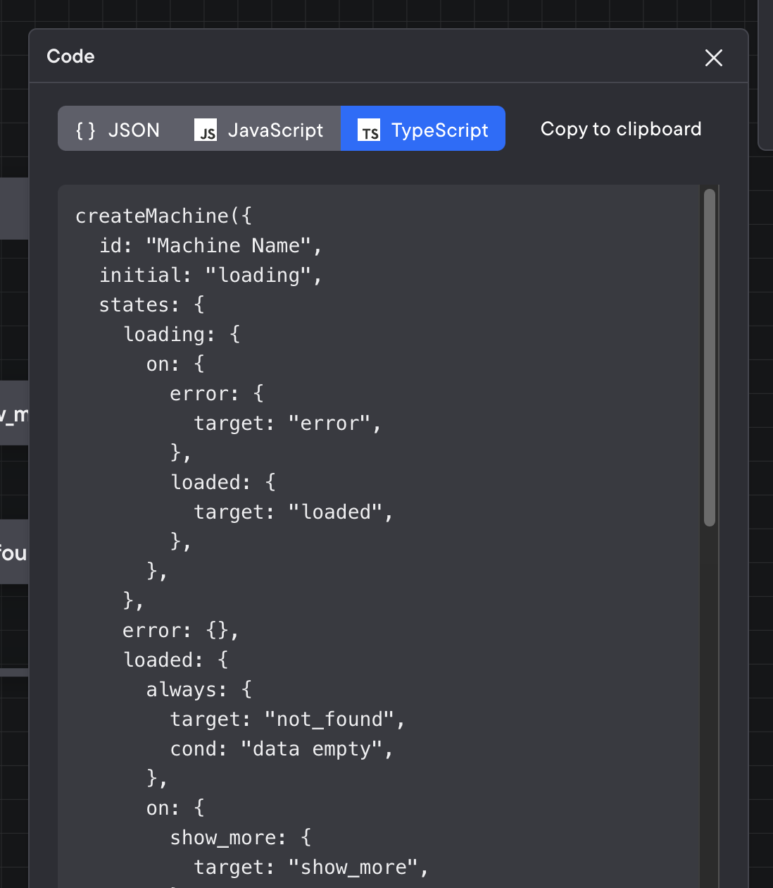
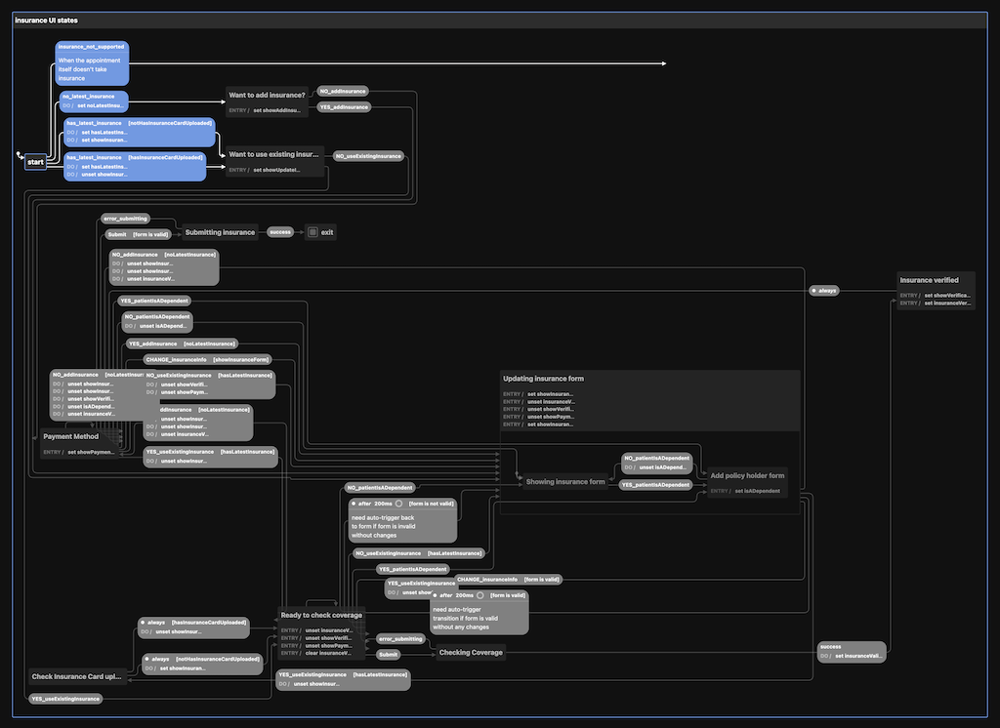

Two years ago I wrote [When your brain is breaking, try XState](https://swizec.com/blog/when-your-brain-is-breaking-try-xstate/) after building a UI interaction so twisted my brain leaked out my ears. [XState](https://xstate.js.org), a state machine library, helped.



XState turns ternary soup into a well-defined set of state transitions. Great, if your brain thinks about problems as state machines. Terrible, if you have that one nutter on your team who won't shut up about the beauty of state machines and keeps stuffing them into your code.

_"Damn it Swiz why can't you write 3 nested ifs like a normal person!"_

And yeah, this is fine

```javascript
return (
  <div>
    {isLoading && <Spinner />}
    {!isLoading && !data && <NotFound />}
    {!isLoading && isError && <Ooopsies />}
    {!isLoading && data && (
      <>
        <List data={data} count={10} />
        {!showMore && <Button onClick={onShowMore} />}
      </>
    )}
    {!isLoading && data && showMore && (
      <>
        <List data={data} count={data.length} />
        <Button onClick={onHideMore} />
      </>
    )}
  </div>
)
```

... until it isn't.

To me that code feels borderline. You can understand, if you try hard enough. You might even be able to debug what's wrong (I think there's a bug). But add 1 more variable and the whole thing blows up.

4 booleans put you at 2^4 = 16 potential states. Not all of which are possible. A 5th turns that into 32 combinations 😅

## The problem with state machines on a team

The problem with XState and state machines in general is that unless you're the person who wrote this:

```javascript
  states: {
    loading: {
      on: { ERROR: "error", LOADED: "loaded" },
    },
    error: {},
    loaded: {
      on: { SHOW_LESS: "show_less", NOT_FOUND: "not_found" },
    },
    show_less: {
      on: { SHOW_MORE: "show_more" },
    },
    show_more: {
      on: { SHOW_LESS: "show_less" },
    },
    not_found: {},
  }
```

You have no idea what it means. You could analyze it, visualize a picture in your brain, but all that's too much effort when you're wondering _"Why can't I click this button and have this thing happen???"_

Because it's an impossible transition and XState is doing its job, dummy. You need to wire up a new transition.

But how!? Yeah that's, uh, gonna take 20min to explain ... 😅

## How Stately.ai solves the problem

Since that post 2 years ago, David – creator of XState – and team have been hard at work on [Stately.ai](https://stately.ai), a tool for building state machines visually 😍

I wrote about an initial version in [A new VSCode extension makes state machines shine on a team](https://swizec.com/blog/a-new-vscode-extension-makes-state-machines-shine-on-a-team/). That was great but not quite ready yet.

Now there's a web editor and it. is. wonderful.

https://twitter.com/Swizec/status/1587503973828767745

The idea of Stately.ai is that instead of writing object soup and visualizing in your head, _you start with the picture_. Draw the state machine first, collaborate on getting it right, then export into code.

I even tried it when talking through a complex problem with my product owner who isn't an engineer. Worked great!

https://twitter.com/Swizec/status/1574498660401889281

We later collaborated as an engineering team to visually build the final state machine. Here's how

### Going visual first

Taking the conditional soup from before, you'd start with a loading state:



Then add transitions for error and loaded states.



Loaded data can transition into a `not_found` state on its own.



Later, you'll have to implement the `data loaded` guard as a function. XState takes a map of functions for that.

And once data is loaded, users can flip between `show_less` and `show_more`.



Before you put all that into code, the simulator can help you debug any issues and missed transitions.


A lot of dead states in my example. Would be nice to add the ability to retry after an error or when there's no data.

Once you're happy with your state machine, the Stately.ai editor can export it into code.



Plug that into XState, combine with your favorite UI library, and you're ready to go 😍

## Does it _work_ work?

Going visual first with a team of engineers worked okay. Our first machine was too complex for a good learning experience and became so complex it breaks the visualizer 😅



And I think the process was a little abstract for a lot of people. The logic doesn't quite feel real unless it's code.

But I could see the lighbulbs. There's this moment when an engineer goes "oh .. Oh ... OH!!". And then they get it.

You need to [play with it](https://stately.ai) :)

Cheers,<br/>
~Swizec

PS: this is what I mean by [focus on fundamentals](https://swizec.com/blog/reader-question-should-you-learn-the-latest-hotness/). XState and Stately are tools that come and go, but [state machines have been with us since 1956](https://en.wikipedia.org/wiki/Moore_machine).
