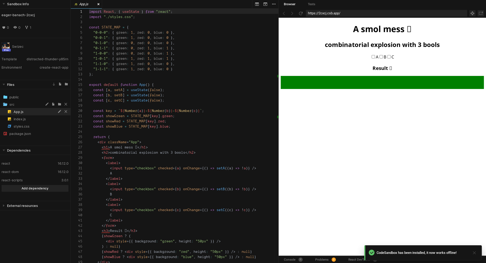

Ever built code that&#x27;s like a Jenga tower of conditional logic?It always starts off easy. If A is true, show X, otherwise Y. Oh but if B is true then show Z, unless A is also true, then you need Y _and_ Z. And if C happens after A is true, but not after B is true, then you ...

Aaaaand you&#x27;ve got a mess. A piece of code that&#x27;s going to be _fun_ to maintain.

This happens a lot. Sometimes fast, sometimes after months of polishing your logic to include every edge case.

And that&#x27;s okay. Messes happen.

It&#x27;s what you do with your mess that matters.

## How you create a mess

Here&#x27;s a mess, I made it just for you ❤️

Check the checkboxes to get different colors. Looks silly in this example and I assure you it happens all the time.

Like when I was building an insurance intake form that shows fields depending on previous answers _and_ what the API says is even possible in this particular case 😅

Messes happen when you&#x27;re dealing with a combinatorial explosion. Every new condition _doubles_ the number of possible states.

3 variables give us 8 possible states. 4 makes 16. 5 is 32.

That&#x27;s booleans.

Imagine enums with 4 possible states. 3 of those and you&#x27;re looking at 64 combinations.

🤯

Your first inclination is to write chains of conditionals. Cover the 3 or 4 happy-path cases and done.

The other 60 are edge cases you find in production through bug reports. You fix those.

And you create long and complex conditionals that nobody on your team can read. Each bug fix creates 5 new bugs.

Everything&#x27;s connected, nothing makes sense.

## How you fix the mess with hashmaps

Your way out of this mess is a stable mapping of states to values. Easiest to do with a hashmap.

You can start with a truth table to get your bearings. Great for boolean logic, difficult for enums. You run out of dimensions 😅

Truth table for the mess above looks like this:

You can turn that into a hashmap of states. A piece of data that tells you how the code behaves.

&amp;t=seti&amp;l=javascript&amp;ds=true&amp;wc=true&amp;wa=true&amp;pv=48px&amp;ph=32px&amp;ln=false&amp;code=const%20STATE_MAP%20%3D%20%7B%0A%20%20%220-0-0%22%3A%20%7B%20green%3A%201%2C%20red%3A%200%2C%20blue%3A%200%20%7D%2C%0A%20%20%220-0-1%22%3A%20%7B%20green%3A%201%2C%20red%3A%200%2C%20blue%3A%200%20%7D%2C%0A%20%20%220-1-0%22%3A%20%7B%20green%3A%200%2C%20red%3A%200%2C%20blue%3A%200%20%7D%2C%0A%20%20%220-1-1%22%3A%20%7B%20green%3A%200%2C%20red%3A%201%2C%20blue%3A%201%20%7D%2C%0A%20%20%221-0-0%22%3A%20%7B%20green%3A%200%2C%20red%3A%200%2C%20blue%3A%201%20%7D%2C%0A%20%20%221-0-1%22%3A%20%7B%20green%3A%201%2C%20red%3A%201%2C%20blue%3A%201%20%7D%2C%0A%20%20%221-1-0%22%3A%20%7B%20green%3A%201%2C%20red%3A%200%2C%20blue%3A%200%20%7D%2C%0A%20%20%221-1-1%22%3A%20%7B%20green%3A%201%2C%20red%3A%200%2C%20blue%3A%200%20%7D%0A%7D%3B)

And you use it like this:

&amp;t=seti&amp;l=javascript&amp;ds=true&amp;wc=true&amp;wa=true&amp;pv=48px&amp;ph=32px&amp;ln=false&amp;code=%20%20const%20key%20%3D%20%60%24%7BNumber(a)%7D-%24%7BNumber(b)%7D-%24%7BNumber(c)%7D%60%3B%0A%20%20const%20showGreen%20%3D%20STATE_MAP%5Bkey%5D.green%3B%0A%20%20const%20showRed%20%3D%20STATE_MAP%5Bkey%5D.red%3B%0A%20%20const%20showBlue%20%3D%20STATE_MAP%5Bkey%5D.blue%3B)

😍

Isn&#x27;t that more readable, easier to understand, and way easier to debug? Got a problem, change the map. Done.

## How you fix the mess with state machines

What a hashmap can&#x27;t do, is guard against impossible states. What if you don&#x27;t want users to click A when B and C are true? 🤔

That&#x27;s when you need a [state machine](https://en.wikipedia.org/wiki/Finite-state_machine), my friend. They&#x27;re fun to build, tricky to get right, and different to think about than you&#x27;re used to.

`useReducer` is a state machine. Redux, too. `useState` if you squint your eyes.

Here&#x27;s a state machine for each of the `useState`s in our smol mess example.

Circles are states, arrows are transitions. You can draw a state machine like this for almost anything\[^1].

That&#x27;s where [XState](https://xstate.js.org/) shines – it&#x27;s designed for state machines. It can even visualize them for you 😍

Yeah, no wonder that form broke my brain.

## Using XState

Now, how do you use XState to fix the mess above?

First you need to define the state machine. Flip your mindset from mapping states to transitioning between states.

I like to do this in the [XState visualizer](https://xstate.js.org/viz/). Helps you see what you&#x27;re doing.

👆 Click to see the full machine in XState visualizer

You define XState machines by listing states, their meta data, and performable actions. Each action points to the next state.

&amp;t=seti&amp;l=javascript&amp;ds=true&amp;wc=true&amp;wa=true&amp;pv=48px&amp;ph=32px&amp;ln=false&amp;code=const%20smolMessMachine%20%3D%20Machine(%7B%0A%20%20%20%20id%3A%20&#x27;smolMess&#x27;%2C%0A%20%20%20%20initial%3A%20&#x27;0-0-0&#x27;%2C%0A%20%20%20%20states%3A%20%7B%0A%20%20%20%20%20%20&#x27;0-0-0&#x27;%3A%20%7B%0A%20%20%20%20%20%20%20%20on%3A%20%7B%0A%20%20%20%20%20%20%20%20%20%20A%3A%20&#x27;1-0-0&#x27;%2C%0A%20%20%20%20%20%20%20%20%20%20B%3A%20&#x27;0-1-0&#x27;%2C%0A%20%20%20%20%20%20%20%20%20%20C%3A%20&#x27;0-0-1&#x27;%0A%20%20%20%20%20%20%20%20%7D%2C%0A%20%20%20%20%20%20%20%20meta%3A%20%7B%20green%3A%201%2C%20red%3A%200%2C%20blue%3A%200%20%7D%0A%20%20%20%20%20%20%7D%2C%0A%20%20%20%20%20%20&#x27;0-0-1&#x27;%3A%20%7B%0A%20%20%20%20%20%20%20%20on%3A%20%7B%0A%20%20%20%20%20%20%20%20%20%20A%3A%20&#x27;1-0-1&#x27;%2C%0A%20%20%20%20%20%20%20%20%20%20B%3A%20&#x27;0-1-1&#x27;%2C%0A%20%20%20%20%20%20%20%20%20%20C%3A%20&#x27;0-0-0&#x27;%0A%20%20%20%20%20%20%20%20%7D%2C%0A%20%20%20%20%20%20%20%20meta%3A%20%7B%20green%3A%201%2C%20red%3A%200%2C%20blue%3A%200%20%7D%0A%20%20%20%20%20%20%7D%2C>)

This looks like a lot of work compared to a hashmap, I know, but it&#x27;s invaluable when you want to prevent some transitions. Or you need to run side-effects when states are entered/exited.

XState can do all that, it&#x27;s great.

Putting this in our smol mess, you get this:

&amp;t=seti&amp;l=javascript&amp;ds=true&amp;wc=true&amp;wa=true&amp;pv=48px&amp;ph=32px&amp;ln=false&amp;code=const%20%5Bstate%2C%20send%5D%20%3D%20useMachine(smolMessMachine)%3B)

Hooks the machine up to your component. `state` is the current state machine state, `send` is like dispatch – sends actions.

Checkboxes use `send` instead of `setX`

&amp;t=seti&amp;l=javascript&amp;ds=true&amp;wc=true&amp;wa=true&amp;pv=48px&amp;ph=32px&amp;ln=false&amp;code=%3Clabel%3E%0A%20%20%3Cinput%20type%3D%22checkbox%22%20checked%3D%7Ba%7D%20onChange%3D%7B()%20%3D%3E%20send(%22A%22)%7D%20%2F%3EA%0A%3C%2Flabel%3E)

And you read current state like this:

&amp;t=seti&amp;l=javascript&amp;ds=true&amp;wc=true&amp;wa=true&amp;pv=48px&amp;ph=32px&amp;ln=false&amp;code=%2F%2F%200-0-0%20%F0%9F%91%89%20%5Bfalse%2C%20false%2C%20false%5D%0Aconst%20%5Ba%2C%20b%2C%20c%5D%20%3D%20state.value.split(%22-%22).map(Number).map(Boolean)%3B%0A%0Aconst%20showGreen%20%3D%20!!state.meta%5B%60smolMess.%24%7Bstate.value%7D%60%5D.green%2C%0AshowRed%20%3D%20!!state.meta%5B%60smolMess.%24%7Bstate.value%7D%60%5D.red%2C%0AshowBlue%20%3D%20!!state.meta%5B%60smolMess.%24%7Bstate.value%7D%60%5D.blue%3B)

Your code would have better-named states than my example. No need to translate with .map :)

The meta data nests under your state machine name because you can have multiple running in parallel. That&#x27;s when XState becomes pure wow 😉

And unless I made a mistake, all 3 codesandboxes should behave the same. But 2 of those are way easier to debug ✌️

Happy hacking

Cheers,  
~Swizec

\[^1] finite state machines can&#x27;t solve every solvable problem. [Pushdown automata](https://en.wikipedia.org/wiki/Pushdown_automaton) (state machines with a stack) are more powerful and [Turing machines](https://en.wikipedia.org/wiki/Turing_machine) (state machine with an infinite memory) can solve anything

PS: you can use XState in server code, too