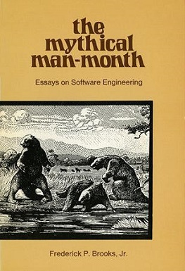

It might. What's your job Friend?

If you're in the _"write code to exact specifications"_ business ... now's a good time to start leveling up. The AI's not ready yet.

If you're in the _"use engineering to solve fuzzy problems over time"_ business ... get excited! AI is on the cusp of automating the tedious part of your job 🥳

I wanted to try [Github Copilot](https://copilot.github.com), an AI coder that Github launched recently, but I couldn't. Instead we'll use a story from history and a story from life.

https://twitter.com/Swizec/status/1412768622007648256

## Mythical Man Month

In his 1975 book [Mythical Man Month](https://en.wikipedia.org/wiki/The_Mythical_Man-Month), Brooks talks about surgical teams for programmers. His thesis is that programmers are an expensive resource on the critical path of a project.

Being on the [critical path](https://en.wikipedia.org/wiki/Critical_path_method) means that _you_ are responsible for how fast a project can go.

Since _you_'re critical, the best way to speed up a project is to use [the theory of constraints](https://swizec.com/blog/build-better-software-with-the-theory-of-constraints/) and remove any and all obstacles in your way. Anything at all that isn't worth your time.

In Brooks's time that included what he calls a surgical programming team:

- programmer writes the code
- typist types the code
- code inputter puts code into computers
- code runner runs the code and reports results
- secretary deals with outside distractions

Typist, code inputter, and code runner ... because _running code_ is a waste of your time. Too slow.

## Sufficiently smart compilers

Decades after the Mythical Man Month came the compiler wars. I don't know if they were wars, but "compiler wars" has a nice ring to it.

Since the 80's our industry has been looking for a [sufficiently smart compiler](https://wiki.c2.com/?SufficientlySmartCompiler) 👉 _"Can you stop optimizing your code and write for legibility?"_

> This is a classic argument often pulled out in a LanguagePissingMatch. The gist is that the HighLevelLanguage **H** may be slower than the LowLevelLanguage **L**, but given a SufficientlySmartCompiler this would not be the case. Moreover, this hypothetical compiler could use the high-level information available in language **H** to perform optimizing transformations which are simply not possible in **L**, thereby making an optimally-compiled **H** even faster than an optimally-compiled **L**.
>
> Note that this kind of argument is only invalid as long as the SufficientlySmartCompiler is hypothetical. The very moment compilers appear that do exploit the high level information this argument is valid. Java is the best example - in the beginning it was slow - much slower than C - and SufficientlySmartCompiler was only used as an excuse. But then as Java became more popular, support for better compilers started to appear which did exploit information that was not available to C compilers: Real time profiles of code use; real time use of reference use. These make Java indeed AsFastAsCee (or faster) in a large area of applications

I once had coffee with the guy who wrote an early JPEG library for C as his PhD thesis.

Back then C was slow. You had to use hand-written assembly code in critical parts. A compiler couldn't possibly be smart enough to get it right.

And then he wrote a working and fast JPEG compressor in pure C. Minds blown 🤯

I hope this wasn't a tall tale on his part.

The thrust of his argument was: For years, you had to dip below C to a low level assembly language to carefully optimize your code. Until one day you didn't.

## The job evolves

We now live in a world of sufficiently smart compilers, [Moore's law](https://reactfordataviz.com/articles/moores-law/), and high level languages.

We focus on obvious code. Code that's quick to read and easy to understand. Compilers deal with the details.

When's the last time you thought about register allocation? Never? In college? What about optimizing your data to avoid page faults? Or branch mis-prediction?

Yeah me neither. Doesn't come up. Tools solve the details and we focus on solving problems.

But 20 years ago _that was the whole job_. Interviews asked you to write a linked list or invert a binary tree _because doing that by hand, optimally, was your whole job_.

And in Brooks's time, you could get a programming job as a "code inputter" ...

With AI at your side, it's going to be easier than ever to [own the outcome, not the work](https://swizec.com/blog/how-to-own-projects-like-a-senior-engineer/#own-the-outcome-not-the-work). In a way it's like [hiring interns](https://swizec.com/blog/the-surprising-benefit-of-hiring-interns-to-write-your-code/) to help with the boring parts you've built a thousand times before.

Cheers, 
~Swizec

PS: there are interesting issues with Github Copilot specifically. The current implementation has a high likelihood of overfitting its training data and performing a glorified copypaste. There's debate on whether that infringes copyright.

[sparkjoy|ai-wont-take-your-job]
