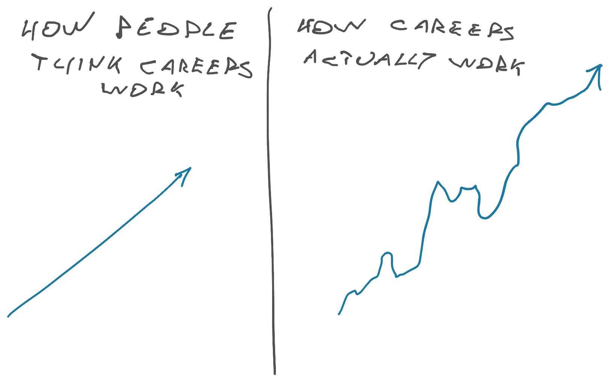

Tech has been going through a rough patch. Hiring freezes, promotion freezes, layoffs ... what's a regular schmuck like us to do? Attack!

_Why_ all this is happening makes total sense. Interest rates go up, money \_now\_ becomes important. Why invest in the future, if you can get the same 4% return by putting money in a bank account? Companies ain't dumb.

But to you and I this is super frustrating.

Promised promotions evaporated. _"We can't give you the title without more money, that would be unfair, and we don't have more money"_ ... doesn't stop you from giving the work does it 🙄

Recruiter emails slowed down. What used to be a few emails per week of _"Hey we're hiring for this perfect amazing role!"_ turned into a few per month of _"Hey we got this role you're overqualified for, reaching out ... eh forget it, someone else will take it, no pressure"_

Thousands got laid off. _"We over-hired and that's totally our fault and we take full responsibility, but you're the one taking the consequences sorry"_ 🙃

After 2 years of the hottest tech market in memory, all that feels like a cold bucket of water.

Remember the ALS challenge? Old meme ...

## Out of ashes comes the good stuff

You know what happens after a forest fire?

The ground is full of amazing fertilizer (the ash), the air is full of amazing sunshine (fewer trees), and all the weeds sucking your nutrients are gone. The baby trees explode into life! _This_ is the moment they've all been waiting for.

Your career can be like that baby tree.

But you have to plant those seeds now. Invest in your future! Take a pause and think: What do _you_ want from your career? What work do _you_ want to do? What excites _you_?

Forget what your employer wants. Forget what the influencers hype. What are _you_ interested in? How can you get ready?

Figure that out _and go hard_. Right now. Today. Take an hour after work (hell, do it during work) and play with a new technology. Or read a book. Or a paper. Or that side project collecting dust in the corner of your memory.

## Prepare now, pounce later

Careers aren't linear and crises don't last forever. Companies, departments, and projects are always coming and going.

But _you_, you my friend, you are the one constant in your career. When one job burns down, the next – better – job is right around the corner.

But only if you're ready when the opportunity shows up. Are you ready?

Cheers, 
~Swizec
