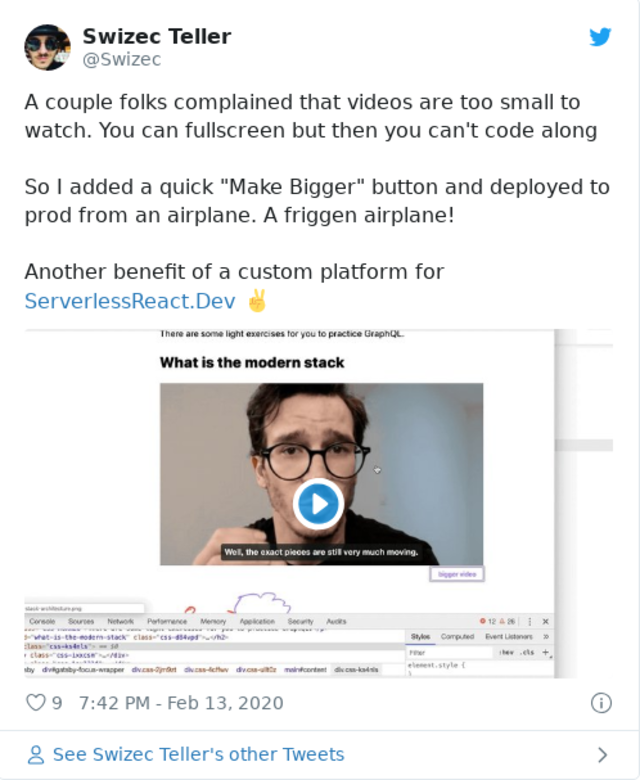

Rule number 1 of indie hacking: _Coding is a trap, focus on your product._

So why the heck did I build a course platform for [ServerlessReact.Dev](https://serverlessreact.dev) when services like Teachable, Podia, Thinkific, and such already exist? Because of friction my friend.

Lemme explain

My goal is to give frontend engineers superpowers and turn them into full-fledged product owners. Whether that product is a feature at work or a great idea for an app.

The way I do that is quality content.

Thoughtful emails from experience, detailed articles, well-researched video courses, deep dive workshops, and funny gifs. You gotta have gifs.

Everything else is a distraction. _Especially_ building a custom course platform.

But here&#x27;s the thing: managing content is _also_ a distraction. I should focus on _creating_ content. Doing research, following trends, finding ideas, writing, editing, recording, coding ...

What creating shouldn&#x27;t involve is futzing around with video uploads, getting transcripts, adding subtitles, rescaling images, formatting content, embedding stuff, or even looking for gifs.

And that&#x27;s where other course platforms fail.

In appealing to the lowest common denominator they lose the very thing that makes them useful: Removing work, _being frictionless_.

## How a custom platform reduces friction

Most course platforms are designed to be _simple_, but they&#x27;re not designed to be _easy_. At least not if you&#x27;re technical or stuck in your ways.

I write in markdown. Using iA Writer since 2010 or so.

I record in OBS. Often livestreamed.

My DSLR is the face camera. When there&#x27;s no code, I just talk into the DSLR like a vlog.

I edit videos in DaVinci Resolve.

All serious work should be version controlled with Git. Saved in Dropbox at the very least. It&#x27;s got version control too.

Now, which platform do you think supports that authoring setup my friend?

Yep, none of them.

## Platforms and misaligned incentives

You see, their incentive isn&#x27;t to make _your_ life easy. Platforms want to make _everyone_&#x27;s life simple.

Come on Teachable and we&#x27;ve got you covered. Come to Podia and get started. No skills required.

Spin up our editor and write your content. Flick on the webcam and record right here. Upload a video and we&#x27;ll keep it safe for ya.

**Please use our platform for authoring _and_ publishing.**

I&#x27;ve already got a great _authoring_ flow, thanks. Can I still use your platform?

Sure you can, just go through these five bazillion painful steps and we&#x27;ve got you!

All these platforms use WYSIWYG. No markdown support. You&#x27;re supposed to write right there and hit publish.

Oh you don&#x27;t want to write here? Maybe you can copy pasta. Oh wait you&#x27;d like to preserve your formatting when you paste? LoL

You want to upload videos? Great! Just click these five buttons in the right sequence and we&#x27;ve got you. We&#x27;ll even host it for ya.

Integrate with your video editing software? hahahahahahaha

Oh you want version control? What&#x27;s that? You realize nobody outside of tech even realized that&#x27;s a thing right? Why on earth would we support that feature don&#x27;t be silly.

Captions? Eh

Transcripts? You can copy pasta into a new section can&#x27;t you?

Multiple videos per lesson? That does not fit our philosophy. A/B testing has showed that users want one video at a time and then to click a big fat NEXT button so they get a sense of accomplishment for finishing a lesson.

But my videos are short. You have to watch 3 of them to get all the steps of the same overall lesson.

_A/B testing has showed_ ...

## So I built my own

So after spending heaps of money, time, and effort trying to make Teachable easier to work with and _absolutely dreading_ the pain of making a new course ... **I said fuck it and built my own**

Now my process looks like this:

- livestream a build
- edit into videos in DaVinci Resolve
- hit render
- DaVinci uploads to Vimeo
- find video urls on Vimeo
- paste into iA Writer
- add descriptions in Markdown
- run `now --prod` to deploy
- go to Rev.com
- select Vimeo vids
- Rev creates captions and delivers straight to Vimeo

It. Is. Wonderful. 😍

Easiest it&#x27;s ever been to make a course.

And check this my friend: ServerlessReact.Dev is built with Gatsby so adding a new section or module is as easy as creating a new `module.mdx` file. Hit deploy and voila, new page.

I have ideas to make it even more frictionless. Gatsby can read Vimeo&#x27;s API and handle the videos itself. Maybe even insert transcripts from Rev 🤔

Using Gatsby also means that my course renders as a static HTML page. You can use it on your phone, laptop, crappy wifi, or wonderful broadband. Once it&#x27;s open it&#x27;s open.

And the best part? I can fix things from an airplane.

🤘

Cheers,  
~Swizec

PS: this post got long so maybe I&#x27;ll write about the Gumroad-&gt; Auth0 -&gt; useAuth -&gt; course integration next time. Interested? hit reply

PPS: Gumroad because I&#x27;m not dumb enough to build my own checkout ;)
