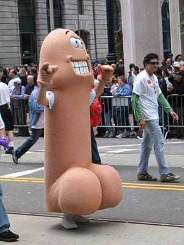

- 

  Image via [Wikipedia](http://commons.wikipedia.org/wiki/Image:2005_walking_penis.jpg)

**Size matters!** But obviously that&#x27;s a very lame argument so let&#x27;s work it out a bit. Everybody knows that when it comes to impregnating homo sapienatic females any and all but the weirdest of [male](http://en.wikipedia.org/wiki/Male "Male") homo sapienatic instruments will do. It can be wide, it can be small, it can be whatever. As long as it&#x27;s longer than 5 inches you&#x27;re good and obviously since you&#x27;re here and we have this thing called [evolution](http://en.wikipedia.org/wiki/Evolution "Evolution") and inherited traits, chances are your [phallic](http://en.wikipedia.org/wiki/Phallus "Phallus") instrument is longer than 5 inches mister. And 5 inches is quite alright, I wouldn&#x27;t want a 5 inch knife in my back ... But homo sapiens are smart cookies and they needed something more out of sex. This thing called an endorphinal high, we like drugs maaan, because after all, if sex would hurt nobody would do it and then we&#x27;d all be fucked. Not to mention that&#x27;s no fun at all. So most of the time when a homo sapiens female and a homo sapiens male get together it isn&#x27;t to make little hobbits, it&#x27;s to make fun and create natural occuring brain drugs. Woo. This however introduces a problem, the lukewarm hole most females sport is very stretchy and the more fun it&#x27;s having the more it stretches. The damn thing does not in the least care about what you&#x27;re putting inside, it just wants more and more and more and it gets bigger and bigger. Then the lady stops getting pleasure because she can&#x27;t feel anything. Hell, there&#x27;s very little friction left! What do? Well obviously you put a bigger instrument into the hands of the master male homo sapiens so that he could pleasure the female better. Problem solved! By the by, many animal [species](http://en.wikipedia.org/wiki/Species "Species") have tricks to make the female more ... uhm ... willing. Like cats have spikes on their instruments and ducks have a spiral penis! Wow, amazing, shocker! Ok so no bitching about &quot;Size doesn&#x27;t matter, it&#x27;s how you use it&quot; Sod off with those, size, in [humans](http://en.wikipedia.org/wiki/Human "Human"), is about 80% of the equation when it comes to pleasurable activities of the sort. Therein lies the problem. The more the woman wants to have fun, the bigger instrument she needs. But how can you tell who&#x27;s got a big instrument when the damn bastards keep it neatly tucked away in their garment? **Confidence!** The more confidence a male [sports](http://en.wikipedia.org/wiki/Sport "Sport") the bigger their schlong! The mechanism for how big schlong == big confidence is probably self-evident so let&#x27;s leave it at this. The _reason_ why bigger schlong equals bigger confidence is that lasses need a heuristic for finding bigger pleasure.

[![Reblog this post [with Zemanta]](http://img.zemanta.com/reblog_e.png?x-id=620b4d5a-69f5-487e-97eb-1b503a0ca9bf)](http://reblog.zemanta.com/zemified/620b4d5a-69f5-487e-97eb-1b503a0ca9bf/ "Reblog this post [with Zemanta]")
