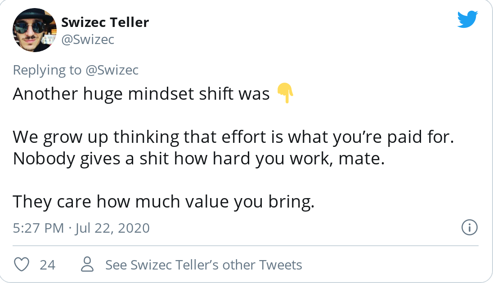
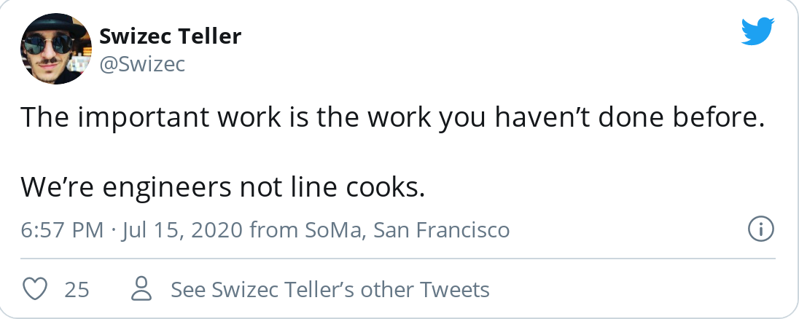

Your boss comes up to you and says _&quot;Yo we&#x27;ve got the perfect project for you&quot;_

_&quot;We need new functionality in this feature and you&#x27;re the last person to work on it. Means you&#x27;re the best fit_

Didn&#x27;t I work on this 3 years ago?

_&quot;Yes, hasn&#x27;t been touched since&quot;_

And that&#x27;s why engineers are worth the big bux my friend. **We build assets.**

## How engineers build assets

Consider a typical job: You do the work, create value, get paid.

Service jobs are like that.

You go to the DMV, see the bored bureaucrat and you try to lighten their day. Smile and a chitchat. Doesn&#x27;t work. Still grumpy.

Now imagine it from their end.

You&#x27;re sitting in your chair all day having the same damn conversations. These fools come up to you, all saying the same stupid chitchatty words ... yes you got in a wreck, no this never happens to you otherwise, yes it was the other person&#x27;s fault, yep the lines are long, yeah it&#x27;s wednesday, mhm weather sure is nice ... 🤮

You grab their papers, add the stamp, count there&#x27;s 3, say the same old _&quot;Okay take these papers to window 5, tell them Margarite sent you, ask for article 2a-dash-c, I added a postit note. Then you go to ..._

Every day. Every week. Every month. For years.

You&#x27;d be grumpy too.

Compare that to an engineering job.

You get a project. You iterate with the product team, the design team, the other engineers.

It&#x27;s a long and sometimes painful process. You bang your head against the wall. Problem after problem. Issues always come up.

You ship to production and wish you never have to look at this bullshit ever again.

**And unlike the bureaucrat, you don&#x27;t!!** You&#x27;re done.

Tomorrow brings a new challenge. A new project. New idea. New everything. You&#x27;re using the same technology, [building on your past projects](https://swizec.com/blog/path-dependence/swizec/9448), sure, _but you&#x27;re building something new._

That&#x27;s because you&#x27;ve created an asset.

An asset that&#x27;s going to keep doing ~~its~~ your job long after you&#x27;ve moved on. After you&#x27;ve left the company even. Your code&#x27;s gonna keep chugging along making cash.

**That&#x27;s** why engineers are worth 💰.

And lest you think we&#x27;re alone: Designers build assets when they create design systems, marketers build assets with funnels and email chains, managers build assets with improved processes, entrepreneurs build assets with teams.

The trick is to do work that works when you don&#x27;t.

## Use this concept to up your salary

Your value is in building assets. Now what?

Use that knowledge to increase your salary. In my [5 years of books &amp; courses or how I made \$369,000 on the side](https://swizec.com/blog/5-years-of-books-courses-or-how-i-made-369000-on-the-side/swizec/9453) article, I mention between the lines that day job income went from $60,000 to $175,000 in 5 years.

That&#x27;s a 3x difference. 😇

How?

Part of it is leverage. Having a sidehustle means I can negotiate aggressively. Savings mean I can always walk away.

The **big part is understanding your value** and finding folks who value it. That&#x27;s the trick.

## Your work is worth different 💰 to different people

You can do N hours of coding per day. When you&#x27;re done you&#x27;re done. You can&#x27;t juice a squeezed lemon.

Who should you sell those value-creating hours to?

Let&#x27;s say you create a landing page. Standard work, nothing hard. Direct revenue generating asset.

2000 visitors, 200 clicks, 20 purchases. 1% conversion, not bad.

Company A sells a $9 product. Company B sells a $90 product.

Your 5 hours of work are worth $180 to Company A and $1800 to Company B. Same 5 hours of work, same difficulty of effort.

Company C has a huge brand, massive traffic machinery, and a \$90 product. 2,000,000 visitors land on your new page on day 1.

👉 you created a \$1,800,000 asset. Same 5 hours of easy effort.

🤯

Happy Friday ❤️

Cheers, ~Swizec

PS: this is why SFBA has these crazy salary dynamics. There&#x27;s more unicorns per capita than anywhere else in the world.
