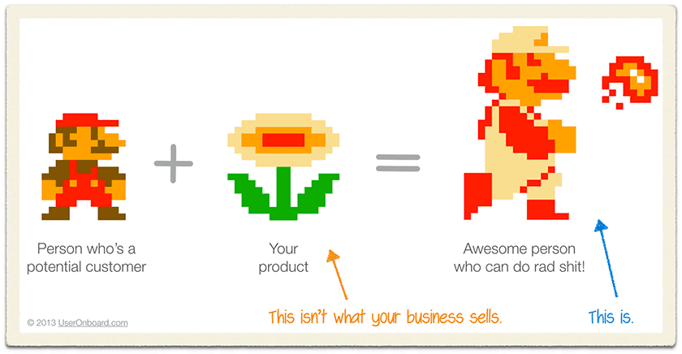
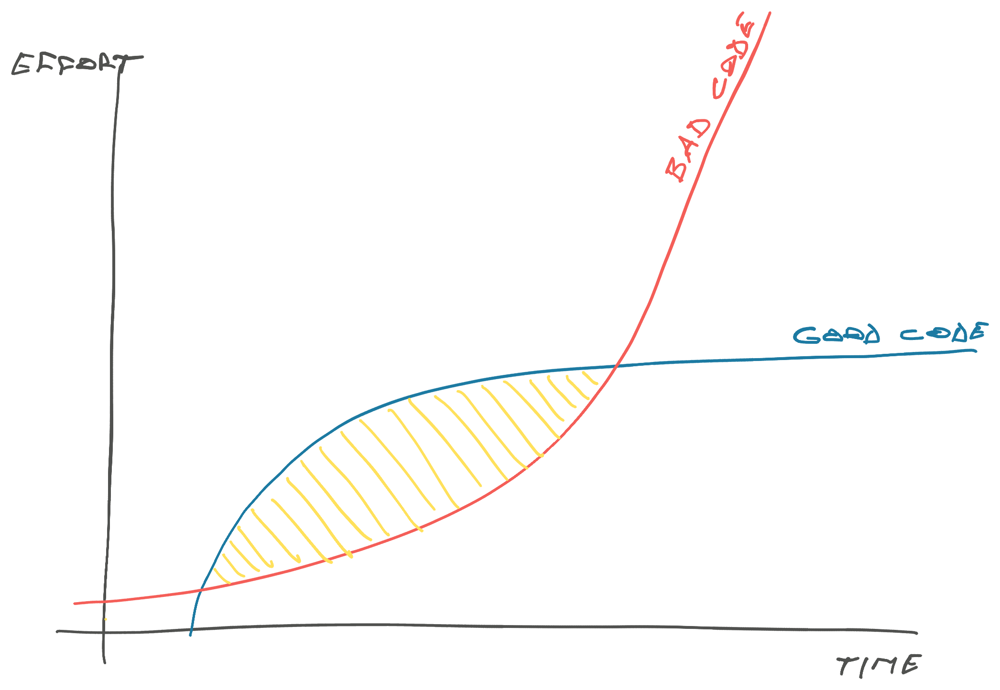

Beginners and executives sometimes ask why would you even care about code structure. As long as it works, right?

It's true that [the code is not the goal](https://swizec.com/blog/the-code-is-not-the-goal/), empowering users is the goal. We build the flower and all Super Mario cares about is being able to shoot fireballs.

But code structure _does_ matter. Yes, if you have to choose between perfect code and working software, choose shipping. That's why the [big ball of mud is the world's most popular architecture](https://swizec.com/blog/big-ball-of-mud-the-worlds-most-popular-software-architecture/).

It matters because [_Software engineering is programming over time_](https://swizec.com/blog/what-i-learned-from-software-engineering-at-google/). It's not about does your code work today, it's about how will you keep it working tomorrow?

You won't know the right structure to use right away. [Developing software is like kicking a can](https://swizec.com/blog/writing-software-is-like-kicking-a-can/). If you force too much structure too soon, you'll slow yourself down _and_ build the wrong structure that's a pain in your neck forever.

[You can't fix the wrong abstraction](https://swizec.com/blog/you-can-t-fix-the-wrong-abstraction/).

But with zero structure, you will hit a wall.

You won't be able to grow your team or [give away your legos](https://review.firstround.com/give-away-your-legos-and-other-commandments-for-scaling-startups/). A team will step on each other's toes and feel like there's too many chefs in the kitchen. And only folks who have the whole codebase memorized will be able to help.

As the codebase grows, memorizing the whole thing becomes impossible. [The codebase always grows](https://swizec.com/blog/the-laws-of-software-evolution/).

https://twitter.com/Swizec/status/1830095359127011821

Your best bet is to make code easy to move around.

- use idempotent functions
- avoid dependencies outside your scope
- declare your types
- define clear interfaces
- strictly separate the inside/outside of your blob
- let the domain guide your design
- prefer duplication over smooshing concerns

Cheers, 
\~Swizec
