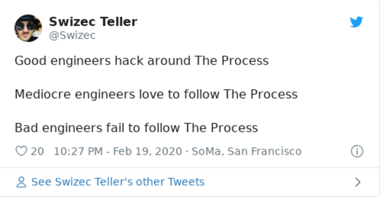
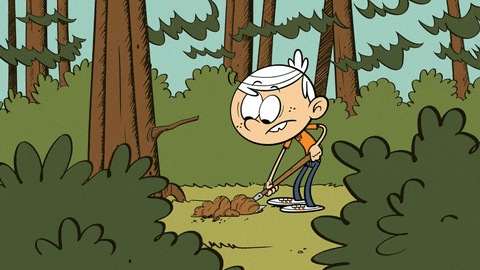

Companies start life in the cowboy phase – a band of brothers and sisters building something cool.

You ship straight to prod, you understand the whole business, you vibe with everyone around you. They think it, you build it. Telepathic almost.

When something goes wrong, you know how to fix it. The whole system fits in your head. You know what everyone is working on, and you Just Know™ what matters most.

Life is good. An engineer's dream.

Then something goes wrong.

You push a critical bug. Production goes down. Customers lose data. Thanksgiving promotions don't work. The site crashes at a pitch to investors. Money is lost.

Time to grow up.

## A process is born

You add checks and balances.

Something simple – everyone's code needs to go through a pull request. Helps you know what's going on, increases team learnings, ensures at least two people see every change.

Great idea!

Then you add QA, product managers, designers, feature owners, internal clients, external clients, this person that person ... before you know it every idea goes through committee after committee before it even reaches the developer.

## Nothing gets done anymore

3 or 4 years after starting, if you're not careful, most of your time goes to meta work. Work about work.

You have an idea. Tell the PM.

PM puts it on their pile of ideas.

Every Friday, your PM – now called Head of Product because you're a very real grownup company – looks at this list and decides what to work on.

Your idea might just align with business objectives.

PM looks at everyone touched by this idea and goes into Requirements Gathering mode. They talk to sales, customer support, operations, engineering, the CEO, the COO, the janitor, and maybe that homeless dude outside.

3 weeks later a spec is born.

5 miles long, covering all edge cases, and with everyone's pet addition. Your idea is on line 5 paragraph 6. Now unrecognizable.

## You get to work

Work starts with reviewing the spec. You talk to the PM ask a bunch of questions, poke holes in the edge cases, talk to the clients again just to make sure everyone understands the spec in the same way.

Everyone had a new idea. That little something they forgot.

The spec grows a mile.

You create a detailed estimate. Line by line. Investigate the code, plan the solution, really dig down to what's needed. Hand waving with an _"Eh about 5 days"_ won't do in a serious grownup organization like yours.

It takes you 3 days to dig through the requirements, the aging codebase, and the technical debt. You're pretty sure you know how to implement this.

Estimate: 5 days.

You spend another 2 days writing test cases for QA, help docs for feature testing, and some documentation for yourself. Gotta know how you'll know the feature works before you start. Them's the rules.

## Code is just a checklist

You finally get to code. 2 weeks since you started the project.

Ah bliss

Except your estimate is so detailed that there's no fun left. You're just following a checklist. A detailed list of steps pre-determined while estimating.

You've done the engineering. The fun stuff. Now you're just doing work. Like digging a trench.

## Time to deploy

10 days later you're ready to deploy.

Oh the estimate was 5? Ha! You forgot work takes _work_. Even if it's simple, easy, and following a checklist, it still takes time.

Frustrating, I know.

You send a pull request to the 5 repositories you changed. Ship off to QA. And ask the PM to verify everything looks good.

Five hundred comments and 3 feature additions later, you're ready to ship.

That took another week.

5 months from idea to feature but at least your deployment process is easy. You're a young startup after all!

Just poke the deployment engineer and she'll get to it tomorrow.

Maybe.

Cheers,  
~Swizec
