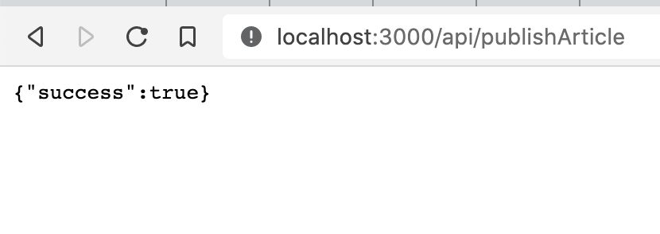

NextJS has built-in support for backend code and wow

_CodeWithSwiz is a twice-a-week live show. Like a podcast with video and fun hacking. Focused on experiments. [Join live Wednesdays and Sundays](https://youtube.com/swizecteller)_

https://www.youtube.com/watch?v=zjGTC9PK2gA

In this episode of CodeWithSwiz, we tried NextJS's support for /api routes – code running on the backend.

Got that working, then my internet died. Couldn't finish the full objective of using an /api route to publish code to GitHub. 💩

## Why NextJS /api routes are great

NextJS uses a special `/pages/api` folder for routes running on the server. Both at compile-time _and_ run-time. Always server side code.

Same file-based routing as your frontend code 👉 put a file there and it's available at `<domain>/api/filename`. Export a default function from this file and that's your API controller.

```javascript
// pages/api/publishArticle.js

export default async (req, res) => {
  res.status(200).json({ success: true })
}
```

`req` is the request object, `res` is the response object. You read inputs from `req` and return outputs by modifying `res`.



You'll be familiar with this pattern, if you've used [Express](https://expressjs.com/) before. The most popular JavaScript backend framework, I believe.

Looks compatible with existing Express middlewares 🤘

Locally these routes work with your development server. Deploy to Vercel and they become cloud functions. AWS Lambdas (I assume) running on each API call. Haven't tried with Netlify.

In short, you get serverless without the pain 😍


## How you can use /api to get things done

Unlike the traditional Express approach, NextJS forces you to use these routes as an API. They're meant to return data, not pages.

You want to have this discipline in your project as early as possible. Transitioning later when your team grows hurts. Been working on that transition at dayjob.exe and oof, hella gotchas 😅

On the stream, we created a [React Query](https://react-query.tanstack.com/) mutation running off a button click. It sends a POST request to our `/api` route with the full article.

```javascript
// components/ShipIt.js

export const ShipIt = ({ article }) => {
  const [shipArticle, { status, isLoading }] = useMutation(async () => {
    // makes a POST request to the server
    return fetch("/api/publishArticle", {
      method: "POST",
      headers: {
        // enables automatic body parsing
        "Content-Type": "application/json",
      },
      body: JSON.stringify(article),
    })
  })

  if (isLoading) {
    return <Spinner></Spinner>
  } else {
    return <Button onClick={shipArticle}>Ship It</Button>
  }
}
```

We set up a mutation, show a spinner when it's loading, and a button with a click handler otherwise. Click the button, call the `shipArticle` method returned from `useMutation`, execute the `fetch()` call.

Setting the content-type header tells NextJS to parse POST body as a JSON string. Makes it easier to access values :)

```javascript
// pages/api/publishArticle.js

export default async (req, res) => {
  // req.body.title == article title
  // req.body.description == article description
  // etc

  res.status(200).json({ success: true })
}
```

Tanner says we can share queries and mutations between frontend and backend. Gonna try that next time ✌️

https://twitter.com/tannerlinsley/status/1305266028574728192

## Using GitHub's REST API to commit files

Original goal was to use an `/api` route to publish an article. Since they're markdown files in a repo, that means using the GitHub API to make a commit.

We use the [@octokit/rest](https://github.com/octokit/rest.js/) library for that.

Runs in Node.js, which means it works with our NextJS server routes. But it's super complex and hard to figure out.

After much spelunking through the docs, we got an authenticated request working. It required a [personal GitHub acces token](https://docs.github.com/en/github/authenticating-to-github/creating-a-personal-access-token) added to `.env.local`.

```javascript
// pages/api/publishArticle.js

import { Octokit } from "@octokit/rest"

const octokit = new Octokit({
  auth: process.env.GITHUB_TOKEN,
})

export default async (req, res) => {
  const { data } = await octokit.request("/user")
  // prints user info
  console.log(data)

  // ...
}
```

Instantiates Octokit with your token and requests `/user` data. Makes the project hardcoded to you, but works. We'd have to add a full authentication system to let anyone else use this.

We figured out how to add files to repositories juuuuust as my internet died.

```javascript
await octokit.repos.createOrUpdateFileContents
```

Join me Wednesday evening and we'll figure out the rest 🤞

Cheers,<br/>
~Swizec

PS: since this article was published, Gatsby added /api routes too 🥳
