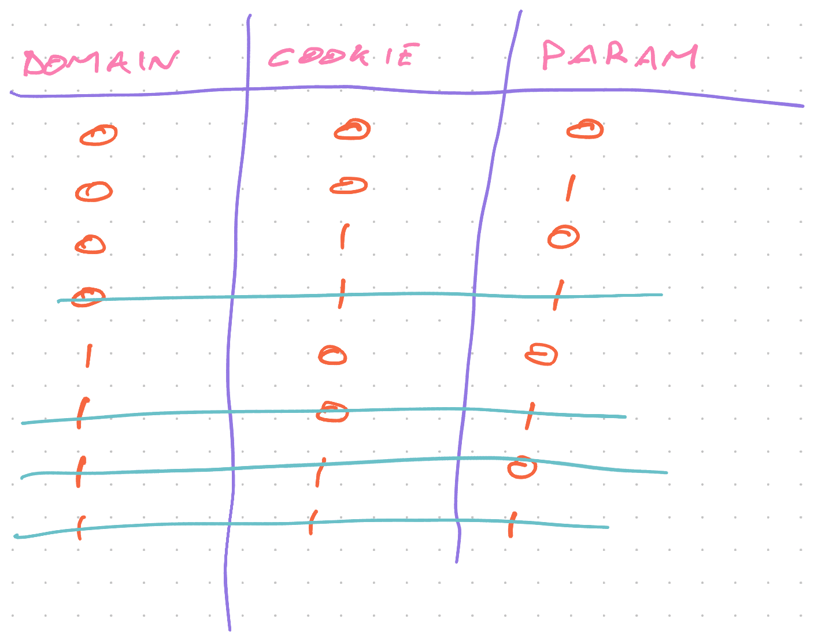

Last week we talked about how [small decisions can lead to big changes](https://swizec.com/blog/even-small-things-can-make-your-code-gnarly/) in your codebase. We used null-checks as an example but didn't explain _why_ those are bad.

It's about exploding complexity.

## Starts simple

Take a basic React component for example. It takes a user and renders their info. Like for a page header.

```typescript
type User = {
  name: string
}

function UserInfo(props: { user: User }) {
  return <div>{props.user.name}</div>
}
```

We have a `User` type that defines properties and a component that takes `user` as a prop. It then renders the user's name.

How would you test this?

### There is 1 important state

In theory, this component has an infinite number of states. The `name` string can be anything.

But you can rely on React and browser rendering to work. You only need to test that when you pass a user name, it renders.

```javascript
test('renders username', () => {
	let component = renderer.create(
		<UserInfo user={{ name: 'Swiz' }}> />
	)

	expect(component.toJSON()).toMatch(
		'<div>Swiz</div>'
	)
})
```

## A null check doubles your important states

Let's see what happens when a user's name may be undefined and we want to show a default.

```typescript
type User = {
  name?: string | null
}

function UserInfo(props: { user: User }) {
  return <div>{props.user.name || "Unknown"}</div>
}
```

The name property may be `undefined` or `null`. We can treat those the same because there is a special circle in hell for people who use the difference between `undefined` and `null` for program logic.

Altho it _can_ be useful sometimes. I've done it 😇

When the username is undefined, our component now shows `Unknown` instead.

How many tests do you need now?

### There are 2 important states

You now need to write 2 tests to verify this component works.

```javascript
test('renders username', () => {
  let user = { name: 'Swiz' }
	let component = renderer.create(
		<UserInfo user={user}> />
	)

	expect(component.toJSON()).toMatch(
		'<div>Swiz</div>'
	)
})

test('renders Unknown', () => {
  let user = {}
	let component = renderer.create(
		<UserInfo user={user}> />
	)

	expect(component.toJSON()).toMatch(
		'<div>Unknown</div>'
	)
})
```

The first test verifies rendering the username, the second test verifies the default state.

If you don't trust JavaScript's `||` operator, you could add another test for an explicit `name: null` value.

And you might notice I wrote a bug. Empty usernames render as `Unknown`. 💩

That's where [fuzzing](https://en.wikipedia.org/wiki/Fuzzing) is useful. Finding little edge cases like that.

## _Every_ null check doubles your states

Now here's where it gets crazy. _Every_ null check doubles the number of tests you need.

```typescript
type User = {
  name?: string
  avatar?: string
  karma?: number
}

function UserInfo(props: { user: User }) {
  const { user } = props

  return (
    <div>
      {user.avatar ?  : <DefaultAvatar />}
      <label>{user.name || "Unknown"}</label>
      <p>{typeof user.karma === "undefined" ? "🐣" : user.karma}</p>
    </div>
  )
}
```

Show user avatar or a default. Show their name or 'Unknown'. Show their karma or 🐣.

How many test cases does this component need?

That's right! 8.

Add one more and you get 16. At 5 nullable properties, you're looking at 32 combinations. `2^N(nulls)` adds up fast 🙃

And if you're treating `undefined` and `null` as different, that formula becomes `3^N(nulls)`.


## How to solve exploding complexity

Truth tables are my favorite tool in this case. Write out all your nullable variables, iterate their states, cross out what's impossible.

Here's an example from an article about [How tests uncover hidden complexity in your code](https://swizec.com/blog/how-tests-uncover-hidden-complexity-in-simple-code/)

[](https://swizec.com/blog/how-tests-uncover-hidden-complexity-in-simple-code/)

You take the rows that aren't crossed out and write tests. Or decide that's way too many states and simplify your code.

When you have lots of transitions between states, I like to [use XState](https://swizec.com/blog/when-your-brain-is-breaking-try-xstate/). Helps when your brain is breaking ☺️

Cheers,<br/>
~Swizec

PS: I'm calling it a null check because that's the standard phrasing. JavaScript just happens to have 2 different null-ish values – `undefined` and `null`
