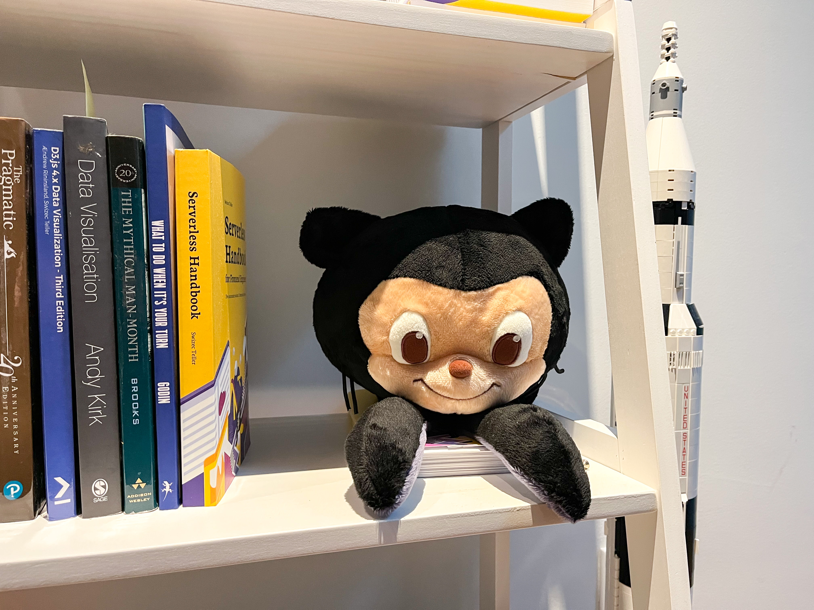

We like to cook at our house. Nice fresh foods with ingredients you recognize. It's great.

But the way we cook is ... different. Put us in the kitchen together and there's sure to be a squabble. _"You're doing it wrong! Gah I can't watch this just let me do it"_

Ever walked into a codebase and it's just ... wrong? I have.

And doing dishes the other day it hit me – two kinds of brains! Organizers and searchers.

https://youtu.be/GgiK-HWKPjw

## How she cooks

Her approach to cooking is best described as creative chaos.

Dishes everywhere. Onion peels on the counter. Potato skins right next to them. Egg shells in the sink. Oven pans on the floor. New pot, knife, and spoon for every thing. Food wrappers on the counter, in the sink, all around.

Half the time she cuts herself because there's no room. If you move a pan, it shoves 5 other things around.

And the food? Amazing.

I'm the cleaning crew. 🥲

## How I cook

My approach to cooking comes from a mom with a devious plan – _"If I never clean his mess, he'll figure it out"_.

> A place for everything and everything in its place.

Before you start: Clean the kitchen.

While you cook: Clean the kitchen.

After you cook: Leave kitchen cleaner than before.

Searching wastes time. The thing wasn't in its place and now your eggs are 20 seconds overcooked. Disaster.

And I like to have room to move. Clear counters, clear stove, clear everything. Reuse the same pot as much as possible. Use the fewest number of spoons. Elegance.

And the food ... eh it's okay. She's taken over the kitchen and I'm out of practice.

## Why the difference

https://youtu.be/GgiK-HWKPjw

We're like that scene in Ratatouille. The talented artiste meets the ruthless professional.

The difference comes from how we see efficiency.

She's got excess brainpower and keeping track of where she left things is easy. Her brain works like a [least recently used cache](<https://en.wikipedia.org/wiki/Cache_replacement_policies#Least_recently_used_(LRU)>). To find a thing, you remember where you last used it and look in that one place. Easy.

If it's not there, someone moved it and omaigod how dare you mess with her system. Usually me trying to clean 😂

Me, I need all the help I can get. The only things I can memorize are useless wikipedia facts and coding techniques.

_"Where did you last use it?"_ heck if I know. When something's missing, I look in the 5 places it could be.

That's why everything gets categorized, organized, and put away. _Before_ I start cooking. Ain't nobody got time to search around when there's dishes on the stove!

## How this looks in code

Something similar happens in code. You have people who like to organize and those who like to search.

**Organizers** try to classify things. CSS goes in these files, JavaScript in those files over there. You have a folder for controllers and another for models.

Everything looks neat and organized. Want to find a piece of code? Easy! Remember its classification and go there.

Good luck if your brain puts the Octocat Plushie under toys and theirs puts it under swag.

**Searchers** optimize around search. Modern tooling is great for this. Why bother organizing if Cmd+P can find any file in your project? Why classify your code if `git grep` (global search) can find any fragment? Who cares about folder structure if VSCode auto-imports your code?

Name it well, leave some breadcrumbs, and you're good! Anything you need is a short search away. Hell, click a function and your IDE jumps to definition 🤩

This may be generational. There is evidence that [younger folk no longer think in folders](https://www.theverge.com/22684730/students-file-folder-directory-structure-education-gen-z).

## A mixed strategy is best

Pure search is chaos, pure organization is annoying.

Everything in a large bag of code feels messy. The search space is too big. You feel overwhelmed.

Everything organized is annoying to use. To get anything done you have to run around a bazillion files and keep a bunch of context in your brain. Hard to keep track.

Here's what I've found works best:

- **tools and ingredients** are organized by type. Spices go in the spice rack, knives in the knife block.
- **features and tasks** are organized by what works together. Cleaning supplies go in the tiny closet by the stairs.

When you're building brooms, you want a bucket of screws, a box of brushes, and a rack of sticks. Quick to find, easy to assemble.

When you're cleaning a spill, you want the broom and the floor spatula together. You need both to fulfill the task.

Same with code.

When you're building forms, you want quick access to all input fields, to buttons, common validations, and API logic.

But when you're building the login form, it's nice when the layout, style, and logic are all in one place. You think of them as A Thing.

And if you can search for it all, perfection.

Cheers,
~Swizec

PS: I navigate with search and jump-to-definition. Find a foothold, follow the path. If [you watch me code](https://youtube.com/c/SwizecTeller), you'll see I hide the file explorer tab. No need :)
