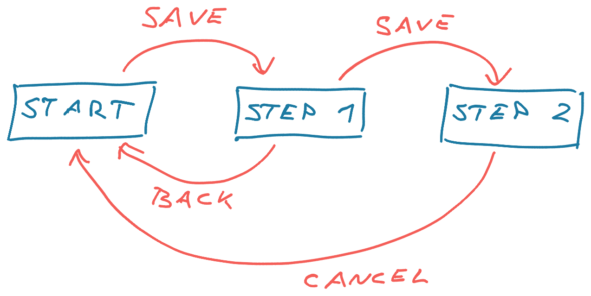

My girlfriend loves to ask me to grab something from her purse. I think it's some sort of sick joke. How could anyone find anything in that pile of keys, tissues, forgotten headphones, receipts, and five different wallets?

She finds everything on her first try.

Her purse is a black hole bigger on the inside and would certainly make an exciting research subject for a physicist, but it makes sense to her. _"It's easy,"_, she says, _"men just can't find anything"_

The same is true for code. What feels obvious to you may not make sense to others.

When I look at a state machine definition, my mind translates it into a picture. Others see a gaggle of nested dictionaries and think it's a mess.

```javascript
const smolStateMachine = {
	start: {
		saveAction: {
			doStuff: () => ...
			next: 'step1'
		}
	},
	step1: {
		backAction: {
			next: 'start'
		},
		saveAction: {
			doStuff: () => ...
			next: 'step2'
		}
	},
	step2: {
		cancelAction: {
			next: 'start'
		}
	}
}
```

When you know what to look for, this gaggle of dictionaries becomes a picture like this:



First level keys are states, second level keys are arrows, third level keys define what those arrows do.

You might think that's neat, unnecessary, or just don't like how it feels. And that's fine. Once you understand how _I_ think about it, the code becomes easier to read.

_PS: Code is a direct expression of how you understand the problem and an extension of the way you think. Reading somebody else's code is like learning how they think._

One of the ways we confuse each other is by how we organize code. Engineers fall in two camps:

1.  Categorizers, who like strict folder structure
2.  Searchers, who like to use search tooling

The biggest frustrations happen when these camps work together.

## Categorizers

When it comes to household items, I'm a categorizer.

My socks drawer has buckets for different types of socks, my t-shirts come in piles for work, leisure, and gym, my desk has a drawer for notebooks and a drawer for laptops (work and home), and if you put the pasta sauce on the wrong shelf in my kitchen I will end you.

> A place for everything and everything in its place.

This makes finding any item easy. You think of its category and go to where that category is stored.

The physical structure of your house works like a database index. Instead of searching through all your possessions, you traverse a tree of categories: Socks are small clothes and you're going running. Bedroom -> closet -> sock drawer -> running bucket.

Works great when you live alone.

_PS: The performance gain of an index depends on how aggressively it can partition your data to limit the search space for a query. In some situations an index can be slower than a table scan searching item by item._

What happens when others in your family can store things? What if they disagree about what category it falls under? Is the wonderful [Lovelace> & Babbage by Stoney Babua](https://en.wikipedia.org/wiki/The_Thrilling_Adventures_of_Lovelace_and_Babbage) more of a sci-fi, historical fiction, educational fanfic, or comic book?

Code is a team effort and that's where categorizers run into trouble. They like to organize code like I organize my closet – folders for everything.

A folder for styles, UI elements, database models, services, controllers, routes, user flows, and others. The structure makes it easy to find any type of code.

Want a route? Look in `/routes`. Want a service? Look in `/services`. Want a UI component? Look in `/components`.

Categorization works until you ask questions like _"Where do I find the code that fetches every comment by a user?"_. Is that in the user model, the comment model, or maybe it's in a queries folder? Could be a comment service ...

Another issue with categories is that you're doing the world's most dreaded whiteboard interview every time your categories start to break down – can you balance a tree? Engineers wisely shy away from that and shove code where it doesn't belong.

But hey, the codebase looks clean. At first.

## Searchers

A searcher is someone like my girlfriend. If you leave things where you last used them, you always know where to look first.

But the house looks like a mess 🙃

The bigger problem with searching is that it's slow. Last thing you wanna do while rushing out the door is to spend 5 minutes digging through your closet to find a matching pair of socks.

My girlfriend has an immense memory and searching works for her. She remembers where things are. At least the general area. But when she asks me to help, well I wasn't there the last time she used the thing. Best I can do is search the entire house item by item.

While she's using a memorized index, I'm doing a slow table scan. No wonder she says I'm useless!

But code is not socks.

Code is structured data full of connections – a dependency graph like we mentioned in Chapter 4. Computers can memorize structured data for you!

Features like

- jump to definition,
- rich text search,
- highlight every use of a function or variable

make it so you can navigate a codebase with complete disregard for how it's stored. All that matters is the code's logical structure.

And because you're navigating the code's logical structure, you can move code to wherever is most convenient. This unlocks great flexibility and makes code easier to change.

But it looks like a mess.

## What about both?


Whether you like categories or searching may be generational. In [File not Found](https://www.theverge.com/22684730/students-file-folder-directory-structure-education-gen-z) for The Verge, Monica Chin writes about conundrum college professors are struggling with – young students don't understand folders. Why organize your research when everything is searchable?

They have a point.

It's all sequential flat bytes in storage anyway. Why bother organizing when global search is so fast and powerful?

SmallTalk tried to tried to give you the freedom to think about code in abstract terms back in the 80's. No more files, just dependencies. Move anything anywhere and the compiler will figure it out. It didn't catch on. Computers weren't fast enough.

What works best nowadays is a mix of approaches: Use categories, not too many, mostly by feature.

Cheers,<br/>
~Swizec
