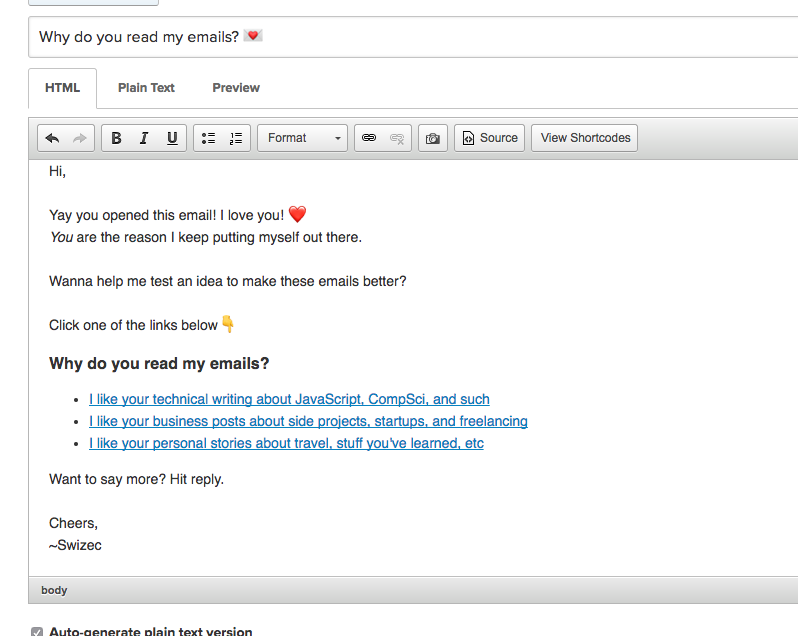
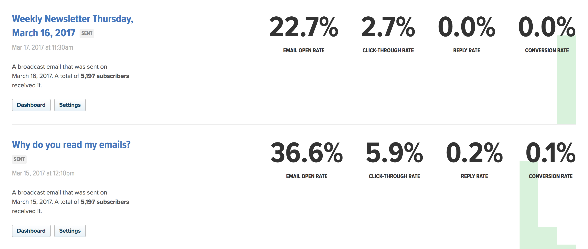

Last week, I sent this email to 7,118 people:

Scary, but necessary. For a while now, I&#x27;ve been feeling my weekly emails aren&#x27;t as good as they should be. Open rates are dropping, subscribers are churning almost as fast as they&#x27;re coming in…

Not a good place to be. ?

I mean, just look at this. 36% open rate on the random question, 22% on the weekly email two days later. Not good at all.

Yes, that _does_ list only 5,197 subscribers. It&#x27;s because my email list is split between two Drip accounts. The big list is for people who subscribe by buying a product or signing up for a technical course or getting a free book chapter or something like that. A smaller, 2,000-person list is for those who subscribe directly through this blog.

You could say one list leans towards customers and the other leans towards fans. Open and click-through rates are similar for both lists.

The lists are split because I thought they were two different types of audiences back when I set it up. They&#x27;re not.

## Here&#x27;s what I found out ?

77 people hated the question and unsubscribed. That hurt, but it&#x27;s only 1%. I guess I&#x27;ll live.

32 people loved it and shared it on Twitter from the _[&quot;Thank you for being awesome&quot;](https://swizec.com/thanks.html)_ page.

15 people replied.

3 people complained on Twitter that I only gave them one voting option. This was on purpose to force a decision :)

500 people clicked a link and voted. That&#x27;s amazing. Thank you. ❤️

Here&#x27;s the breakdown:

My dreams of becoming the Casey Neistat of JavaScript are dashed. ? People don&#x27;t care about my personal shit. They want code and more code. Some care about the business of code.

It&#x27;s okay. I&#x27;ve heard rumors that the reason people like my code writings is because I make them personal and approachable. ?

**So how am I going to use this info to make my weekly emails better?**

I&#x27;m going to make the emails a lot more personal. I know people said they don&#x27;t care, but I think that secretly they do. Every week, there&#x27;s going to be a short cover letter that’s exclusive to the mailing list. This, I think, will improve our relationship.

And while all three groups are going to get the same content, it&#x27;s going to be personalized. For the technical group, the lead story will be technical; for business, the lead will be business; and so on. This, I think, will improve open rates.

I&#x27;m also going to use this to improve people&#x27;s onboarding experience. After you subscribe, you&#x27;ll get to choose a topic.

The overall goal is to help people become better engineers. We&#x27;ll see if it works :)
