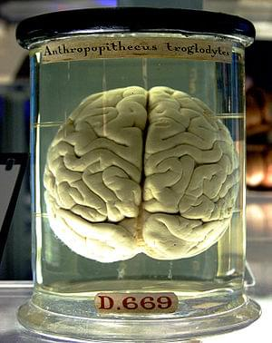
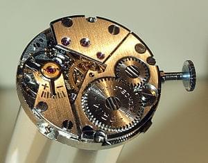
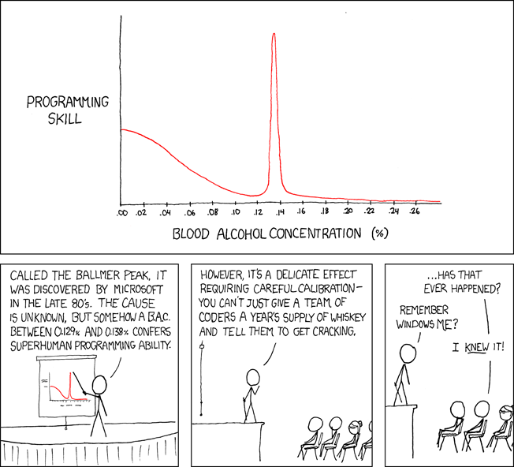

_\[This essay has been expanded into a book, you should read it, [here](http://nightowlsbook.com)]_ \[caption id=&quot;&quot; align=&quot;alignnone&quot; width=&quot;300&quot;] Image via Wikipedia\[/caption] A popular saying goes that [Programmers](http://en.wikipedia.org/wiki/Programmer "Programmer") are machines that turn caffeine into [code](http://en.wikipedia.org/wiki/Source_code "Source code"). And sure enough, ask a random programmer when they do their best work and there&#x27;s a high chance they will admit to a lot of late nights. Some earlier, some later. A popular trend is to get up at 4am and get some work done before the day&#x27;s craziness begins. Others like _going_ to bed at 4am. At the gist of all this is avoiding distractions. But you could just lock the door, what&#x27;s so special about the night? I think it boils down to three things: the maker&#x27;s schedule, the sleepy brain and bright computer screens.

## The maker&#x27;s schedule

[Paul Graham](http://paulgraham.com "Paul Graham (computer programmer)") wrote about [the maker&#x27;s schedule](http://www.paulgraham.com/makersschedule.html) in 2009 - basically that there are two types of schedules in this world (primarily?). The traditional manager&#x27;s schedule where your day is cut up into hours and a ten minute distraction costs you, at most, an hour&#x27;s worth of time. \[caption id=&quot;&quot; align=&quot;alignleft&quot; width=&quot;300&quot;] Image via Wikipedia\[/caption] On the other hand you have something PG calls the maker&#x27;s schedule - a schedule for those of us who produce stuff. Working on large abstract systems involves fitting the whole thing into your mind - somebody once likened this to constructing a house out of expensive [crystal glass](http://en.wikipedia.org/wiki/Lead_glass "Lead glass")and as soon as someone distracts you, it all comes barreling down and shatters into a thousand pieces. This is why programmers are so annoyed when you distract them. Because of this huge mental investment, we simply can&#x27;t start working until we can expect a couple of hours without being distracted. It&#x27;s just not worth constructing the whole model in your head and then having it torn down half an hour later. In fact, talking to a lot of founders you&#x27;ll find out they feel like they simply can&#x27;t get any work done during the day. The constant barrage of interruptions, important stuff (tm) to tend to and emails to answer simply don&#x27;t allow it. So they get most of their &quot;work work&quot; done during the night when everyone else is sleeping.

## The sleepy brain

But even programmers should be sleeping at night. We are not some race of super humans. Even programmers feel more alert during the day. \[caption id=&quot;&quot; align=&quot;alignright&quot; width=&quot;313&quot;] Ballmer&#x27;s peak, by XKCD and shame on you if you don&#x27;t recognise the style\[/caption] Why then do we perform our most mentally complex work work when the brain wants to sleep and we do simpler tasks when our brain is at its sharpest and brightest? Because being tired makes us better coders. Similar to the ballmer peak, being tired can make us focus better simply because when your brain is tired it _has_ to focus! There isn&#x27;t enough left-over brainpower to afford losing concentration. I seem to get the least work done right after drinking too much tea or having a poorly timed [energy drink](http://en.wikipedia.org/wiki/Energy_drink "Energy drink"). Makes me hyperactive and one second I&#x27;m checking twitter, the next I&#x27;m looking at hacker news and I just seem to be buzzing all over the place.. You&#x27;d think I&#x27;d work better - so much energy, so much infinite overclocked brainpower. But instead I keep tripping over myself because I can&#x27;t focus for more than two seconds at a time. Conversely, when I&#x27;m slightly tired, I just plomp my arse down and _code_. With a slightly tired brain I can code for hours and hours without even thinking about checking twitter or facebook. It&#x27;s like the internet stops existing. I feel like this holds true for most programmers out there. We have too much brainpower for ~80% of the tasks we work on - face it, writing that one juicy algorithm, requires ten times as much code to produce an environment in which it can run. Even if you&#x27;re doing the most advanced machine learning (or something) imaginable, a lot of the work is simply cleaning up the data and presenting results in a lovely manner. And when your brain isn&#x27;t working at full capacity it looks for something to do. Being tired makes you dumb enough that the task at hand is enough.

## Bright computer screens

This one is pretty simple. Keep staring at a bright source of light in the evening and your [sleep cycle](http://en.wikipedia.org/wiki/Circadian_rhythm "Circadian rhythm")gets delayed. You forget to be tired until 3am. Then you wake up at 11am and when the evening rolls around you simply aren&#x27;t tired because hey, you&#x27;ve only been up since 11am! \[caption id=&quot;&quot; align=&quot;alignright&quot; width=&quot;300&quot;] Image via Wikipedia\[/caption] Given enough iterations this can essentially drag you into a different timezone. What&#x27;s more interesting is that it doesn&#x27;t seem to keep rolling, once you get into that equilibrium of going to bed between 3am and 4am you tend to stay there. Or maybe that&#x27;s just the [alarm clocks](http://en.wikipedia.org/wiki/Alarm_clock "Alarm clock") doing their thing because society tells us we&#x27;re dirty dirty slobs if we have breakfast at 2pm.

## Fin

To conclude, programmers work at night because it doesn&#x27;t impose a time limit on when you have to stop working, which gives you a more relaxed approach, your brain doesn&#x27;t keep looking for distractions and a bright screen keeps you awake. You should sign up by email to receive tips and science about productivity and keeping your sanity as a developer, [here](http://swiz.ec/nightowls-list).

###### Related articles

- [Holding a Program in One&#x27;s Head (2007)](http://paulgraham.com/head.html) (paulgraham.com)
- [The Mature Programmer](http://cbloomrants.blogspot.com/2011/11/11-22-11-mature-programmer.html) (cbloomrants.blogspot.com)
- [So You Want to be a Computer Programmer](http://computersight.com/programming/so-you-want-to-be-a-computer-programmer/) (computersight.com)
- [Programmers are fucking lazy](http://swizec.com/blog/programmers-are-fucking-lazy/swizec/2648) (swizec.com)
- [How to be the 10X programmer](http://blog-johnfn.herokuapp.com/entry/4) (blog-johnfn.herokuapp.com)
- [What&#x27;s in a name? Programmer or Developer](http://bob-roberts.net/2011/11/06/whats-in-a-name-programmer-or-developer/) (bob-roberts.net)
- [Why I Will Never Feel Threatened by Programmers in India](http://blog.jpl-consulting.com/2011/12/why-i-will-never-feel-threatened-by-programmers-in-india/) (jpl-consulting.com)

