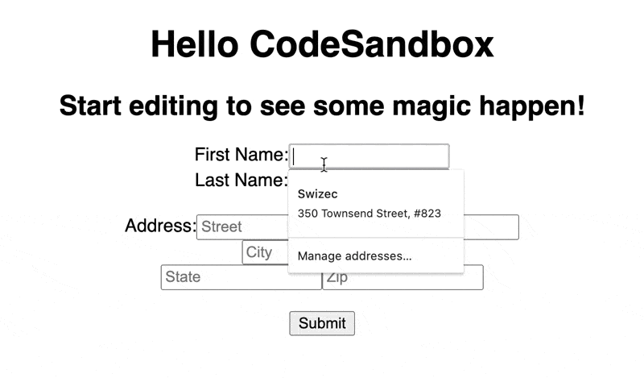
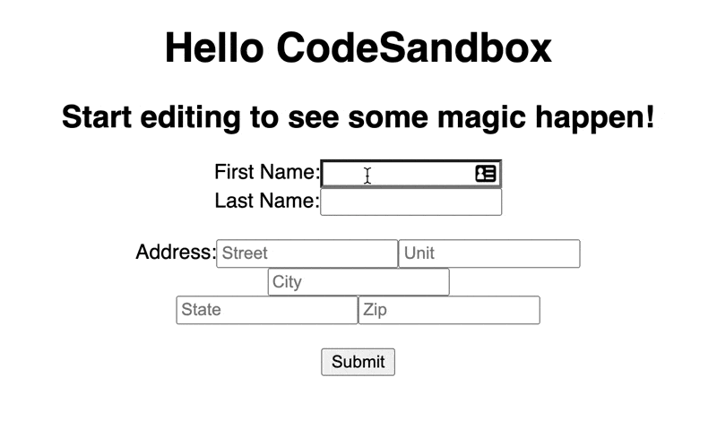
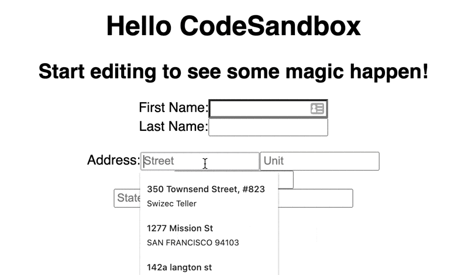
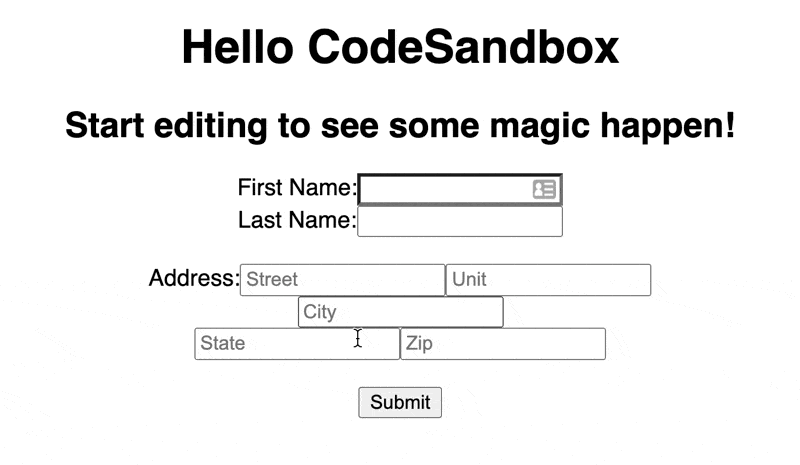

Forms are fun. They start simple then blow up in your face.

You've seen this pattern in every React tutorial with form fields:

https://codesandbox.io/s/jovial-khorana-63819

```javascript
const [firstName, setFirstName] = useState("")

// ...
;<input
  name="firstName"
  value={firstName}
  onChange={(event) => setFirstName(event.target.value)}
/>
```

A controlled input. Gets value from state, updates value on change. Works great 👍

Keeping form values in state is convenient for business logic. You trigger a re-render for every keypress but that's okay, React is fast.

Then you add more fields ...

https://codesandbox.io/s/hardcore-colden-viz62

```javascript
const [firstName, setFirstName] = useState("")
const [lastName, setLastName] = useState("")
const [address1, setAddress1] = useState("")
const [address2, setAddress2] = useState("")
const [city, setCity] = useState("")
const [zip, setZip] = useState("")
const [state, setState] = useState("")
```

That sure blew up 😅

State up the wazoo, re-renders on any field change, and you haven't even thought about validation, error states, dirty states, and all the rest that goes into a form.

You're smart and you can make this work. I know you can {{ subscriber.first_name | truncatewords: 1, "" | capitalize }}.

But imagine a monster form like I was dealing with last week.

https://twitter.com/Swizec/status/1288627385990918144

😇

## Custom form generators help

You can [build a form generator](https://swizec.com/blog/why-you-should-build-a-form-generator/) to remove the repetitive work.

Helper component, a loop or two, and off you go, right?

```javascript
const Input = ({ name, value, setValue, placeholder }) => (
  <input
    name={name}
    value={value}
    placeholder={placeholder}
    onChange={(event) => setValue(event.target.value)}
  />
)
```

https://codesandbox.io/s/friendly-hypatia-j27ck

Ok I didn't use loops, but you get the idea.

The `<Input>` component is generic and we pass-in state and setters from above. Then you can add errors, default values, different styles, etc.

You don't want to push state handling into the `Input` component itself. That's a recipe for pain.

A better approach might be to turn form state into an object and build a reducer.

https://codesandbox.io/s/recursing-bogdan-i2c4x

```javascript
const [
  { firstName, lastName, address1, address2, city, zip, state },
  setState,
] = useState({
  firstName: "",
  lastName: "",
  address1: "",
  address2: "",
  city: "",
  zip: "",
  state: "",
})

function valueSetter(name) {
  return (value) =>
    setState((formState) => {
      return {
        ...formState,
        [name]: value,
      }
    })
}

// ...

;<Input name="lastName" value={lastName} setValue={valueSetter("lastName")} />
```

Your form state lives inside an object – one key per field. You can always see current state and you always know what's going on.

For easy updates you've got the `valueSetter` method that returns a function to update a single field.

Works great 👍

You're triggering a full re-render for every field change, you don't have validations, no way to show errors, and no way to know when a field is dirty.

_PS: dirty fields are fields that changed and the value hasn't been saved yet_


## react-hook-form makes everything better

[react-hook-form](https://react-hook-form.com/) solves those problems for you.

It's a hook-based form solution that takes care of:

- managing state
- errors
- dirty fields
- validations

_And_ minimizes re-renders by avoiding controlled inputs.

Yep, react-hook-form uses the fields themselves to keep state. Pulls it out when you need it.

Here's the example above built with react-hook-form:

https://codesandbox.io/s/staging-lake-gg7zm

State management turns into this:

```javascript
const { register, handleSubmit } = useForm()
```

Setting up a field turns into this:

```javascript
const Input = ({ name, register }) => <input name={name} ref={register} />
```

The `register` method returns a React ref and sets up the form machinery.

And when you're ready to submit, values come as an object with a key for every field.


You get HTML5 validations out of the box. They show up in the `errors` object. Like this:

https://codesandbox.io/s/shy-leftpad-c82j0

```javascript
const Input = ({ name, register, errors, placeholder }) => (
  <>
    <input
      name={name}
      ref={register({ minLength: 5 })}
      placeholder={placeholder}
    />
    {errors && <span>{name} is invalid</span>}
  </>
)

// ...
const { register, handleSubmit, errors } = useForm()

// ...
;<Input name="firstName" register={register} errors={errors.firstName} />
```

By default validations run on change.



And you can change that with a line of code 😍

```javascript
const { register, handleSubmit, errors } = useForm({
  mode: "onBlur",
})
```



### Add context for more flexibility

Passing errors and registers into every field like above is silly. Too much work.

That's why react-hook-form supports context.

Using the same approach as my [Wormhole state management](https://swizec.com/blog/wormhole-state-management/) article:

- create a form
- put everything in context
- wormhole to context with a hook

You get form components that magically connect to your form. Register themselves, know about errors, dirty states. Everything 😍

Like this

https://codesandbox.io/s/optimistic-euclid-46ifb

```javascript
const Input = ({ name, placeholder }) => {
  const { register, errors } = useFormContext()

  return (
    <>
      <input
        name={name}
        ref={register({ minLength: 2 })}
        placeholder={placeholder}
      />
      {errors[name] && <span>{name} is invalid</span>}
    </>
  )
}
```

Every field validates a 2 character `minLength` and displays its own errors.



Using them in a form looks easy now:

```javascript
<Input name="firstName" />
```


### Add Yup for big validations

You've got the machinery to spit out forms now. Small schlep and you're done.

Render a form, pepper it with `<Input name="X" />` fields and voila. Happy boss, happy customer, happy you.

And then it's time for real validations. Not `minLength` or `required`. _Real_ validations. The kind where `lastName` is required, but only if `firstName` is filled in.


You can add [yup](https://github.com/jquense/yup) for that. react-hook-form supports it out of the box ✌️

Here's the example above that validates you wrote the whole address, but only if you wrote the street name.

https://codesandbox.io/s/dreamy-rain-xoc5s



To make that happen you 👇

Write a Yup schema describing the shape of your data. Bit of an art to it, make sure you don't fall off the deep end with conditional validations. They get tricky.

```javascript
const schema = yup.object().shape({
  firstName: yup.string(),
  lastName: yup.string(),
  address1: yup.string(),
  address2: yup.string(),
  city: yup.string().when("address1", {
    is: (address1) => address1.length > 0,
    then: yup.string().required(),
  }),
  state: yup.string().when("address1", {
    is: (address1) => address1.length > 0,
    then: yup.string().required(),
  }),
  zip: yup.string().when("address1", {
    is: (address1) => address1.length > 0,
    then: yup.string().required(),
  }),
})
```

The Yup docs are _okay_, not stellar. I recommend tinkering until it works.

Then you tell react-hook-form about your schema:

```javascript
const formMethods = useForm({
  mode: "onChange",
  resolver: yupResolver(schema),
})
```

And change your `register` call back to vanilla:

```javascript
<input name={name} ref={register} placeholder={placeholder} />
```

And you've got reusable field components that work with any form. Pop them in, set the schema, get validations and error handling and all the rest.


Happy hacking

Cheers,<br/>
~Swizec

PS: in my code I went as far as a generic `<Form>` component that sets up the context provider and `<form>` element for me.
