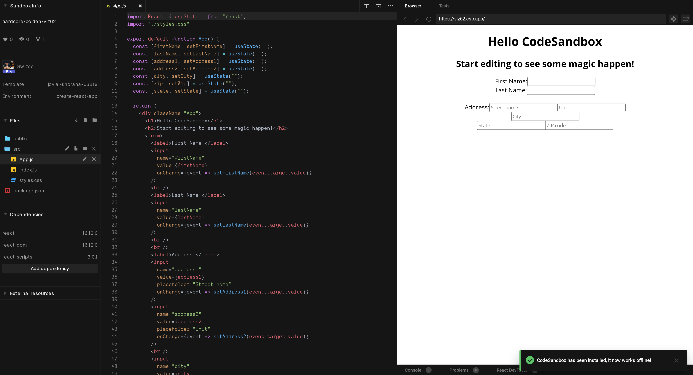

Forms are fun. They start simple then blow up in your face.

You've seen this pattern in every React tutorial with form fields:

&t=seti&l=javascript&ds=true&wc=true&wa=true&pv=48px&ph=32px&ln=false&code=const%20%5BfirstName%2C%20setFirstName%5D%20%3D%20useState(%22%22)%3B%0A%0A%2F%2F%20...%0A%3Cinput%0A%20%20name%3D%22firstName%22%0A%20%20value%3D%7BfirstName%7D%0A%20%20onChange%3D%7Bevent%20%3D%3E%20setFirstName(event.target.value)%7D%0A%2F%3E>)

A controlled input. Gets value from state, updates value on change. Works great 👍

Keeping form values in state is convenient for business logic. You trigger a re-render for every keypress but that's okay, React is fast.

Then you add more fields ...

&t=seti&l=javascript&ds=true&wc=true&wa=true&pv=48px&ph=32px&ln=false&code=%20%20const%20%5BfirstName%2C%20setFirstName%5D%20%3D%20useState(%22%22)%3B%0A%20%20const%20%5BlastName%2C%20setLastName%5D%20%3D%20useState(%22%22)%3B%0A%20%20const%20%5Baddress1%2C%20setAddress1%5D%20%3D%20useState(%22%22)%3B%0A%20%20const%20%5Baddress2%2C%20setAddress2%5D%20%3D%20useState(%22%22)%3B%0A%20%20const%20%5Bcity%2C%20setCity%5D%20%3D%20useState(%22%22)%3B%0A%20%20const%20%5Bzip%2C%20setZip%5D%20%3D%20useState(%22%22)%3B%0A%20%20const%20%5Bstate%2C%20setState%5D%20%3D%20useState(%22%22)%3B>)

That sure blew up 😅

State up the wazoo, re-renders on any field change, and you haven't even thought about validation, error states, dirty states, and all the rest that goes into a form.

You're smart and you can make this work. I know you can {{ subscriber.first_name | truncatewords: 1, "" | capitalize }}.

But imagine a monster form like I was dealing with last week.

😇

## Custom form generators help

You can [build a form generator](https://swizec.com/blog/why-you-should-build-a-form-generator/swizec/9394) to remove the repetitive work.

Helper component, a loop or two, and off you go, right?

&t=seti&l=javascript&ds=true&wc=true&wa=true&pv=48px&ph=32px&ln=false&code=const%20Input%20%3D%20(%7B%20name%2C%20value%2C%20setValue%2C%20placeholder%20%7D)%20%3D%3E%20(%0A%20%20%3Cinput%0A%20%20%20%20name%3D%7Bname%7D%0A%20%20%20%20value%3D%7Bvalue%7D%0A%20%20%20%20placeholder%3D%7Bplaceholder%7D%0A%20%20%20%20onChange%3D%7Bevent%20%3D%3E%20setValue(event.target.value)%7D%0A%20%20%2F%3E%0A)%3B>)

Ok I didn't use loops, but you get the idea.

The `<Input>` component is generic and we pass-in state and setters from above. Then you can add errors, default values, different styles, etc.

You don't want to push state handling into the `Input` component itself. That's a recipe for pain.

A better approach might be to turn form state into an object and build a reducer.

&t=seti&l=javascript&ds=true&wc=true&wa=true&pv=48px&ph=32px&ln=false&code=%20%20const%20%5B%0A%20%20%20%20%7B%20firstName%2C%20lastName%2C%20address1%2C%20address2%2C%20city%2C%20zip%2C%20state%20%7D%2C%0A%20%20%20%20setState%0A%20%20%5D%20%3D%20useState(%7B%0A%20%20%20%20firstName%3A%20%22%22%2C%0A%20%20%20%20lastName%3A%20%22%22%2C%0A%20%20%20%20address1%3A%20%22%22%2C%0A%20%20%20%20address2%3A%20%22%22%2C%0A%20%20%20%20city%3A%20%22%22%2C%0A%20%20%20%20zip%3A%20%22%22%2C%0A%20%20%20%20state%3A%20%22%22%0A%20%20%7D)%3B%0A%0A%20%20function%20valueSetter(name)%20%7B%0A%20%20%20%20return%20value%20%3D%3E%0A%20%20%20%20%20%20setState(formState%20%3D%3E%20%7B%0A%20%20%20%20%20%20%20%20return%20%7B%0A%20%20%20%20%20%20%20%20%20%20...formState%2C%0A%20%20%20%20%20%20%20%20%20%20%5Bname%5D%3A%20value%0A%20%20%20%20%20%20%20%20%7D%3B%0A%20%20%20%20%20%20%7D)%3B%0A%20%20%7D%0A%20%20%0A%20%20%2F%2F%20...%0A%20%20%0A%20%20%3CInput%0A%20%20%20%20%20%20name%3D%22lastName%22%0A%20%20%20%20%20%20value%3D%7BlastName%7D%0A%20%20%20%20%20%20setValue%3D%7BvalueSetter(%22lastName%22)%7D%0A%20%20%20%20%2F%3E>)

Your form state lives inside an object – one key per field. You can always see current state and you always know what's going on.

For easy updates you've got the `valueSetter` method that returns a function to update a single field.

Works great 👍

You're triggering a full re-render for every field change, you don't have validations, no way to show errors, and no way to know when a field is dirty.

_PS: dirty fields are fields that changed and the value hasn't been saved yet_

## react-hook-form makes everything better

[react-hook-form](https://react-hook-form.com/) solves those problems for you.

It's a hook-based form solution that takes care of:

- managing state
- errors
- dirty fields
- validations

_And_ minimizes re-renders by avoiding controlled inputs.

Yep, react-hook-form uses the fields themselves to keep state. Pulls it out when you need it.

Here's the example above built with react-hook-form:

State management turns into this:

&t=seti&l=javascript&ds=true&wc=true&wa=true&pv=48px&ph=32px&ln=false&code=const%20%7B%20register%2C%20handleSubmit%20%7D%20%3D%20useForm()%3B>)

Setting up a field turns into this:

&t=seti&l=javascript&ds=true&wc=true&wa=true&pv=48px&ph=32px&ln=false&code=const%20Input%20%3D%20(%7B%20name%2C%20register%20%7D)%20%3D%3E%20(%0A%09%3Cinput%20name%3D%7Bname%7D%20ref%3D%7Bregister%7D%20%2F%3E%0A)>)

The `register` method returns a React ref and sets up the form machinery.

And when you're ready to submit, values come as an object with a key for every field.

You get HTML5 validations out of the box. They show up in the `errors` object. Like this:

&t=seti&l=javascript&ds=true&wc=true&wa=true&pv=48px&ph=32px&ln=false&code=const%20Input%20%3D%20(%7B%20name%2C%20register%2C%20errors%2C%20placeholder%20%7D)%20%3D%3E%20(%0A%20%20%3C%3E%0A%20%20%20%20%3Cinput%0A%20%20%20%20%20%20name%3D%7Bname%7D%0A%20%20%20%20%20%20ref%3D%7Bregister(%7B%20minLength%3A%205%20%7D)%7D%0A%20%20%20%20%20%20placeholder%3D%7Bplaceholder%7D%0A%20%20%20%20%2F%3E%0A%20%20%20%20%7Berrors%20%26%26%20%3Cspan%3E%7Bname%7D%20is%20invalid%3C%2Fspan%3E%7D%0A%20%20%3C%2F%3E%0A)%3B%0A%0A%2F%2F%20...%0A%20%20const%20%7B%20register%2C%20handleSubmit%2C%20errors%20%7D%20%3D%20useForm()%3B%0A%20%20%0A%2F%2F%20...%0A%3CInput%20name%3D%22firstName%22%20register%3D%7Bregister%7D%20errors%3D%7Berrors.firstName%7D%20%2F%3E>)

By default validations run on change.

And you can change that with a line of code 😍

&t=seti&l=javascript&ds=true&wc=true&wa=true&pv=48px&ph=32px&ln=false&code=const%20%7B%20register%2C%20handleSubmit%2C%20errors%20%7D%20%3D%20useForm(%7B%0A%09mode%3A%20'onBlur'%0A%7D)%3B>)

### Add context for more flexibility

Passing errors and registers into every field like above is silly. Too much work.

That's why react-hook-form supports context.

Using the same approach as my [Wormhole state management](https://swizec.com/blog/wormhole-state-management/swizec/9442) article:

- create a form
- put everything in context
- wormhole to context with a hook

You get form components that magically connect to your form. Register themselves, know about errors, dirty states. Everything 😍

Like this

&t=seti&l=javascript&ds=true&wc=true&wa=true&pv=48px&ph=32px&ln=false&code=const%20Input%20%3D%20(%7B%20name%2C%20placeholder%20%7D)%20%3D%3E%20%7B%0A%20%20const%20%7B%20register%2C%20errors%20%7D%20%3D%20useFormContext()%3B%0A%0A%20%20return%20(%0A%20%20%20%20%3C%3E%0A%20%20%20%20%20%20%3Cinput%0A%20%20%20%20%20%20%20%20name%3D%7Bname%7D%0A%20%20%20%20%20%20%20%20ref%3D%7Bregister(%7B%20minLength%3A%202%20%7D)%7D%0A%20%20%20%20%20%20%20%20placeholder%3D%7Bplaceholder%7D%0A%20%20%20%20%20%20%2F%3E%0A%20%20%20%20%20%20%7Berrors%5Bname%5D%20%26%26%20%3Cspan%3E%7Bname%7D%20is%20invalid%3C%2Fspan%3E%7D%0A%20%20%20%20%3C%2F%3E%0A%20%20)%3B%0A%7D%3B>)

Every field validates a 2 character `minLength` and displays its own errors.

Using them in a form looks easy now:

&t=seti&l=javascript&ds=true&wc=true&wa=true&pv=48px&ph=32px&ln=false&code=%3CInput%20name%3D%22firstName%22%20%2F%3E>)

### Add Yup for big validations

You've got the machinery to spit out forms now. Small schlep and you're done.

Render a form, pepper it with `<Input name="X" />` fields and voila. Happy boss, happy customer, happy you.

And then it's time for real validations. Not `minLength` or `required`. _Real_ validations. The kind where `lastName` is required, but only if `firstName` is filled in.

You can add [yup](https://github.com/jquense/yup) for that. react-hook-form supports it out of the box ✌️

Here's the example above that validates you wrote the whole address, but only if you wrote the street name.

To make that happen you 👇

Write a Yup schema describing the shape of your data. Bit of an art to it, make sure you don't fall off the deep end with conditional validations. They get tricky.

&t=seti&l=javascript&ds=true&wc=true&wa=true&pv=48px&ph=32px&ln=false&code=const%20schema%20%3D%20yup.object().shape(%7B%0A%20%20firstName%3A%20yup.string()%2C%0A%20%20lastName%3A%20yup.string()%2C%0A%20%20address1%3A%20yup.string()%2C%0A%20%20address2%3A%20yup.string()%2C%0A%20%20city%3A%20yup.string().when(%22address1%22%2C%20%7B%0A%20%20%20%20is%3A%20address1%20%3D%3E%20address1.length%20%3E%200%2C%0A%20%20%20%20then%3A%20yup.string().required()%0A%20%20%7D)%2C%0A%20%20state%3A%20yup.string().when(%22address1%22%2C%20%7B%0A%20%20%20%20is%3A%20address1%20%3D%3E%20address1.length%20%3E%200%2C%0A%20%20%20%20then%3A%20yup.string().required()%0A%20%20%7D)%2C%0A%20%20zip%3A%20yup.string().when(%22address1%22%2C%20%7B%0A%20%20%20%20is%3A%20address1%20%3D%3E%20address1.length%20%3E%200%2C%0A%20%20%20%20then%3A%20yup.string().required()%0A%20%20%7D)%0A%7D)%3B>)

The Yup docs are _okay_, not stellar. I recommend tinkering until it works.

Then you tell react-hook-form about your schema:

&t=seti&l=javascript&ds=true&wc=true&wa=true&pv=48px&ph=32px&ln=false&code=%20%20const%20formMethods%20%3D%20useForm(%7B%0A%20%20%20%20mode%3A%20%22onChange%22%2C%0A%20%20%20%20resolver%3A%20yupResolver(schema)%0A%20%20%7D)%3B>)

And change your `register` call back to vanilla:

&t=seti&l=javascript&ds=true&wc=true&wa=true&pv=48px&ph=32px&ln=false&code=%3Cinput%20name%3D%7Bname%7D%20ref%3D%7Bregister%7D%20placeholder%3D%7Bplaceholder%7D%20%2F%3E>)

And you've got reusable field components that work with any form. Pop them in, set the schema, get validations and error handling and all the rest.

Happy hacking

Cheers,  
~Swizec

PS: in my code I went as far as a generic `<Form>` component that sets up the context provider and `<form>` element for me.
