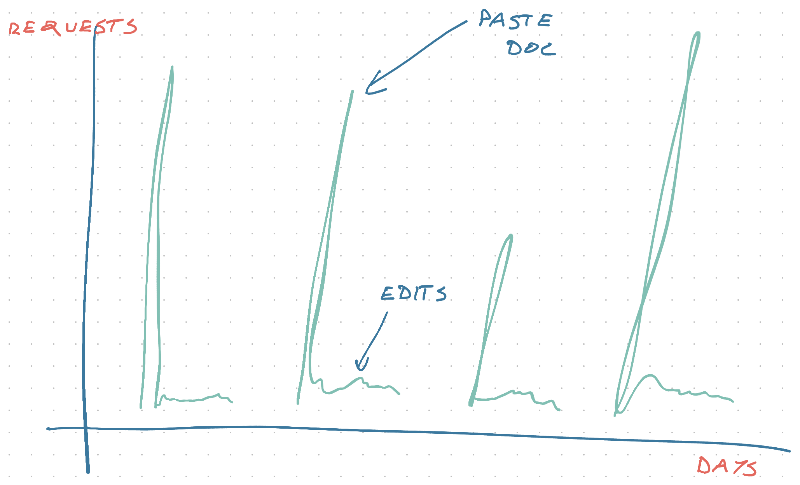

import { ContentUpgrades } from "@swizec/gatsby-theme-course-platform"

We've talked about [how a $12 AWS bill runs a $50k business](https://swizec.com/blog/how-a-dollar12-aws-bill-powers-a-dollar50k-business/). Today let's talk about _why_.

Think about the load on this newsletter builder:


How do you think it works?

## TechLetter.app architecture

The frontend for TechLetterApp is a create-react-app project. Nothing fancy. You can [see the code on GitHub](https://github.com/Swizec/letter-builder).

It runs on Vercel, using their git integration. `git push origin master` deploys new code in 2 minutes.

On the left, a `<textarea>` uses `onChange` callbacks to update values in global state. Shared via context in a cumbersome way because I was new to context 2 years ago. 😇

```javascript
// MarkdownInput.js
export default () => (
  <Consumer>
    {({ markdown, onChangeMarkdown }) => (
      <React.Fragment>
        <Heading>Markdown</Heading>
        <Textarea onChange={onChangeMarkdown} value={markdown} />
      </React.Fragment>
    )}
  </Consumer>
)
```

**Every change triggers a re-render** of the `LetterRender` component. This detail is important.

```javascript
// LetterRender.js
export default React.forwardRef((props, ref) => {
  const { markdown } = useContext(MarkdownContext)
  const rendered = useRemark(markdown)

  return (
    <div ref={ref}>
      <Heading>
        Rendered{" "}
        <span role="img" aria-label="face">
          {" "}
          💌
        </span>
      </Heading>
      <Content>{rendered}</Content>
    </div>
  )
})
```

<ContentUpgrades.ServerlessHandbook />

### useRemark() turns markdown into React

See this line?

```javascript
const rendered = useRemark(markdown)
```

That's the frontend secret sauce.

A compiler that takes Markdown and uses a chain of open source and [custom remark plugins](https://swizec.com/blog/custom-markdown-extensions-with-remark-and-hast-handlers). One of the components it creates is called `<Screenshot>`.

```javascript
// Screenshot.js
function Screenshot({ node }) {
  const [image, setImage] = useState(loaderImg)

  const reloadImage = async () => {
    setImage(loaderImg)
    try {
      const res = await fetch(node.url),
        response = await res.json()

      if (response.status === "success") {
        setImage(response.url)
      } else {
        throw "Screenshot error"
      }
    } catch (e) {
      setImage(errorImg)
    }
  }

  useEffect(() => {
    reloadImage()
  }, [node])

  // display image
}
```

Screenshot is important 👉 makes an API request `const res = await fetch(node.url)` _every time you sneeze_.

Look at this:


soooooo many requests, every character triggers a new one 😂

I knew it was bad, but I didn't realize it was _that_ bad until I made this gif.

PS: it's because `node` changes object identity on every change. Effect should run on `node.url`.

## A traffic pattern that kills your project

Every one of those requests talked to a server. The server had to:

1.  Run Chrome in headless mode without UI
2.  Load a [special tweet embedder site](https://tweet-embedder-swizec.vercel.app/?url=https://twitter.com/Swizec/status/1367503207803609090) running on Vercel
3.  Wait for the page to load
4.  Find the right DOM node
5.  Measure its size
6.  Take a screenshot
7.  Save to a temporary file
8.  Upload that file to S3
9.  Return the S3 link

Now imagine doing that 120 times while you type a sentence. Or 20 times _all at once_ when you paste a document.

Server doesn't know you're bailing my friend, it finishes the full cycle every time. Yes my S3 is full of crap 😅

What do you think traffic looks like?



**Days of nothing** followed by a _huge spike_ followed by lots of nothing. Your worst nightmare.

How many servers do you set up? 🤔

## How serverless makes this work

Traffic like that is where serverless shines.

> Google likes to call serverless architectures ‌from prototype to production to planet-scale.

You don't want to use serverless at planet scale, but Google is right: Serverless scales. A lot.

With serverless, you don't need to think about traffic patterns and provisioning. Average load? Peak load? Lowest load? Auto-scaling? Who cares 🤷‍♀️

https://twitter.com/slobodan_/status/1369679609655083020

At rest, serverless does nothing. No requests, no server, no cost.

When ALL THE REQUESTS COME, serverless rallies the troops.


Each request **creates a new server in milliseconds**. Fastest I've seen was in the 20ms range for small functions. The [screenshot lambda](https://github.com/Swizec/lambda-screenshot-as-a-service) takes about half a second. Needs to run Chrome and Chrome is fat 🙃

You get up to 1000 of these in parallel on AWS. Other providers are different.

And I don't mean 1000 requests per second, oh no, I mean _1000 servers all at once_. If your code takes 50ms to run, that's 50,000 requests per second. 🚀

Speed depends on what you're doing. Screenshots are slow.

## What about traditional servers?

Now imagine TechLetterApp didn't have scale on demand ...

You have 2 options:

1.  Servers for average load – 2 requests per day 🤨
2.  Servers for peak load – 200 requests per minute 💸

Both suck.

A newsletter builder that can do 2 screenshots per day is useless. Takes you a week to build 1 email.

Scale to peak load of 200 per minute and you're throwing money in the furnace. Can you imagine the cost?

You end up with a middle ground: Enough servers to work okay but not great.

And that's how I kept crashing my friend's side project and nagging him on Slack every night while getting the Serverless Handbook print ready. He built a tool that takes markdown and turns it into a print PDF. Runs a render on every save.

It crashed. A lot. Shit's hard 😅

What do you think? Getting ideas yet? 😛 Hit reply

Cheers,<br/>
~Swizec
