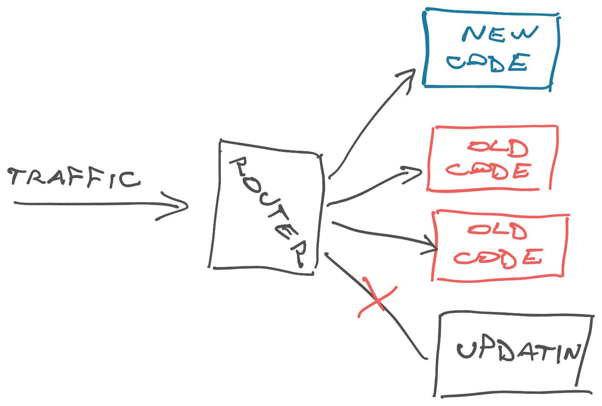

At scale there are no rollbacks and no cut-overs. Your software only moves forward.

aside: This email is adapted from a book chapter I spent the last 3 weeks writing. It's a complex idea that took 10 years to grok. I tried squeezing it into a digestible length. Would love to hear your thoughts.

## Data lives forever

Data is the biggest reason software only moves forward.

Once you save state, your code will need to understand that state forever. This is double true for state that leaves your system and becomes distributed.

Billing state, emails, and async jobs are a common early introduction to these issues.

When a user gives you money, they expect the transaction to be rock solid. You can't just lose their payment because you changed an implementation detail and their receipt no longer has a valid ID or a payment method you no longer support.

Plus billing state _loves_ spreading to other systems.

You'll find finance moving it to spreadsheets and other weird programs, data integrations putting it in warehouses and BI tools, and it's going out in emails and 3rd party payment processors and their bank and your bank ... billing data gets everywhere. If any of those systems come back and ask for invoice `ID12345`, you better have an answer.

In most cases, tax and business authorities expect you to keep sale records for at least 5 years. Even if users never look that far back in history, an auditor might.

### How data only moves forward

Say you started with two payment methods: stripe and coupons.

You write your database table to support a `payment_type` field. Code cares about this because the two payment types have different behaviors. They fetch info from different sources, display different UI, etc. Your business folk care about this because they want to know which purchases are revenue (stripe) and which aren't (coupons).

To keep your data clean and avoid unexpected values, you add a constraint on the database – `['stripe', 'coupon']` – and types in your code. If anything unexpected shows up, the code throws an error. An error in this case is better than showing garbage payment info to the user.

Later you add cash and credit cards.

The constraint expands to `['stripe', 'coupon', 'credit_card', 'cash']`. You update types in the code and build the new code-paths.

You test your changes and deploy. However, testing payments is hard – there's lots of edge cases and code-paths you can't replicate in a test environment without using real money. You soon find a bug.

But while your code was deployed, a few users have made purchases with the new payment types. Now you're stuck.

If you rollback that deploy, those new users who bought with `cash` or `credit_card` payments will get an error when they try to use the service they paid for. But that's okay – the database won't let you rollback a constraint when existing data don't match.

How do you handle this?

You could delete `cash` and `credit_card` rows, but then you lose the payments. You could change them to `stripe` or `coupon`, but then you can't restore this info after you fix the bug ...

Ok so the _database_ can't be rolled back. Data lives forever.

What about the code? That depends: Are you okay with users getting an error when the code tries to read a database row with a payment method it doesn't recognize? Maybe you can guarantee users can't do that by turning off a feature flag.

But then those users might complain when their recent purchase doesn't work correctly.

## Distributed systems + state

This is a classic distributed systems and state problem. You may not think of your code and database as a distributed system, but it is. Here's a 1 question test:

Can parts of the system (app, database, ...) change independently?

If the answers is yes, your system is distributed. You can independently deploy, update, start, stop, and otherwise manage parts of your system (app and database). Even if both run on the same machine and you almost always update them together.

This brings lots of benefits.

For example: You can update your application code without always upgrading to the latest version of your database service. Or you can reboot your application without losing database functionality that the finance team relies on. And in some cases you can even rollback your code without rolling back the database.

The end version of this approach for big teams is a microservices architecture where every team runs their own flock of independent services that do specific things. Even at a smaller scale you'll run into at least

- a caching service,
- a database service,
- a load balancer,
- your core app,
- and a few services for async backend tasks

Those scheduled jobs behave like services even if all they do is call an API on your core application. Does the API still work when the job triggers in 3 weeks? 😉

## Old and new side-by-side always

The challenge a distributed system brings is that all the parts need to agree on a shared definition of business logic.

If your database is structured one way and your code expects another, the system breaks. If a client calls an API and it doesn't exist, or your client can't parse the response, the system breaks.

You won't notice this while you're small and have little traffic. You can update database definitions, then update the code. Or update the code and then the database. Nothing bad happens.

But as you scale, that period between updating every part of the system becomes an issue. How long _exactly_ are your database and your code out of sync? What about the clients? How many requests can you get during that time?

This depends on the update and the size of your system.

A large database takes longer to apply updates. An application with a few servers of redundancy takes longer than flipping 1 server. And who knows when end-users will hit the `Update` button on their client.

At scale, you can assume the system is always running multiple out-of-sync versions of your code. Requests never stop.

Imagine if a barista said _"Oh sorry, you ordered coffee right when I was putting in a new stack of coffee cups. Couldn't hear you"_. This happens and we repeat the order. All good. But if they charge you for the coffee, lose your order, then claim you never ordered and make you pay again ... you'll be pretty upset.

### Your updates take time to propagate

The worst update delay I've seen was a user hitting our servers with an iOS app 2 years out of date. It broke and we got an alert. Then we crossed our fingers that the user figured out what to do because their client was from before we added the _"Hey your app is out of date"_ popup feature.

Even without end-user clients, a few minutes to propagate updates is typical.

You'll deploy to 1 server, make sure it's good, reroute traffic, move on to the next server, until eventually the latest code runs everywhere (this is usually automated). While updates are happening, you have a few servers running old code and a few running new code – all accepting live traffic distributed at random.

These are known as [blue/green deploys](https://martinfowler.com/bliki/BlueGreenDeployment.html), a standard approach in managing distributed systems. Besides ensuring your code at least runs and passes checks before routing traffic, they also ensure there's no downtime.

When you have traffic and a distributed system, there is no such thing as a cut-over. You're always running multiple versions of your code.

## A few tips

There are no hard rules on how to handle software always moving forward. It depends on your update, the exact nature of your system, and your appetite for errors.

Here are a few rules of thumb I like to use:

- additive changes are fine
- be permissive about your inputs (ignore extras instead of failing)
- instead of breaking changes to an API endpoint, make a new one
- update the database first
- update servers before clients
- if possible, have an option to force-update clients
- accept all versions of an input and merge data on the back end
- deprecate slowly
- keep updates small

You won't always need all of these.

Updating the payment system hits different than updating a button color. The key is to ask yourself _"How will this break while there's a version mismatch? How do we keep both old and new clients happy?"_ then act accordingly.

If you're still here, thanks ❤️ this is way long for an email

Cheers, 
\~Swizec
