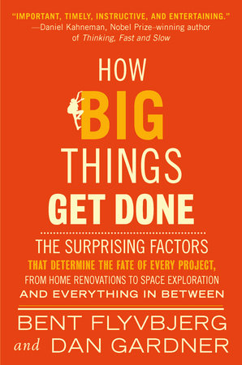

In [How Big Things Get Done](https://www.penguinrandomhouse.com/books/672118/how-big-things-get-done-by-bent-flyvbjerg-and-dan-gardner/) authors Flyvbjerg and Gardner talk about why large projects fail.

They look at case studies ranging from Hendrix's perfect recording studio to the most-failed home project (kitchen renovations) and how come China builds more infrastructure faster than The West.

A few themes keep coming up:

- maximizing over satisficing
- slow iteration
- invention instead of reuse
- scope creep
- work in progress

We've talked about how [**work in progress** kills your progress](https://swizec.com/blog/workinprogress-kills-your-progress/). Starting new projects before you finish the old projects is a recipe for overwhelm, multitasking, and slowly poking around instead of _finishing_ work with force.

**Scope creep** happens every time you go _"We're here, might as well do X, Y, and Z cleanup"_. [Make it work first](https://swizec.com/blog/let-small-fires-burn/). Don't solve problems you're not here to solve.

**Maximizing over satisficing** means that you're looking for the perfect solution instead of something good enough. This often leads to **invention instead of reuse** where you spend too much of your budget (time, money, brainpower) building a custom thing instead of choosing a good enough solution that you can start using immediately.

All this leads to **slow iteration**, which is what really kills big projects. We spend so much time planning and maximizing the project before the work even starts that by the time we start, our plans are outdated and don't fit anyone's needs.

Plans always need revision anyway – you find new details when doing the work. Instead of big upfront design, get started sooner with a less detailed plan that's easier to change. [Architecture is like a path in the woods](https://swizec.com/blog/architecture-is-like-a-path-in-the-woods/) after all.

Cheers,
\~Swizec
