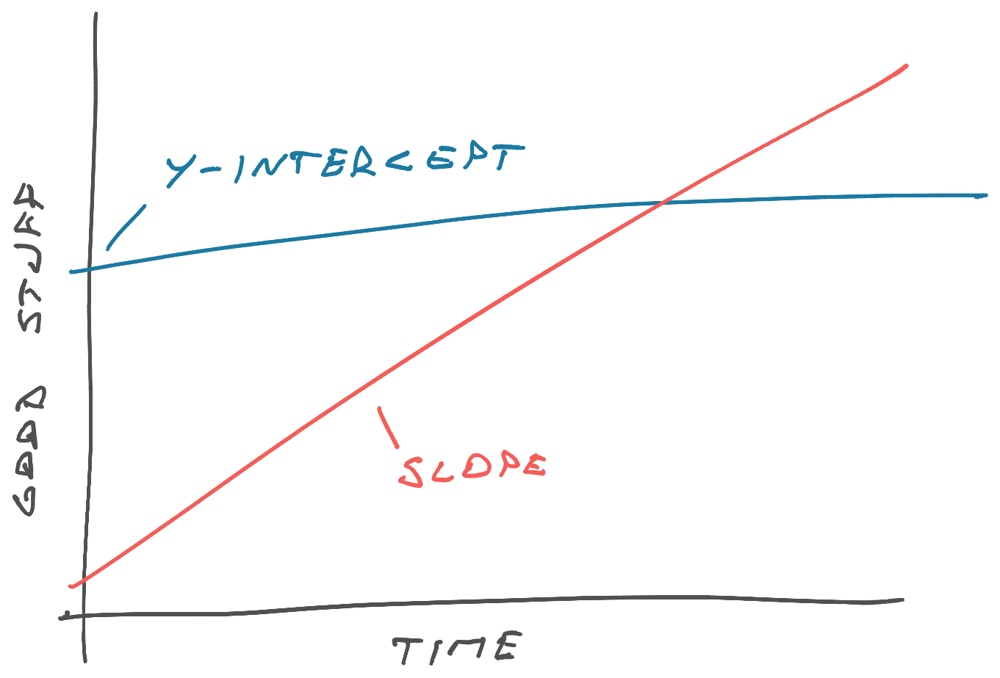
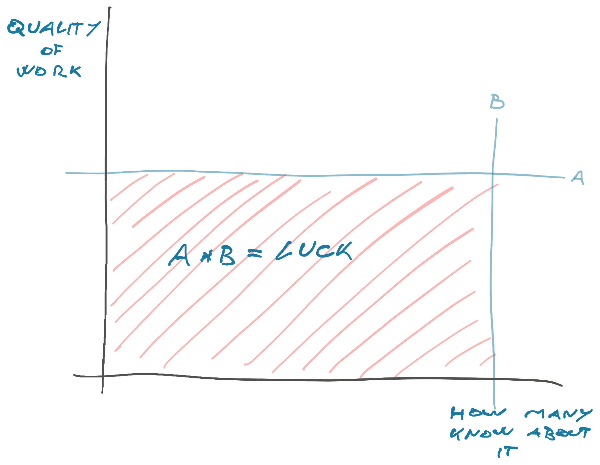

I was talking to a coworker the other day and mentioned that for us tech lead is a role, not a title, and comes with no extra pay. He blue-screened. Why would you do that? 🤨

Indeed. Why _would_ you do that?

1.  Bigger better problems
2.  Slope
3.  Luck surface area

Opportunity likes to dress in dirty overalls and look like work. Plus tackling new challenges is fun.

## Bigger better problems

As a [tech lead](https://swizec.com/blog/on-becoming-tech-lead/) you get to solve bigger better problems. Instead of pre-chewed agile stories that slice and dice a project into digestible chunks, you get to do the chewing.

Product owner not sure if their ideas are feasible? You get to chat.

Product owner struggling to break down a project? You get to help.

Head of engineering not happy with current tooling looking for alternatives? You get to do the research and join the calls.

Big new initiative with uncertain staffing, fuzzy requirements, and spanning multiple teams? You get to clarify requirements, define which teams are needed, establish a roadmap, and figure out how all these teams can work together.

A lot of that happens "in the room", you don't decide on your own. This can be months before a project hits anyone's sprint.

## Slope

A little bit of slope beats a lot of y-intercept.

You increase slope by doing hard things. Work at the edge of your ability, press haaaard at the wall, keep pressing. And then it moves.

Boop.

What used to be hard now feels easy. Your new default.

Plateaus happen when you work on autopilot. True in relationships, true at the gym, true in your career. You need bursts of extra effort balanced with recovery to advance.

[Peak Performance](https://thegrowtheq.com/books/peak-performance/) is my favorite book exploring this concept in great detail.

## Luck surface area

Your luck is a function of what you do and how many people know about it.

By being "in the room" you increase both factors. You get the opportunity to do more meaningful/impactful/cool/interesting work _and_ more people know about it.

Coordinating with many teams automatically gives you more visibility across the company. Steering big initiatives makes you more visible to leadership. The bottom axis.

And you get to make a bigger impact. Like when I [spotted a smöl tweak that solved a big performance problem](https://swizec.com/blog/my-biggest-react-app-performance-boost-was-a-backend-change/), but if I wasn't "in the room", I wouldn't even know we were talking about it. The left axis.

## But why?

Career capital my friend.

You can leverage these things later.

Cheers, 
~Swizec
