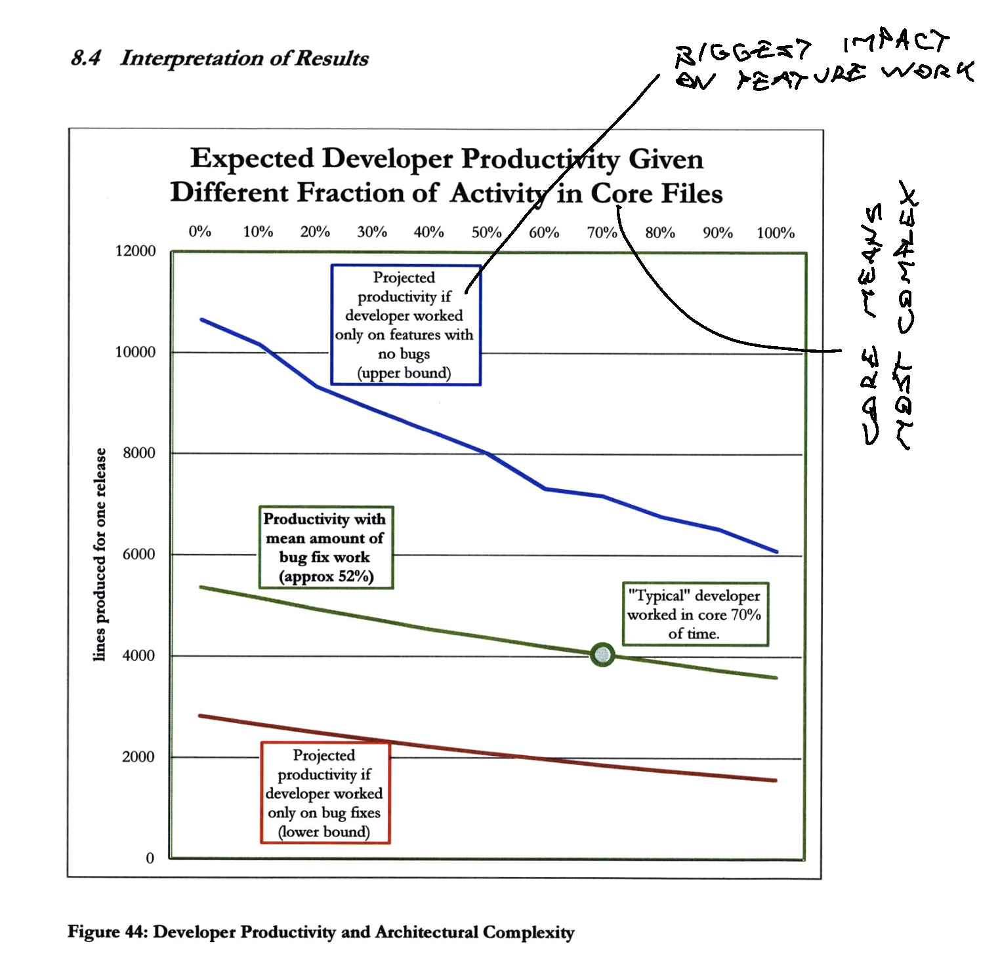
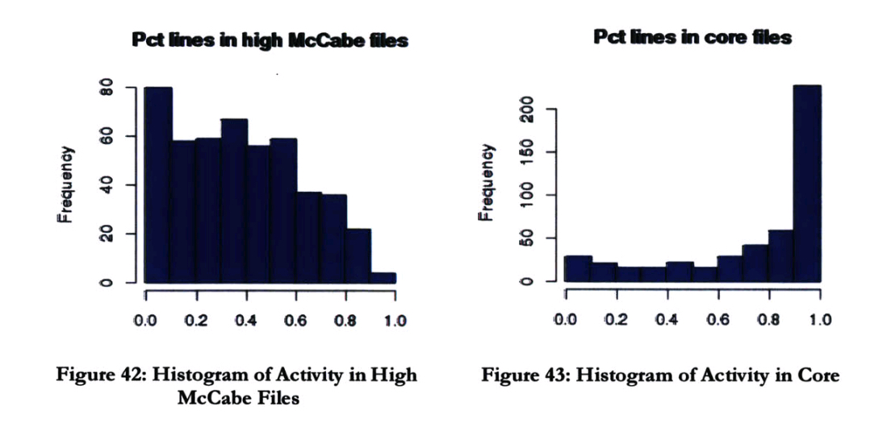
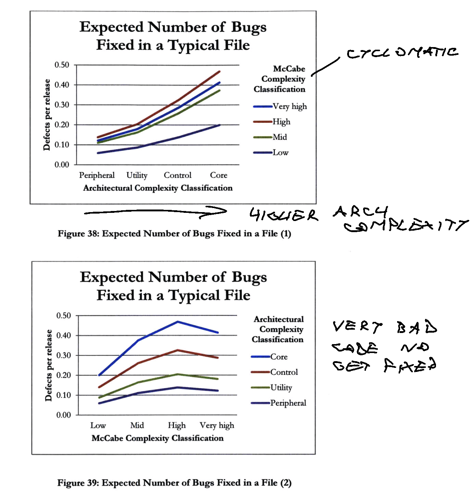
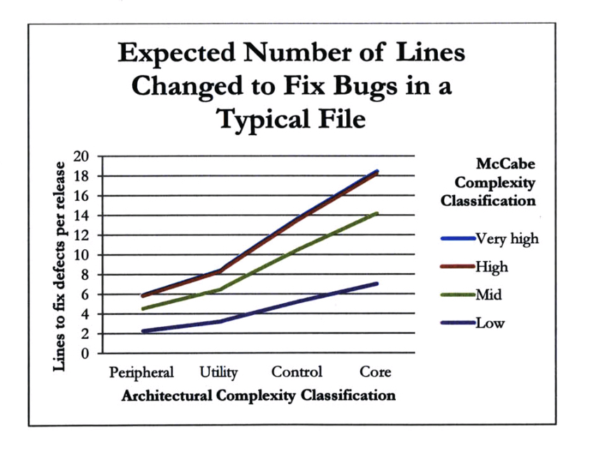
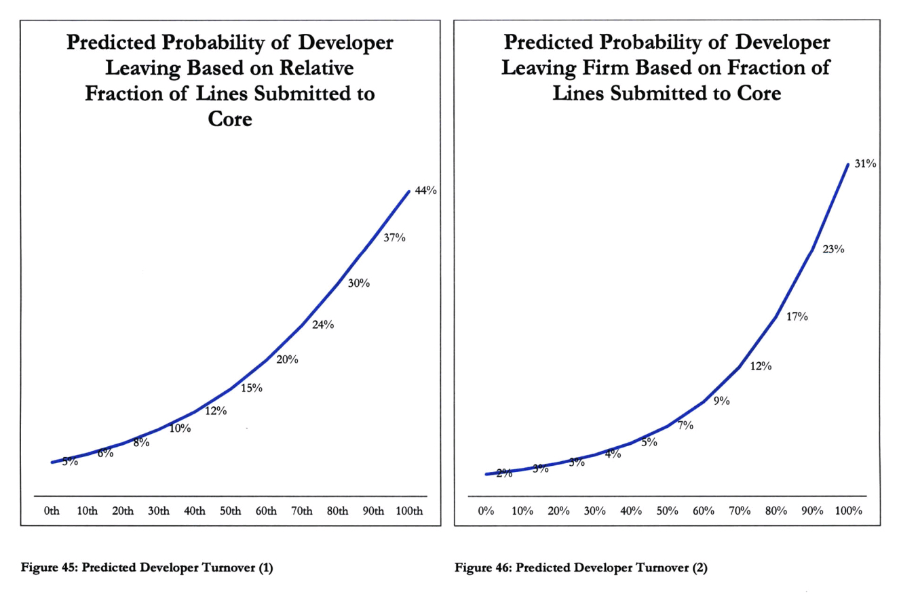

Software engineering is an endless battle against entropy. We start with systems that are simple and, if we're not careful, over time they become complex.

Systems that start as complex don't work. Gall's law.

This is the last in a series of articles on [System Design and the Cost of Architectural Complexity](https://dspace.mit.edu/handle/1721.1/79551), a 2013 PhD thesis from MIT. You can read my scribbled-over version at [/pdfs/system-design-and-the-cost-of-architectural-complexity-with-swiz-notes.pdf](https://swizec.com/pdfs/system-design-and-the-cost-of-architectural-complexity-with-swiz-notes.pdf).

Previous installments at:

- [You can't fix the wrong abstraction](https://swizec.com/blog/you-can-t-fix-the-wrong-abstraction/)
- [Two types of complexity and their impact](https://swizec.com/blog/two-types-of-complexity-and-their-impact/)

## tl;dr

The study found 3 measurable effects of [architectural complexity](https://swizec.com/blog/two-types-of-complexity-and-their-impact/#architectural-complexity) in a real-world project:

1.  Up to 50% drop in productivity
2.  3x higher defect density
3.  10x increase in staff turnover

## Measuring the impact of architectural complexity

The thesis set out to empirically show that complexity hurts. Sturtevant, the author, structured the research as a natural experiment on a real-world project.

Using a real project is important because many "programmer productivity" studies are done on comp sci students (who are newbs and thus not representative) using unrealistic class projects. Or they study open source projects where you find too many uncontrolled variables.

Every engineer in this study had a similar 40-hour work week, had business objectives to accomplish, used similar tools, and had some level of understanding of the project. The study controlled for career tenure and company tenure.

All studied code was written in C++. Auto-generated and config files were excluded.

Sturtevant chose 3 variables to measure based on intuitive observations of how it feels to work with tough systems:

1.  **Productivity**, working on tough code _feels_ slower
2.  **Defect density**, complex code is harder to debug, fix, and reason about
3.  **Staff turnover**, sometimes you just wanna throw your computer out the window and rage quit, you know you do

The natural experiment compared how working in high complexity files impacts these metrics compared to working in lower complexity files. They studied the project for "8 releases", a few years.

## Productivity

Measuring productivity for software engineers is notoriously difficult. We're all prima-donnas and think highly of what we do.

Over here in the real world, counting changes is good enough. If you change more lines of code, you're more productive. If you change fewer, you're less. On a large project with many developers across several years, the [law of large numbers](https://en.wikipedia.org/wiki/Law_of_large_numbers) takes over and the little details don't matter.

These are _statistical measures_ that work for populations. You cannot use this approach to judge a specific individual or contribution.

However, Sturtevant did find that some developers are 10x more productive than others. This individual variance overshadowed any effect from architectural complexity and made the study more difficult to conduct 💩

To combat individual variance, the study used each developer as a self-control – comparing how their productivity changes depending on the complexity of the code they're changing.

### The impact of architectural complexity

Working on bugs is always less productive than building new features. You need less code to fix a thing that exists.

Despite that, we see a consistent drop in productivity the more time a developer spends in files with higher complexity. This fits anecdotal observations. 👍

Worryingly, **complexity attracts work**! On average, engineers spend 3/4 of their time in the most complex areas of the code. This produces a compounding negative effect on productivity.

What's interesting is that **more experienced engineers are less productive**. I don't have a graph for this. It looks like more experienced engineers are [less affected by complexity](https://swizec.com/blog/two-types-of-complexity-and-their-impact/#the-impact-of-tough-code-vs-tough-systems) and therefore spend a higher portion of their time in complex areas of the code and fixing bugs. This makes them overall less productive.

But it's likely that "less productive" means they're doing work that more junior members would find impossible.

## Defect density

Defect density measures the number of bugs per line of code. As defined by your issue tracking system. If nobody cares, it's not a bug ✌️

Sturtevant's study focused on "bugs per release" with each release changing about 15,000 lines of code.

### The impact of complexity

The higher the architectural complexity of a file, the more bug fixes it gets. This makes sense because higher complexity files contain more code _and_ that code is harder to understand _and_ it touches more parts of the system.

But files with high cyclomatic complexity don't get fixed. People write workarounds instead of detangling spaghetti.

Defect density experiences a compounding effect same as productivity. More complex files require more changes to fix a bug, thus making the bug harder to fix _and_ increasing its blast radius to cause further bugs.

## Staff turnover

Staff turnover was measured as the likelihood that an engineer left the firm during this study or within 4 years after. Tenure was controlled for – we know you're more likely to leave the longer you stay and that experienced engineers are showered in opportunities.

An obvious question arises: _"Does staff turnover cause complexity, or does complexity cause turnover?"_.

The study found that complexity causes turnover – the more time you spend in complex parts of the code, the more likely you are to leave. But more experienced engineers spend more of their time in complex code 🤔

### The impact of architectural complexity

> More productive developers were more likely to remain with the firm.

This quote stood out to me. People who feel unproductive get demoralized and leave. Slogging through tough code day after day crushes your soul.

The folks who spent _the least_ time in complex files, had a 5% chance of leaving. Those who spent the most, a 44% chance. That is huge.

No other variable Sturtevant tried had any measurable effect on turnover.

Further study may be necessary to fully tease apart the effect of "experienced engineers are more likely to leave" and "experienced engineers spend more time in complex code". Until then: Make sure you give yourself a break with easy wins :)

## What do?

Write less complex code. Fight the entropy.

In [you can't fix the wrong abstraction](https://swizec.com/blog/you-can-t-fix-the-wrong-abstraction/) we talked about how this study cites that once your code is bad enough, only a [partial] rewrite can fix it. And in [two types of complexity and their impact](https://swizec.com/blog/two-types-of-complexity-and-their-impact/) we talked about why you should focus more on fixing architectural complexity than fixing complicated code.

Keep different parts self-contained, independent, and easy to understand – modular. Splitting by domain boundaries works best. Finding those boundaries is hard.

I'm writing a book about this stuff based on experience. It's almost ready. This study was the missing puzzle piece 🤘

Cheers, 
~Swizec
