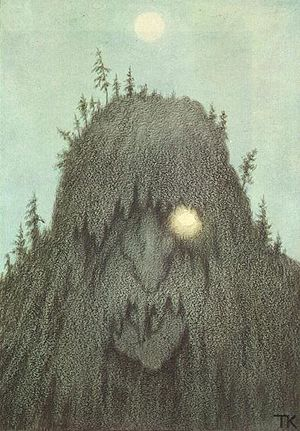

Yesterday I got into a bit of an argument over what trolling is and isn't with @[unmarketing](http://twitter.com/unmarketing "@unmarketing") because he reposted a year old blogpost that describes what he believes trolling to be.

He basically describes a [troll](http://en.wikipedia.org/wiki/Troll_%28Warhammer%29 "Troll (Warhammer)") as such:

> Usually this sorry excuse for a human being would type something like “Your mom is hot” or “That’s what your mom said”. (the irony of this is that the troll usually resides in his [mom’s basement](http://1.bp.blogspot.com/_txnr5mob49s/R9oC8MV4iCI/AAAAAAAAAIQ/W8qkDILVxhA/s400/nerd2.JPG), and is horribly, horribly alone)

But I think this is wrong. Maybe one day a long time ago, back when [IRC](http://en.wikipedia.org/wiki/Internet_Relay_Chat "Internet Relay Chat") was still the only useful social network on all the vast internets, it was correct that trolls weren't very sophisticated and turned to easy, stupid and plain insulting slurs and word plays to troll people. Although I don't think that's exactly true either, surely even back then there proper trolling was already happening (wikipedia seems to alude to such).

Basically what @unmarketing, and many people in general to be honest, gets wrong is the lack of distinction between trolling and simply being a jerk. Jerky behaviour does not a troll make!

Personally I would put trolling somewhere in the realm of performance art. A good troll isn't about insulting people, it's more about performing a clever set of actions to produce either a comical or, even better, an emotional response from anyone watching.

Usually when the effect is comical, it's at the expense of the person being trolled, while the emotional responses are usually elicited from the person or persons being trolled directly.

In essence, the [internet troll](http://en.wikipedia.org/wiki/Troll_%28Internet%29 "Troll (Internet)") is to the internet what a [standup comedian](http://en.wikipedia.org/wiki/Stand-up_comedy "Stand-up comedy") is to the physical world. And the tactics don't even differ very much!

There is also a certain elegance that comes with trolling when done well, the best trolls in my opinion come from misapplying some basic principles ever so slightly to give us a convincing argument that simply doesn't hold water under scrutiny. A good example of such are various examples of troll physics one can find all over the internet.

But my favourite are the kind of trolls that put up a mirror for people to look into. They elicit an emotional response simply by posing questions people don't like to think about, or asking explanations of things that people just simply take for granted. The troll doesn't even say very much of substance, but rather guides the target to poke holes in their own arguments and view of the world.

Or sometimes what constitutes a good troll is simply something that is neither funny nor very emotionally charged, but simply epic. A good example of such a troll would be last year's nominations for TIME's man of the year award things where [Moot](http://en.wikipedia.org/wiki/4chan "4chan") got on the cover of TIME because people from 4chan completely obliterated the voting process by not only putting him in first place, but also writing out "marble cake, also the game" with the first letters of the poll results.

In short, don't go around labeling every jerk online a troll because you really aren't doing justice to the art of trolling when you do that.