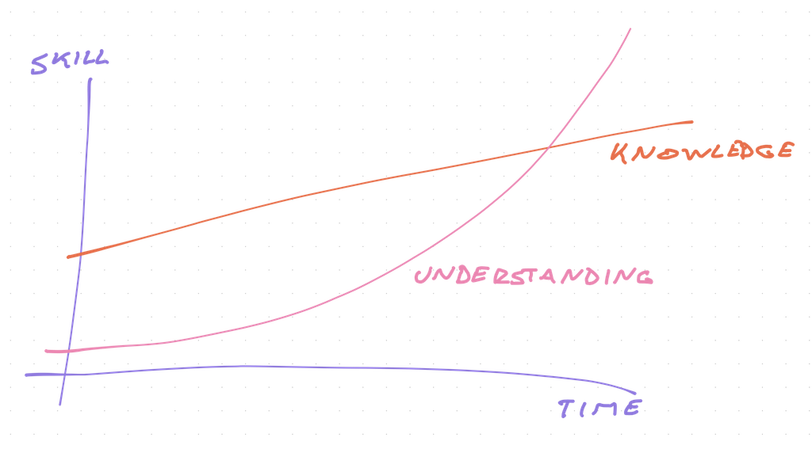
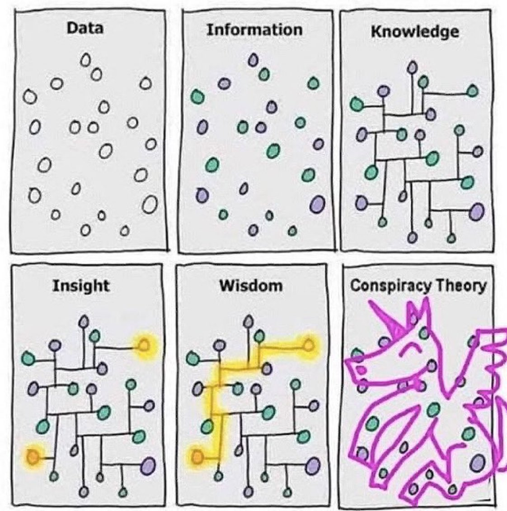

In one of his best anecdotes, Richard Feynman shares a secret insight into understanding vs. knowledge.

> I often liked to play tricks on people when I was at MIT. One time, in mechanical drawing class, some joker picked up a French curve (a piece of plastic for drawing smooth curves--a curly, funny-looking thing) and said, "I wonder if the curves on this thing have some special formula?"
>
> I thought for a moment and said, "Sure they do. The curves are very special curves. Lemme show ya," and I picked up my French curve and began to turn it slowly. "The French curve is made so that at the lowest point on each curve, no matter how you turn it, the tangent is horizontal."

The french curve is a drawing tool from the olden days. Before you could ask a computer to draw any curve.

> All the guys in the class were holding their French curve up at different angles, holding their pencil up to it at the lowest point and laying it along, and discovering that, sure enough, the tangent is horizontal. They were all excited by this "discovery"--even though they had already gone through a certain amount of calculus and had already "learned" that the derivative (tangent) of the minimum (lowest point) of any curve is zero (horizontal). They didn't put two and two together. They didn't even know what they "knew."

## Knowing vs. understanding

And that my friend is why you should learn to _understand_ not just to know.

How many things do you know? How many tutorials have you followed? How many disjointed bits of info have you accumulated?

My guess is plenty. Heaps. Lots. Many more than you realize. Ask you the right question and you'll be surprised to realize you know the answer.

Ask you that same question in a different way and you have no idea. Never heard of it. This is why whiteboard interviews are hard – questions that you know, but out of context 😉

Same as Feynman's students who knew the answer to _"What is the first derivative of a function at its lowest point?"_ – zero.

And if you asked _"What is the tangent of a curve when its derivative is zero?_ – horizontal, d'oh. Every high schooler knows that.

But show them a random curve and say it's got a magical property that the tangent is horizontal at the lowest point on that curve no matter how you turn it and their minds are blown. What is this sorcery!!?

## How understanding beats knowledge

Understanding lets you _transfer knowledge_ to new domains. With understanding you progress faster.

Most software engineers learn by inference. Bottom up. You do it, I do it, we all do it.

You look at the codebase around you, look for similar problems, and cobble together a solution to your problem. A tweak here, a tweak there, an online how-to tutorial or two ...

You come to a working solution and understand nothing.

Tomorrow you're back to square one. After hundreds of repetitions, you get faster and search less. No idea why it works, but it does so keep doing the same pattern.

Fantastic when you're starting out. _"A good software engineer is just a better googler"_, as the joke goes.

But these baby gains run out my friend.

You'll come to a point where **you** are the world's greatest expert at this particular problem. **You** are the most experienced on the team.

**You** are solving problems nobody has solved before.

https://twitter.com/Swizec/status/1255557735971618816

When that happens, you can't just know things, you have to understand them. You need to pull together bits of info and stackoverflow answers and google results and random blogs into a coherent whole.

You need to _understand_ the reasoning behind those answers. The mindsets. The logic.

And that's where learning through tutorials breaks down.

## How to learn for understanding

We're obsessed with tactics. The knowledge. We shy away from higher levels. Who cares.

_You_ care. I hope.

That higher level is what I aim to teach with my courses, articles, newsletters, all the things. I'm tired of boring surface-level tutorials.

While important for practice and getting your reps in, I think they miss a crucial part of what makes you a great software engineer.

What I like to do is a combination of top-down _and_ bottom-up learning.

**Top-down** learning is about frameworks, mindsets, and deep insights. You learn the structure of how things work. The basics. You'll think it never applies in life, but it's behind everything you do.

**Bottom-up** learning are the tactics. The specific techniques. The little tips. You need these every day.

Where the magic happens is hooking those bottom-up tactics into the mental framework you built top-down. You understand _why_ the tactics work. You can _transfer_ them to other contexts.

And everyone says _"Wow you're so smart! How do you learn new tech so fast??"_

Cheers,
~Swizec
