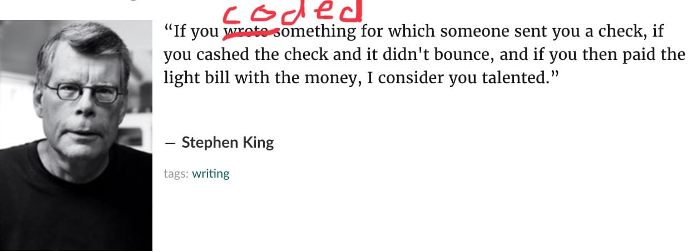

Engineers often complain about &quot;recruiter spam&quot;. Those impersonal emails recruiters send to anyone with a pulse and the words &quot;software engineer&quot; on their LinkedIn profile.

Set your LinkedIn location to San Francisco and your profession to Software Engineer. Try it, I dare you.

There&#x27;s even jokes about tricks people use to avoid recruiters. Include a banana emoji in your subject line. Explain the difference between JavaScript and Java. Don&#x27;t even email me unless you&#x27;re Elon Musk himself.

Haha, those silly recruiters. Don&#x27;t they know I never open my LinkedIn inbox? LoL, they&#x27;re asking for 10 years of experience in JavaScript 27. lololol

🙄

You know what&#x27;s the most common question I get from readers?

_&quot;Hi, I graduated from and I have amazing Comp Sci knowledge. I built this and this and this and I&#x27;m making money as . I want a better job, but nobody&#x27;s emailing me. I&#x27;ve sent out very many applications, and one person replied that they&#x27;re not interested. Everybody else ignored me. I&#x27;m really bummed out. Why is this so easy for everyone else? Am I not good enough?&quot;_

First of all: You&#x27;re great! You&#x27;re writing code, and you&#x27;re being paid for it. You&#x27;re cashing checks, and you&#x27;re paying the bills. That means you&#x27;re a talented programmer in my book!

**_Your code is creating real value_**. Congratulations 👏

Took me 7 years of tinkering before anyone paid for my code. Way more than that before recruiters started emailing.

> “If you wrote something for which someone sent you a check, if you cashed the check and it didn&#x27;t bounce, and if you then paid the light bill with the money, I consider you talented.”

## How are people capable of finding new developer positions so easily when people like me struggle to score a single interview?

Hint: They&#x27;re not. It&#x27;s all a lie. A beautiful story you see on social media without context.

When you go online, look at social media, or talk to a friend at a bar: you get their highlight reel. You haven&#x27;t spoken in 2 months, and you ask how it&#x27;s going.

Are they going to tell you every day in painstaking detail?

Of course not. They say _&quot;Life is great! I just started a new job, moved into a new apartment, and I&#x27;m going on vacation to the Caribbean next month.&quot;_

What they don&#x27;t mention are the 300 job applications they sent out. 200 emails scheduling initial interviews with just 50 responders. 30 versions of their resume tailored for each application. 10 phone screen interviews. 30 in-person interviews. And the 2 job offers they got.

They then spent 3 weeks negotiating the offers until one job fell through and they barely got the other.

Getting a job is _hard work_.

Plus, you&#x27;re comparing yourself to tens, if not hundreds, of others. Follow 1000 people on Twitter, and I promise you at least one of them is starting a new job they&#x27;re excited about every week.

You&#x27;re seeing week after week of excited job announcements while you sit in your cubicle eating chips and distractedly pushing your mouse around trying to work out a boring problem you&#x27;ve been stuck on for days. Ugh why is everyone&#x27;s life so much better than mine!?

It&#x27;s not. You&#x27;re just comparing yourself to a thousand people. You can&#x27;t compete with a thousand people! Compete with yourself.

Changing jobs every 2 years is _super aggressive_. You&#x27;re killing it in your career growth if you get a better job every 2 years. Absolutely smashing it! Meteoric growth.

Patience.

### Job hunting is sales

Finding a job is like running enterprise sales.

You&#x27;re selling a \$400,000 product. Yourself.

Your future employer is paying some $130,000 per year for your $100,000[1](#fn1) salary. Assuming a decent 3-year tenure with no raises, that makes \$360,000.

That&#x27;s an expensive purchase, my friend.

If you were buying something for almost half a million dollars, how certain would you want to be that it&#x27;s the perfect fit for you and your business?

Exactly.

So don&#x27;t despair. It&#x27;s normal to have a 5% response rate to submitting applications. A low success rate in interviews.

You&#x27;re running a sales funnel. Each submission is a new lead. Each reply is a qualified lead. Then you have phone screens, interviews, and salary negotiations.

Finally, after much effort, you close a deal.

And you only need one. Just one deal. That&#x27;s all you need!

### No is good

Getting a NO is a good thing! You want nos. Collect them. Wear them with pride. You&#x27;ve earned those.

Don&#x27;t think of a No as a comment on your skills or quality. It&#x27;s not about that.

Every No is saving you from a job that wouldn&#x27;t be a fit. A job you&#x27;d hate. A job you wouldn&#x27;t be happy in, or you&#x27;d struggle too much, or whatever.

Would you rather hear No or get a job you hate?

### Increase your conversion rate

There&#x27;s a rule in selling things online that says no matter what you do, a 5% conversion rate is about the best you can hope for. A lot less than that, and you&#x27;ve got bad positioning or are talking to the wrong people. A software engineer probably won&#x27;t purchase cow manure.

A higher rate than 5% and you&#x27;re probably underpriced. Charge more.

Sales have higher conversion rates. 10% to 15% for qualified leads from what I&#x27;ve heard.

That means, even if you&#x27;re the best sales person in the world selling exactly what people want, you still need 10 conversations to sell 1 product.

Two ways you can increase conversion rates:

1. Find better leads. Apply to jobs you&#x27;re qualified for, jobs you&#x27;re enthusiastic about, jobs looking for _you_.
2. Don&#x27;t mess up the process. Ranging from obvious things like showing up on time to less obvious stuff like following up relentlessly until they give you an explicit answer.

You can learn this by trial and error. Or read some sales books.

### It&#x27;s a numbers game

Ultimately, it&#x27;s a numbers game. No matter how qualified and how great a match your leads, you need enough of them to make a conversion.

Go to meetups. Network. Meet people. Ask about who&#x27;s hiring. Send emails to everyone who posts on HackerNews. Email everyone who posts on Reddit. Go on Twitter. Announce your job search to the world. Hustle.

Explain what _you_ can do for **them**. Shout it from the roof tops. The more initial contacts you make, the likelier you are to land a sweet gig you&#x27;re gonna love.

And don&#x27;t worry about rejection. Rejection is good.

## How can a developer tell if they&#x27;re skilled?

If you write code that gets deployed to production, is used by real users, and delivers some value to the user (otherwise they wouldn&#x27;t use it) 👇

Then, my friend, you are a skilled developer. Congratulations.

Anything other than users using software you&#x27;ve built is irrelevant. Users don&#x27;t care what people on Twitter say about your code. They just want to solve their problem.

## Any advice on how to make myself more appealing amongst the hundreds of other applicants?

A-ha! That&#x27;s a great question.

First, you have to realize what employers are looking for. They&#x27;re not all looking for the same things.

Most employers are primarily concerned with not making a mistake. Hiring is expensive and firing is unpleasant. They&#x27;d rather skip a few good candidates than hire one bad person.

You can reassure them that you&#x27;re not a mistake.

Show that you&#x27;ve shipped production code. Show that you can work in a team. Show that you&#x27;re hardworking. Show that you won&#x27;t miss deadlines. Show that you&#x27;re a good communicator.

Stuff like that.

Rockstar developers are great, but they&#x27;re also hard to work with. Divas with big egos. Not a great fit for most teams.

Consistency is key! Can you produce good code, day in and day out, at a predictable pace with a predictable level of mistakes?

Awesome! You&#x27;re a great fit for every normal company.

Looking to join more of a fresh startup? Then you gotta show you&#x27;ve got the stomach for crazy work hours, the mental agility for priority shifts, and the ability to come up with novel solutions to novel problems.

Consistency is less important and flashy heroics to ship code on a ridiculous deadline revered.

### But how?

So how do you display those skills?

It depends. Often just saying the right words when expressing your approach to work and philosophy about code (often asked during a phone screen) is enough.

Speak the corporate tongue and you will stand out to a corporation.

Speak the startup tongue and you will stand out to a startup.

Speak the business value add language and you will stand out to a medium-sized business or a consultancy.

What never fails is recording your achievements.

Built something cool for your job? Write a blog. Solved a hairy technical problem that reduced server load 50%? Write a blog. Involved in a project that made \$1,000,000 in revenue? WRITE!

Two types of blogs are most valuable for your career:

1. We had a tough technical problem and here&#x27;s how I solved it
2. I wrote code that improved sales or increased revenue by \$X

Video works, too. Just adding it as a blurb on your LinkedIn is a-ok. You don&#x27;t need a blog. Just a permanent record of your achievements somewhere that an employer might look.

Written in employer tongue. Problem X, solved using Y, with the business result Z.

# Good luck!

You&#x27;re awesome ❤️

There&#x27;s a whole book I could write about this. Perhaps I should. Until then, look up the works of Patio11. [His podcast](https://www.kalzumeus.com/podcast/) will change your life. Listen to it all.

1. http://web.mit.edu/e-club/hadzima/how-much-does-an-employee-cost.html [↩](#ffn1)
