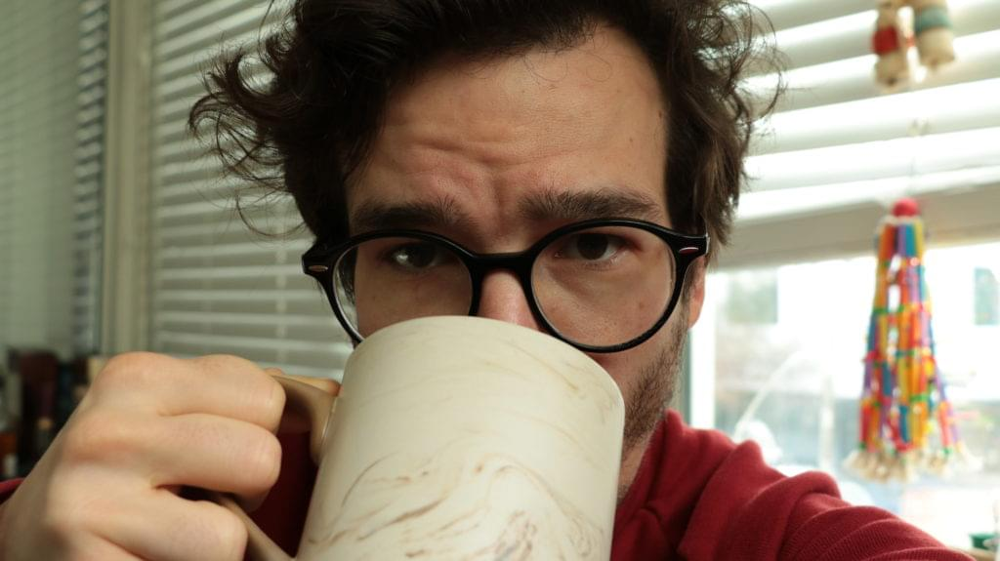
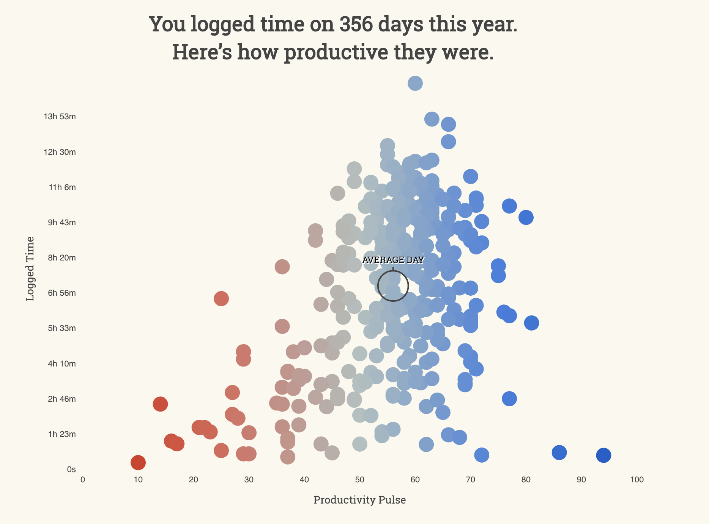
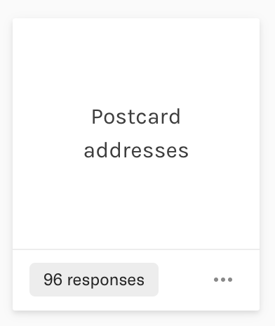

 You&#x27;ll never have more time than you have right now.

Don&#x27;t believe me? Ask your parents.

Life has a way with time. The older you are, the more responsibilities you have. The more worries. The more things you have to take care of.

I thought I was busy as a kid.

School took a whole _five hours_ out of my day. FIVE! How does anyone have time to play with LEGO and watch TV and read books and play video games and write fun programs in PASCAL and hang out with friends _and_ do all this homework and school time are my teachers insane!?

High school ... oh my so busy. Homework, class, extracurriculars. How am I going to write code, write poetry, draw webcomics _and_ learn guitar so I can get the girls!?

But I watched all my favorite movies 10 times and knew all the lines 🤔

https://www.youtube.com/watch?v=SJUhlRoBL8M

For a whole semester we would basically talk in Monty Python quotes with my friends. It was great.

College, super busy. Class, coursework, studying, writing code, building a startup, job, dating. All the things. Not a free moment in the day.

But I watched all episodes of all seasons of How I Met Your Mother, True Blood, and Dr. Who.

Notice however no more webcomics, no more poetry, no guitar.

## Time is a zero sum game

Never say you&#x27;re busy to someone with kids. They will _destroy_ you.

> Oh you think you&#x27;re busy, wait &#x27;till you have kids, lol

¯\\\_(ツ)\_/¯

And even with kids I think it only gets worse. Babies sleep a lot. Toddlers stay in play pens. You can create time if you&#x27;re tricksy.

But when you have to take them to all the soccer practices and gymnastics and play dates _and_ listen to their endless stories about their day? Whoof

My sister was amazing at this. 8 years younger. She could talk your ear off about all the drama between all the girls at all the things for hours and none of it made any sense to me.

She was also amazing in that she could do gymnastics for 2 hours before school, go to school, do gymnastics for 4 hours, come home, do homework for 2 hours, and do it all over again the next day. At friggen 12.

Crazy kid.

But she never hung out with friends after school.

Ultimately, doing something means _not_ doing something else. That&#x27;s how time works. The only non-renewable resource known to man.

You get 24 hours in a day, 7 days in a week, 365 days in a year, [90-ish years in a lifetime](https://waitbutwhy.com/2014/05/life-weeks.html)

That&#x27;s it. What you make of it is up to you.

## Why don&#x27;t you have time to advance your career?

So I asked a bunch of people: [What&#x27;s the biggest obstacle in your career](https://swizecteller.typeform.com/to/GQP8T6) and how can I help?

You know what most said?

No time. No motivation. Too lazy. Procrastinate.

And I thought that was weird. How can you not have time to work on your career when it&#x27;s the biggest part of your life? For 40 years, at least 8 hours a day, your career is what you do.

That&#x27;s a lot of time and effort to not try to improve.

So here are a few tips that have helped me.

1. It&#x27;s not too late. The best time to plant a tree is 20 years ago, the second best time is today. You still got this 💪
2. Always ask yourself: Do I even want to change? It&#x27;s okay to be happy with what you have and who you are. Kudos to you my friend, that&#x27;s the best place to be.
3. Where are you _really_ spending your time?

Your life, _you_, are the sum of your actions and experiences. As Gandhi would say _&quot;Actions express priorities&quot;_, or as Amanda Palmer would say _&quot;You are always exactly the person that you want to be&quot;_.

https://www.youtube.com/watch?v=Q9WZtxRWieM

Amanda also says another thing. An anecdote that&#x27;s stuck with me for forever after reading her book The Art of Asking.

> A farmer is sitting on his porch in a chair, hanging out. A friend walks up to the porch to say hello, and hears an awful yelping, squealing sound coming from inside the house. &quot;What&#x27;s that terrifyin&#x27; sound?&quot; asks the friend. &quot;It&#x27;s my dog,&quot; said the farmer. &quot;He&#x27;s sittin&#x27; on a nail.&quot; &quot;Why doesn&#x27;t he just sit up and get off it?&quot; asks the friend. The farmer deliberates on this and replies: &quot;Doesn&#x27;t hurt enough yet.”

It&#x27;s okay to say you want to change and not do anything about it. Just means you&#x27;re not ready yet. Doesn&#x27;t hurt enough yet. All part of the process 👌

## Where&#x27;s your time _really_ going?

This one&#x27;s easy to answer, terrifying to face, and the most eye opening.

Did you know the average American watches [4 hours of TV per day](https://en.wikipedia.org/wiki/Television_consumption#Statistics)? Four hours. _Four_.

That&#x27;s a lot.

Not sure if official stats include Netflix and other streaming media but I hope they do. Huge time sink.

A few ways to find out where _your_ time is going. 👇

1. Your phone, on iOS at least, has a ScreenTime feature. Here&#x27;s mine from last week.

My phone screen time

Just over 2 hours per day. 30 seconds here, 2 minutes there, it adds up. But okay, much of it is time I&#x27;d otherwise spend standing in line or whatever.

The insidious part is when you run a code compile or something, take out your phone, and get lost. What you were waiting for is done in 30 seconds and you don&#x27;t notice until 5 minutes later.

Like running with a parachute. A little delay on everything you do.

1. Install [RescueTime](https://www.rescuetime.com/). I&#x27;ve been using it for nigh on a decade. Don&#x27;t look at it as actionably as I should, but it&#x27;s interesting to see what I _actually_ do on my computers.

Here&#x27;s [my report for last year](https://www.rescuetime.com/year-in-review/2018/B63tJfPuyTkrwWqRMU2gexOsFOinXSOrsPO8dyvQ). 2573 hours at my computer, 1209 of which were hardcore productive, 1049 were distracting.

I count &quot;communication &amp; scheduling&quot; as distracting and that&#x27;s the 2nd biggest category. Might need to rethink that since a lot of it is productive, actually. 🤔

My RescueTime graph for 2018

1. You can go even deeper, or higher level if you will, with some time tracking tricks of your own. I use a tool that lets me categorize time in broad buckets like content creation, client work, self advancement, and so on.

That&#x27;s an advanced technique. I recommend building the habit, but it&#x27;s not for everyone. Start easy.

## Ok now what?

Now you&#x27;re honest with yourself.

You know where your time is going. You know you&#x27;ll never have more time. You know that to do something you have to _not_ do something else.

The rest is priorities.

What do _you_ want to be?

https://www.youtube.com/watch?v=7TEc_qyKQ0c

# In other news

I had a stupid idea last week and emailed everyone who&#x27;s ever bought something from me. Promised to send them a surprise. It may or may not involve postcards.

💌 My hand&#x27;s gonna hurt 😅

I&#x27;ve also been working through the list of people who answered [that career poll](https://swizecteller.typeform.com/to/GQP8T6) in December or January. Writing personal advice is hard and takes time. I try to be thoughtful.

If you&#x27;re still waiting for yours, I&#x27;m working on it :)

And I&#x27;m preparing to launch React for Data Visualization soon. Polishing up some content, making a few extra videos, figuring out the best way to launch. Stuff like that.

Expect that to happen mid February.

PS: I&#x27;m moving the &quot;A few cool things&quot; section to Friday because &quot;Five things Friday&quot; sounds cool. ✌️

Have a great week
