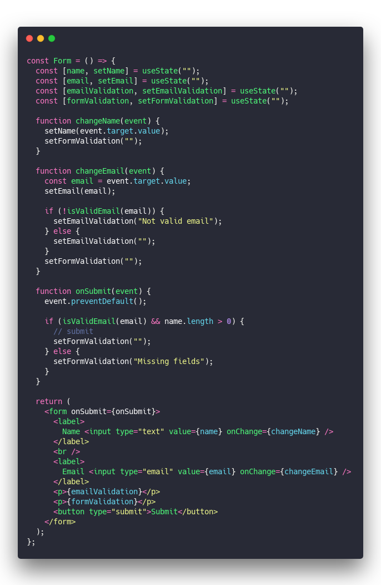
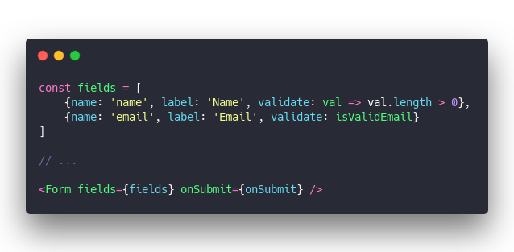
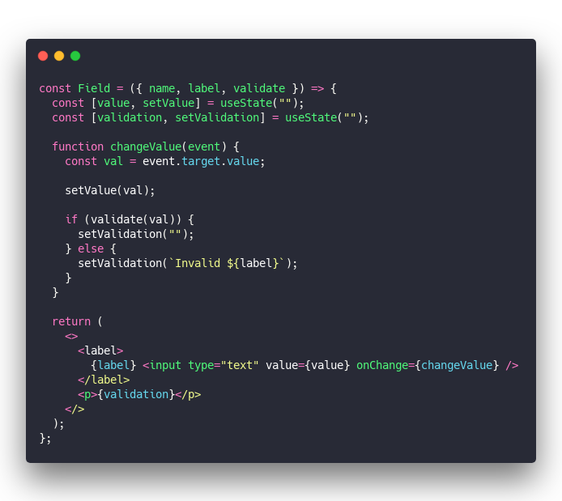
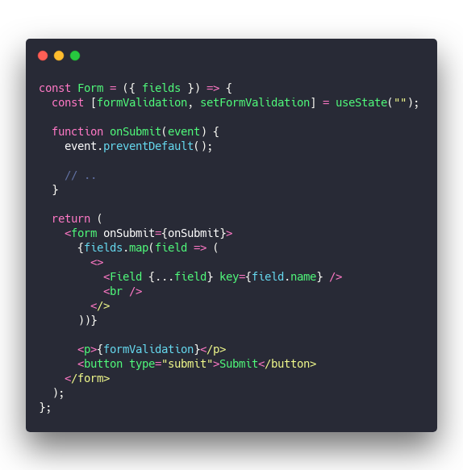
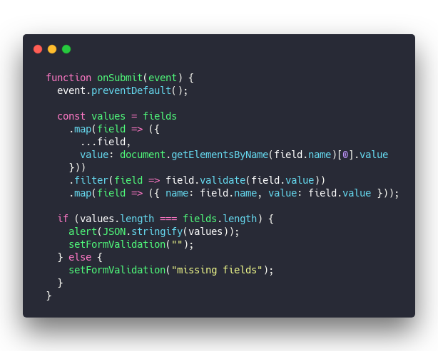

How many forms have you built? 1? 2? 5 bazillion?Lemme guess, every project involves 1 or 2 forms and they're all the friggen same. You got forms coming out the wazoo.Render fields. Connect to state. Add field validation. Detect submit. Add form validation. Send fetch request. Repeat.

How many times can you go through that mind-numbing software bureaucracy before you say **"Enough already!"**

And no, that doesn't mean _"Give it to the most junior engineer on the team coz they still think it's exciting"_ either. That's shitty. (and yes every company does it)

## Build a form generator

Here's what you do instead my friend, you notice a pattern and you solve it once and for all. For every future project. For every engineer on the team. For yourself.

That's how you level up.

**Next time you're building a form, grab some extra time, turn it into a library.**

Sure, libraries like [formik](https://github.com/jaredpalmer/formik) and [react-form](https://github.com/tannerlinsley/react-form) and [redux-form](https://github.com/redux-form/redux-form) exist. There's a bunch for every frontend framework.

And they're not what I'm talking about.

What you need is a form _generator_. A piece of code that takes JSON configuration and spits out a form.

A form that looks like _your_ forms. Follows _your_ design system, has _your_ validation principles, looks like _you_ built it.

### Form generators vs. forms

Take a basic form for example. Name and email.

https://codesandbox.io/s/relaxed-moore-rl1lh?fontsize=14&hidenavigation=1&theme=dark

Handles 2 input fields, validates email as you type, verifies both fields are filled out before submitting.

58 lines of boring code and there's a bunch of cases I didn't cover.

&t=seti&l=javascript&ds=true&wc=true&wa=true&pv=48px&ph=32px&ln=false&code=const%20Form%20%3D%20()%20%3D%3E%20%7B%0A%20%20const%20%5Bname%2C%20setName%5D%20%3D%20useState(%22%22)%3B%0A%20%20const%20%5Bemail%2C%20setEmail%5D%20%3D%20useState(%22%22)%3B%0A%20%20const%20%5BemailValidation%2C%20setEmailValidation%5D%20%3D%20useState(%22%22)%3B%0A%20%20const%20%5BformValidation%2C%20setFormValidation%5D%20%3D%20useState(%22%22)%3B%0A%0A%20%20function%20changeName(event)%20%7B%0A%20%20%20%20setName(event.target.value)%3B%0A%20%20%20%20setFormValidation(%22%22)%3B%0A%20%20%7D%0A%0A%20%20function%20changeEmail(event)%20%7B%0A%20%20%20%20const%20email%20%3D%20event.target.value%3B%0A%20%20%20%20setEmail(email)%3B%0A%0A%20%20%20%20if%20(!isValidEmail(email))%20%7B%0A%20%20%20%20%20%20setEmailValidation(%22Not%20valid%20email%22)%3B%0A%20%20%20%20%7D%20else%20%7B%0A%20%20%20%20%20%20setEmailValidation(%22%22)%3B%0A%20%20%20%20%7D%0A%20%20%20%20setFormValidation(%22%22)%3B%0A%20%20%7D%0A%0A%20%20function%20onSubmit(event)%20%7B%0A%20%20%20%20event.preventDefault()%3B%0A%0A%20%20%20%20if%20(isValidEmail(email)%20%26%26%20name.length%20%3E%200)%20%7B%0A%20%20%20%20%20%20%2F%2F%20submit%0A%20%20%20%20%20%20setFormValidation(%22%22)%3B%0A%20%20%20%20%7D%20else%20%7B%0A%20%20%20%20%20%20setFormValidation(%22Missing%20fields%22)%3B%0A%20%20%20%20%7D%0A%20%20%7D%0A%0A%20%20return%20(%0A%20%20%20%20%3Cform%20onSubmit%3D%7BonSubmit%7D%3E%0A%20%20%20%20%20%20%3Clabel%3E%0A%20%20%20%20%20%20%20%20Name%20%3Cinput%20type%3D%22text%22%20value%3D%7Bname%7D%20onChange%3D%7BchangeName%7D%20%2F%3E%0A%20%20%20%20%20%20%3C%2Flabel%3E%0A%20%20%20%20%20%20%3Cbr%20%2F%3E%0A%20%20%20%20%20%20%3Clabel%3E%0A%20%20%20%20%20%20%20%20Email%20%3Cinput%20type%3D%22email%22%20value%3D%7Bemail%7D%20onChange%3D%7BchangeEmail%7D%20%2F%3E%0A%20%20%20%20%20%20%3C%2Flabel%3E%0A%20%20%20%20%20%20%3Cp%3E%7BemailValidation%7D%3C%2Fp%3E%0A%20%20%20%20%20%20%3Cp%3E%7BformValidation%7D%3C%2Fp%3E%0A%20%20%20%20%20%20%3Cbutton%20type%3D%22submit%22%3ESubmit%3C%2Fbutton%3E%0A%20%20%20%20%3C%2Fform%3E%0A%20%20)%3B%0A%7D%3B>)

Every engineer on your team goes through that _every time_ they build a form. And they build a lot.

This is how they feel 👇

Wouldn't you?

Here's what you do after _someone_ ;) builds a form generator for your team:

&t=seti&l=javascript&ds=true&wc=true&wa=true&pv=48px&ph=32px&ln=false&code=const%20fields%20%3D%20%5B%0A%09%7Bname%3A%20'name'%2C%20label%3A%20'Name'%2C%20validate%3A%20val%20%3D%3E%20val.length%20%3E%200%7D%2C%0A%09%7Bname%3A%20'email'%2C%20label%3A%20'Email'%2C%20validate%3A%20isValidEmail%7D%0A%5D%0A%0A%2F%2F%20...%0A%0A%3CForm%20fields%3D%7Bfields%7D%20onSubmit%3D%7BonSubmit%7D%20%2F%3E>)

😍

## How you build a form generator

A form generator doesn't have to be complicated my friend, it just needs to get the job done.

You'll need 3 parts:

1.  A generic `<Field>` component
2.  A generic `<Form>` component
3.  Couple of loops

Here's a basic example that supports text fields only.

https://codesandbox.io/s/staging-frog-cmcgr?fontsize=14&hidenavigation=1&theme=dark

###

You start with a `<Field>` component like this.

&t=seti&l=javascript&ds=true&wc=true&wa=true&pv=48px&ph=32px&ln=false&code=const%20Field%20%3D%20(%7B%20name%2C%20label%2C%20validate%20%7D)%20%3D%3E%20%7B%0A%20%20const%20%5Bvalue%2C%20setValue%5D%20%3D%20useState(%22%22)%3B%0A%20%20const%20%5Bvalidation%2C%20setValidation%5D%20%3D%20useState(%22%22)%3B%0A%0A%20%20function%20changeValue(event)%20%7B%0A%20%20%20%20const%20val%20%3D%20event.target.value%3B%0A%0A%20%20%20%20setValue(val)%3B%0A%0A%20%20%20%20if%20(validate(val))%20%7B%0A%20%20%20%20%20%20setValidation(%22%22)%3B%0A%20%20%20%20%7D%20else%20%7B%0A%20%20%20%20%20%20setValidation(%60Invalid%20%24%7Blabel%7D%60)%3B%0A%20%20%20%20%7D%0A%20%20%7D%0A%0A%20%20return%20(%0A%20%20%20%20%3C%3E%0A%20%20%20%20%20%20%3Clabel%3E%0A%20%20%20%20%20%20%20%20%7Blabel%7D%20%3Cinput%20type%3D%22text%22%20value%3D%7Bvalue%7D%20onChange%3D%7BchangeValue%7D%20%2F%3E%0A%20%20%20%20%20%20%3C%2Flabel%3E%0A%20%20%20%20%20%20%3Cp%3E%7Bvalidation%7D%3C%2Fp%3E%0A%20%20%20%20%3C%2F%3E%0A%20%20)%3B%0A%7D%3B>)

This component handles a complete field. Renders an input with a label, stores state, and performs validation as you type. Even renders errors.

You can use render props for more flexibility. But that's often _too_ flexible. Aim to build a generator that spits out perfect forms for _your_ company. Every time.

###

The `<Form />` component is a glorified loop.

&t=seti&l=javascript&ds=true&wc=true&wa=true&pv=48px&ph=32px&ln=false&code=const%20Form%20%3D%20(%7B%20fields%20%7D)%20%3D%3E%20%7B%0A%20%20const%20%5BformValidation%2C%20setFormValidation%5D%20%3D%20useState(%22%22)%3B%0A%0A%20%20function%20onSubmit(event)%20%7B%0A%20%20%20%20event.preventDefault()%3B%0A%0A%20%20%20%20%2F%2F%20..%0A%20%20%7D%0A%0A%20%20return%20(%0A%20%20%20%20%3Cform%20onSubmit%3D%7BonSubmit%7D%3E%0A%20%20%20%20%20%20%7Bfields.map(field%20%3D%3E%20(%0A%20%20%20%20%20%20%20%20%3C%3E%0A%20%20%20%20%20%20%20%20%20%20%3CField%20%7B...field%7D%20key%3D%7Bfield.name%7D%20%2F%3E%0A%20%20%20%20%20%20%20%20%20%20%3Cbr%20%2F%3E%0A%20%20%20%20%20%20%20%20%3C%2F%3E%0A%20%20%20%20%20%20))%7D%0A%0A%20%20%20%20%20%20%3Cp%3E%7BformValidation%7D%3C%2Fp%3E%0A%20%20%20%20%20%20%3Cbutton%20type%3D%22submit%22%3ESubmit%3C%2Fbutton%3E%0A%20%20%20%20%3C%2Fform%3E%0A%20%20)%3B%0A%7D%3B>)

Loop through fields, render each one. Add a submit button, `<form>` element, and a place to put errors.

### onSubmit

The `onSubmit` method handles submissions. Validates all fields, runs any form-level validations, and does the thing.

Something like this:

&t=seti&l=javascript&ds=true&wc=true&wa=true&pv=48px&ph=32px&ln=false&code=%20%20function%20onSubmit(event)%20%7B%0A%20%20%20%20event.preventDefault()%3B%0A%0A%20%20%20%20const%20values%20%3D%20fields%0A%20%20%20%20%20%20.map(field%20%3D%3E%20(%7B%0A%20%20%20%20%20%20%20%20...field%2C%0A%20%20%20%20%20%20%20%20value%3A%20document.getElementsByName(field.name)%5B0%5D.value%0A%20%20%20%20%20%20%7D))%0A%20%20%20%20%20%20.filter(field%20%3D%3E%20field.validate(field.value))%0A%20%20%20%20%20%20.map(field%20%3D%3E%20(%7B%20name%3A%20field.name%2C%20value%3A%20field.value%20%7D))%3B%0A%0A%20%20%20%20if%20(values.length%20%3D%3D%3D%20fields.length)%20%7B%0A%20%20%20%20%20%20alert(JSON.stringify(values))%3B%0A%20%20%20%20%20%20setFormValidation(%22%22)%3B%0A%20%20%20%20%7D%20else%20%7B%0A%20%20%20%20%20%20setFormValidation(%22missing%20fields%22)%3B%0A%20%20%20%20%7D%0A%20%20%7D>)

This one iterates through the fields and grabs their values straight from the DOM. A little dirty but it works ✌️

You might want to find a way to communicate values from `<Field />` components with callbacks or something. Maybe hoist state up a level or add a React context ... depends what you need.

Invalid fields are thrown out and the rest collected into an array of `{ name, value }` objects. If that array is same length as the number of fields, the form is valid.

My submit alerts. Yours should call the `onSubmit` prop function of some sort. Let the user of your form builder define what happens :)

## 🤯

An afternoon of brain-bending once, a lifetime of perfect forms.

What are you waiting for? Go save your team from this pain, be the hero they need.

Cheers,  
~Swizec
